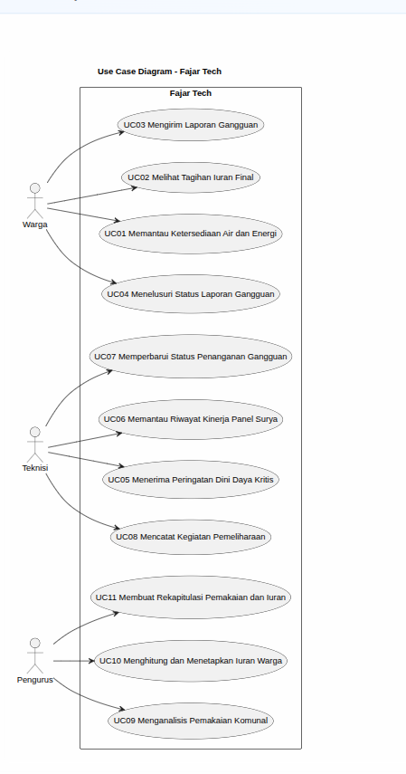

<h1>
IF2150 REKAYASA PERANGKAT LUNAK
 
TUGAS 3
 
USE CASE & SCENARIO USE CASE
</h1>
 

## *Fajar Tech*

### Untuk: *Tigress / Agatha*

Dipersiapkan oleh:

| Informasi | Keterangan |
| --- | --- |
| Kelas | *K-03* |
| Kelompok | *10* |

| NIM | Nama |
|---|---|
| *[13525054]* | *[Raffi Fauzi Hermawan]* |
| *[13525030]* | *[Rionaldo Casey Pandhitha]* |
| *[13525129]* | *[Andro Irsa Syafiq]* |
| *[13525078]* | *[Muhammad Faiz Ramadhan]* |
| *[13525006]* | *[Muhammad Rafiandhi Suryadinata]* |
---

## Daftar Perubahan

| Revisi | Deskripsi |
| :--- | :--- |
| | |
| | |
| | |
| | |

 
 

# BAB 1: Deskripsi Perangkat Lunak

Perangkat lunak kami dibuat agar dapat memantau dan mengelola air dan juga surya. 

Sistemnya dirancang dengan memfokuskan pada platform utama dan satu-satunya melalui website. Website dipilih dikarenakan dapat diakses oleh warga melalui device manapun. Beberapa fitur yang terdapat pada website antara lain adalah melihat ketersediaan air, status daya surya, tagihan iuran, analitik penggunaan komunal, pengelolaan iuran warga, dan platform laporan gangguan serta status perbaikan dari laporan yang masuk.

Dari kacamata pengguna, perangkat layar yang diusulkan ini berfungsi sebagai pusat kendali dan informasi yang memungkinkan operator fasilitas desa dan stakeholder untuk memantau status pompa air, tingkat keterisian tangki, serta juga daya panel surya dan baterai secara real-time. Selain itu, warga juga dapat mencari informasi yang mudah dipahami mengenai ketersediaan air, kondisi pasokan energi, rincian iuran, serta perkembangan laporan gangguan.

Alur kerja sistem ini yaitu menjadi jembatan antar dunia fisik dan digital dalam pengelolaan air dan energi komunal. Perangkat keras di lapangan seperti sensor pada tangki penampungan, pompa air, dan panel surya dapat mengirimkan data aktual ke platform web. Sistem kemudian memproses data tersebut menjadi informasi yang siap digunakan yaitu, tampilan ketersediaan air dan status daya pada dasbor warga, notifikasi peringatan pada teknisi ketika metrik daya sudah hampir habis, serta menyediakan data pemakaian bagi pengurus untuk keperluan analitik dan kalkulasi iuran.

Harapan dari penerapan solusi ini adalah terciptanya pengelolaan infrastruktur air dan energi komunal yang lebih terukur, transparan, dan berkelanjutan di tingkat komunitas. Dengan pemrosesan yang lebih terdigitalisasi, warga dapat memperoleh kepastian informasi tanpa harus bertanya langsung kepada pengurus, teknisi dapat melakukan menangani masalah di lapangan dengan lebih taktis, serta pengurus dapat mengelola data lebih cepat dalam mengambil keputusan komunitas dan kalkulasi iuran.

---

# BAB 2: Kebutuhan Fungsional (KF)

| ID KF | ID Kebutuhan | Penjelasan |
| :--- | :--- | :--- |
| KF01 | R01 | Perangkat lunak dapat menampilkan volume/level air pada tangki penampungan secara realtime pada dashboard warga. |
| KF02 | R02 | Perangkat lunak dapat mengklasifikasikan status ketersediaan air (Normal, Rendah, Kritis) berdasarkan ambang batas yang telah dikonfigurasi, dan menampilkan label status tersebut. |
| KF03 | R03 | Perangkat lunak dapat menampilkan kapasitas baterai (%) dan daya yang dihasilkan panel surya (Watt) secara realtime pada dashboard warga. |
| KF04 | R04 | Perangkat lunak dapat menyimpan dan menampilkan data daya menggunakan satuan pengukuran yang konsisten (misal: Watt, persen) di seluruh tampilan sistem. |
| KF05 | R05 | Perangkat lunak dapat menampilkan rincian tagihan iuran periode berjalan, mencakup periode tagihan, data pemakaian dasar perhitungan, dan jumlah iuran. |
| KF06 | R07 | Perangkat lunak hanya menampilkan tagihan kepada warga setelah status perhitungan iuran periode tersebut ditetapkan sebagai final oleh pengurus. |
| KF07 | R08 | Perangkat lunak dapat menyediakan formulir input laporan gangguan yang mencakup jenis gangguan, deskripsi, dan informasi pendukung (misal foto). |
| KF08 | R08 | Perangkat lunak dapat menyimpan laporan gangguan yang telah diisi warga sebagai entri baru di sistem setelah formulir dikirim. |
| KF09 | R09 | Perangkat lunak dapat memvalidasi bahwa pengguna yang mengirim laporan gangguan merupakan warga terdaftar pada komunitas terkait sebelum laporan disimpan. |
| KF10 | R10 | Perangkat lunak dapat menetapkan status "Menunggu" secara otomatis pada setiap laporan gangguan baru yang berhasil dikirim. |
| KF11 | R11 | Perangkat lunak dapat menampilkan status terkini dan riwayat perkembangan laporan gangguan pada halaman warga pelapor. |
| KF12 | R12 | Perangkat lunak membatasi nilai status laporan gangguan hanya pada tiga pilihan: Menunggu, Sedang Diperbaiki, atau Selesai. |
| KF13 | R13 | Perangkat lunak dapat mengirimkan notifikasi otomatis kepada teknisi ketika kapasitas daya baterai mencapai atau berada di bawah ambang batas aman. |
| KF14 | R15 | Perangkat lunak dapat memastikan notifikasi peringatan daya kritis hanya dikirimkan kepada akun teknisi yang terdaftar dan bertanggung jawab atas perangkat terkait. |
| KF15 | R16 | Perangkat lunak dapat menampilkan grafik riwayat kinerja panel surya dalam rentang waktu yang dapat dipilih oleh teknisi. |
| KF16 | R17 | Perangkat lunak dapat menyimpan data historis kinerja perangkat secara berkala sebagai dasar evaluasi kondisi dan perencanaan pemeliharaan. |
| KF17 | R18 | Perangkat lunak dapat menyediakan fitur bagi teknisi untuk mengubah status laporan gangguan sesuai progres penanganan di lapangan. |
| KF18 | R19 | Perangkat lunak dapat memverifikasi bahwa hanya teknisi yang memiliki penugasan atas laporan tersebut yang dapat mengubah statusnya. |
| KF19 | R20 | Perangkat lunak membatasi perubahan status laporan gangguan hanya mengikuti tahapan Menunggu, Sedang Diperbaiki, dan Selesai. |
| KF20 | R21 | Perangkat lunak dapat menyediakan formulir pencatatan kegiatan pemeliharaan, mencakup perangkat yang ditangani, waktu pelaksanaan, tindakan, dan catatan hasil. |
| KF21 | R22 | Perangkat lunak dapat menyimpan seluruh catatan pemeliharaan/perbaikan sebagai riwayat yang dapat ditelusuri berdasarkan perangkat dan waktu. |
| KF22 | R24 | Perangkat lunak dapat menampilkan dashboard agregat pemakaian air dan energi komunal beserta riwayatnya kepada pengurus. |
| KF23 | R25 | Perangkat lunak membatasi akses dashboard administratif komunitas hanya untuk akun dengan peran pengurus. |
| KF24 | R26 | Perangkat lunak dapat mengelompokkan data pemakaian berdasarkan periode (misal bulanan) secara konsisten untuk perbandingan antarperiode. |
| KF25 | R27 | Perangkat lunak dapat menghitung iuran warga berdasarkan data pemakaian pada periode yang dipilih pengurus. |
| KF26 | R27 | Perangkat lunak dapat menampilkan hasil perhitungan iuran kepada pengurus untuk ditinjau sebelum ditetapkan sebagai final. |
| KF27 | R29 | Perangkat lunak dapat memverifikasi bahwa hanya akun pengurus dengan kewenangan yang dapat menetapkan hasil perhitungan iuran sebagai final. |
| KF28 | R30 | Perangkat lunak dapat menerapkan tarif/aturan perhitungan yang sama untuk seluruh warga dalam satu periode tagihan yang telah ditetapkan. |
| KF29 | R31 | Perangkat lunak dapat menyediakan fitur pemilihan periode untuk keperluan rekapitulasi data pemakaian dan iuran. |
| KF30 | R31 | Perangkat lunak dapat menghasilkan (ekspor/cetak) dokumen rekapitulasi data pemakaian dan iuran untuk periode yang dipilih. |
| KF31 | R32 | Perangkat lunak membatasi fitur pembuatan rekapitulasi administratif hanya untuk akun pengurus yang berwenang. |
| KF32 | R33 | Perangkat lunak menghasilkan rekapitulasi menggunakan data pemakaian dan iuran yang telah berstatus final untuk periode terkait. |
| KF33 | R36 | Perangkat lunak dapat menghitung tagihan iuran dari warga secara otomatis berdasarkan data pemaiakan dan juga tarif yang berlaku di periode yang terkait |
| KF34 | R38 | Perangkat lunak dapat mencari atau menelusuri status laporan gangguan berdasarkan identitas pelapor (ID)|
| KF35 | R41 | Perangkat lunak dapat mencatat waktu atau timestamp setiap kali status laporan diubah |

---

# BAB 3: Model Use Case

## 3.1 Identifikasi Aktor
| Aktor | Deskripsi |
| :--- | :--- |
| Warga | Pengguna ini bertindak sebagai pihak yang menggunakan sistem untuk memantau air dan listrik dari infrastruktur komunal. Karakteristik dari pengguna ini adalah bersifat non-teknis dan mengutamakan kemudahan mengakses informasi ketersediaan air, status daya, tagihan iuran, serta perkembangan laporan gangguan yang mereka ajukan. |
| Teknisi | Pengguna ini bertindak sebagai pihak yang bertanggung jawab memantau kondisi fisik pompa air, tangki, panel surya, baterai secara langsung di lapangan, dan memasukkan statusnya pada sistem . Karakteristik dari pengguna ini adalah mengutamakan informasi teknis dan real-time untuk melakukan tindakan preventif atau perbaikan sebelum terjadi kegagalan sistem. |
| Pengurus | Pengguna ini bertindak sebagai pihak yang dapat mengakses dashboard pemakaian air dan energi komunal untuk tujuan pengelolaan administratif komunitas seperti pencatatan iuran, pemantauan pemakaian komunal, dan pengawasan tindak lanjut laporan gangguan. Karakteristik dari pengguna ini adalah mengutamakan gambaran menyeluruh untuk pengambilan keputusan dan menjaga transparansi terhadap warga. |

## 3.2 Identifikasi Use Case
Identifikasi seluruh use case yang mencakup Kebutuhan Fungsional pada BAB 2. Satu use case boleh mencakup lebih dari satu KF, dan sebaliknya satu KF boleh muncul di lebih dari satu use case bila memang relevan.

| ID UC | Nama Use Case | Deskripsi Singkat | Aktor Terlibat | ID KF Terkait |
| :--- | :--- | :--- | :--- | :--- |
| *UC01* | *Melakukan Pembayaran Digital* | *Pelanggan memilih metode pembayaran dan menyelesaikan transaksi.* | *Pelanggan* | *KF01, KF02* |
| *UC02* | *Memverifikasi Status Pembayaran* | *Kasir mengecek status transaksi pelanggan sebelum menyerahkan barang.* | *Kasir* | *KF03* |
| *...* | *...* | *...* | *...* | *...* |

## 3.3 Use Case Diagram
Buatlah **satu** use case diagram yang mencakup seluruh aktor dan use case. Sertakan relasi *include*/*extend* apabila ada use case yang saling bergantung.
 

<i>Gambar 1. Use Case Diagram</i>

 

Hal-hal yang perlu diperhatikan dalam pembuatan use case diagram:
- Pastikan notasi UML use case (aktor, oval use case, garis asosiasi, *include/extend*) digambar dengan benar.
- Seluruh aktor dan use case yang telah didefinisikan harus muncul di diagram, tidak ada yang terlewat maupun berlebih.
- Hindari garis yang saling bersilangan tanpa alasan jelas, susun diagram agar mudah dibaca.
- Hindari istilah solusi teknis (misalnya nama tabel database, nama endpoint API) muncul di dalam diagram use case karena use case menjelaskan *interaksi fungsional*, bukan detail implementasi.

## 3.4 Skenario Use Case
Buat skenario untuk **setiap** use case yang telah diidentifikasi pada 3.2. Setiap skenario dapat terdiri dari dua jenis alur:
- **Skenario Normal**: alur utama (*happy path*) di mana interaksi aktor-sistem berjalan lancar tanpa kendala hingga tujuan use case tercapai.
- **Skenario Alternatif**: alur percabangan dari skenario normal, misalnya kondisi gagal, input tidak valid, atau pilihan lain yang tersedia bagi aktor. Boleh ada lebih dari satu skenario alternatif per use case jika ada beberapa titik percabangan berbeda.

Format tabel skenario: kolom **Aksi Aktor** berisi apa yang dilakukan/diinput aktor, kolom **Reaksi Perangkat Lunak** berisi respons sistem terhadap aksi tersebut secara **berurutan** (nomor langkah harus berpasangan/selaras antar dua kolom).

### 3.4.1 Skenario UC01

**Nama Use Case:** *Melakukan Pembayaran Digital*

**Skenario Normal**

| No | Aksi Aktor | Reaksi Perangkat Lunak |
| :--- | :--- | :--- |
| 1 | *Pelanggan memilih menu checkout* | *Sistem menampilkan ringkasan pesanan dan pilihan metode pembayaran* |
| 2 | *Pelanggan memilih metode pembayaran (misal: e-wallet)* | *Sistem mengarahkan pelanggan ke halaman konfirmasi e-wallet* |
| 3 | *Pelanggan mengonfirmasi pembayaran* | *Sistem menerima respons pembayaran berhasil, memperbarui status pesanan menjadi "Lunas", dan menampilkan notifikasi pembayaran berhasil* |

 

**Skenario Alternatif 1: Otorisasi Pembayaran Gagal**

| No | Aksi Aktor | Reaksi Perangkat Lunak |
| :--- | :--- | :--- |
| 1 | *Pelanggan memilih menu checkout* | *Sistem menampilkan ringkasan pesanan dan pilihan metode pembayaran* |
| 2 | *Pelanggan memilih metode pembayaran (misal: e-wallet)* | *Sistem mengarahkan pelanggan ke halaman konfirmasi e-wallet* |
| 3 | *Pelanggan mengonfirmasi pembayaran* | *Sistem menerima respons pembayaran gagal (misal: saldo tidak cukup). Sistem menampilkan pesan error dan meminta pelanggan memilih metode pembayaran lain* |
| 4 | *Pelanggan memilih metode pembayaran lain* | *Sistem kembali ke langkah 2 skenario normal* |

### 3.4.2 Skenario UC02

**Nama Use Case:** *Memverifikasi Status Pembayaran*

**Skenario Normal**

| No | Aksi Aktor | Reaksi Perangkat Lunak |
| :--- | :--- | :--- |
| 1 | *Kasir memasukkan ID Pesanan pelanggan* | *Sistem menampilkan status pembayaran ("Lunas") beserta detail transaksi* |

 

**Skenario Alternatif 1: ID Pesanan Tidak Ditemukan**

| No | Aksi Aktor | Reaksi Perangkat Lunak |
| :--- | :--- | :--- |
| 1 | *Kasir memasukkan ID Pesanan yang salah/tidak ada* | *Sistem menampilkan pesan "ID Pesanan tidak ditemukan" dan meminta kasir memasukkan ulang* |

### 3.4.4 Skenario UC04

Nama Use Case: Menelusuri Status Laporan Gangguan

**Skenario Normal**

| No | Aksi Aktor | Reaksi Perangkat Lunak |
| :--- | :--- | :--- |
| 1 | Warga membuka halaman riwayat laporan gangguan | Sistem mencari laporan gangguan berdasarkan identitas warga. |
| 2 | Warga melihat daftar laporan yang pernah dikirim | Sistem menampilkan daftar laporan gangguan milik warga tersebut. |
| 3 | Warga memilih salah satu laporan | Sistem menampilkan status terkini dari laporan yang dipilih. |
| 4 | Warga melihat perkembangan laporan | Sistem menampilkan riwayat perkembangan laporan gangguan tersebut. |

**Skenario Alternatif 1: Laporan Tidak Ditemukan**

| No | Aksi Aktor | Reaksi Perangkat Lunak |
| :--- | :--- | :--- |
| 1 | Warga membuka halaman riwayat laporan gangguan | Sistem mencari laporan berdasarkan identitas warga. |
| 2 | - | Sistem tidak menemukan laporan yang terkait dengan identitas warga tersebut. |
| 3 | - | Sistem menampilkan informasi bahwa belum ada laporan gangguan yang dapat ditampilkan. |

### 3.4.6 Skenario UC06

**Nama Use Case:** Memantau Riwayat Kinerja Panel Surya

**Skenario Normal**

| No | Aksi Aktor | Reaksi Perangkat Lunak |
| :-- | :-- | :-- |
| 1 | Teknisi membuka halaman pemantauan perangkat | Sistem menampilkan halaman riwayat kinerja panel surya. |
| 2 | Teknisi memilih rentang waktu | Sistem menampilkan grafik kinerja panel surya sesuai rentang waktu yang dipilih. |
| 3 | - | Sistem menggunakan data historis yang tersimpan untuk menampilkan tren kinerja perangkat. |

**Skenario Alternatif 1: Data historis belum tersedia**

| No | Aksi Aktor | Reaksi Perangkat Lunak |
| :-- | :-- | :-- |
| 1 | Teknisi membuka halaman pemantauan perangkat | Sistem memeriksa ketersediaan data historis. |
| 2 | - | Sistem menampilkan pesan bahwa data historis belum tersedia untuk rentang waktu tersebut. |

---

### 3.4.7 Skenario UC07

**Nama Use Case:** Memperbarui Status Penanganan Gangguan

**Skenario Normal**

| No | Aksi Aktor | Reaksi Perangkat Lunak |
| :-- | :-- | :-- |
| 1 | Teknisi membuka daftar laporan yang ditugaskan | Sistem menampilkan laporan gangguan yang dapat ditindaklanjuti. |
| 2 | Teknisi memilih laporan | Sistem menampilkan detail laporan. |
| 3 | Teknisi mengubah status menjadi “Sedang Diperbaiki” | Sistem memverifikasi bahwa teknisi memiliki penugasan atas laporan tersebut. |
| 4 | - | Sistem menyimpan perubahan status sesuai tahapan yang valid. |
| 5 | - | Sistem mencatat timestamp perubahan status. |

**Skenario Alternatif 1: Teknisi tidak berwenang**

| No | Aksi Aktor | Reaksi Perangkat Lunak |
| :-- | :-- | :-- |
| 1 | Teknisi mencoba mengubah status laporan | Sistem memverifikasi penugasan teknisi. |
| 2 | - | Sistem menolak perubahan dan menampilkan pesan bahwa teknisi tidak berwenang atas laporan tersebut. |

### 3.4.11 Skenario UC11

Nama Use Case: Membuat Rekapitulasi Pemakaian dan Iuran

**Skenario Normal**

| No | Aksi Aktor | Reaksi Perangkat Lunak |
| :--- | :--- | :--- |
| 1 | Pengurus membuka menu rekapitulasi pemakaian dan iuran | Sistem memeriksa kewenangan pengurus dan menampilkan pilihan periode. |
| 2 | Pengurus memilih periode rekapitulasi | Sistem mengambil data pemakaian dan iuran pada periode yang dipilih. |
| 3 | - | Sistem memeriksa bahwa data pemakaian dan iuran pada periode tersebut telah berstatus final. |
| 4 | Pengurus memilih untuk membuat rekapitulasi | Sistem membuat rekapitulasi berdasarkan data pada periode yang dipilih. |
| 5 | Pengurus memilih ekspor atau cetak | Sistem menghasilkan dokumen rekapitulasi yang dapat diekspor atau dicetak. |

**Skenario Alternatif 1: Data Belum Final**

| No | Aksi Aktor | Reaksi Perangkat Lunak |
| :--- | :--- | :--- |
| 1 | Pengurus memilih periode rekapitulasi | Sistem mengambil data pemakaian dan iuran pada periode yang dipilih. |
| 2 | - | Sistem menemukan data yang belum berstatus final. |
| 3 | - | Sistem menolak pembuatan rekapitulasi dan menampilkan informasi bahwa rekapitulasi hanya dapat dibuat dari data yang telah final. |

Skenario Alternatif 2: Pengguna Tidak Berwenang

| No | Aksi Aktor | Reaksi Perangkat Lunak |
| :--- | :--- | :--- |
| 1 | Pengguna membuka menu rekapitulasi pemakaian dan iuran | Sistem memeriksa kewenangan pengguna. |
| 2 | - | Sistem menemukan bahwa pengguna tidak memiliki kewenangan sebagai pengurus. |
| 3 | - | Sistem menolak akses ke menu rekapitulasi. |

---

*Lanjutkanlah pola 3.4.x ini untuk setiap ID UC yang telah diidentifikasi pada 3.2, sampai seluruh use case memiliki skenario normal dan skenario alternatif (tidak usah dibuat jika use case tersebut memang tidak memiliki skenario alternatif).*