<h1>
IF2150 REKAYASA PERANGKAT LUNAK
 
TUGAS 4
 
CLASS DIAGRAM
</h1>
 

## *FAJAR TECH*

### Untuk: *Tigress / Agatha*

Dipersiapkan oleh:
| Informasi | Keterangan |
| --- | --- |
| Kelas | K-3 |
| Kelompok | 10  |

| NIM | Nama |
| --- | --- |
| *13525054* | *Raffi Fauzi Hermawan* |
| *13525030* | *Rionaldo Casey Pandhitha* |
| *13525129* | *Andro Irsa Syafiq* |
| *13525078* | *Muhammad Faiz Ramadhan* |
| *13525006* | *Muhammad Rafiandhi Suryadinata* |
---

## Daftar Perubahan

| Revisi | Deskripsi |
| :--- | :--- |
| *A* | *Inisialisasi dokumen CD M4 — integrasi 28 kelas global.* |
| *B* | *Tambah Bab 4.2.10 UC10 + Bab 4.3 overall (Rafiandhi) — KalkulatorIuran, AturanTarif 1:1 Periode, StatusTagihan.* |
| *C* | *Sinkronisasi teks Bab 4.2.10 dengan `assets/diagram/UC10.png` terbaru — penyesuaian stereotipe dependensi, notasi `memilih`/`1..*`, dan note KF25–KF28/KF33 & `<<include>> UC09` / `extends UC02` (sesuai Gambar 10).* |
| *D* | *Simplifikasi Use Case Diagram* |

 
 

# BAB 1: Deskripsi Perangkat Lunak

Perangkat lunak kami dibuat agar dapat memantau dan mengelola air dan juga surya. 

Sistemnya dirancang dengan memfokuskan pada platform utama dan satu-satunya melalui website. Website dipilih dikarenakan dapat diakses oleh warga melalui device manapun. Beberapa fitur yang terdapat pada website antara lain adalah melihat ketersediaan air, status daya surya, tagihan iuran, analitik penggunaan komunal, pengelolaan iuran warga, dan platform laporan gangguan serta status perbaikan dari laporan yang masuk.

Dari kacamata pengguna, perangkat layar yang diusulkan ini berfungsi sebagai pusat kendali dan informasi yang memungkinkan operator fasilitas desa dan stakeholder untuk memantau status pompa air, tingkat keterisian tangki, serta juga daya panel surya dan baterai secara real-time. Selain itu, warga juga dapat mencari informasi yang mudah dipahami mengenai ketersediaan air, kondisi pasokan energi, rincian iuran, serta perkembangan laporan gangguan.

Alur kerja sistem ini yaitu menjadi jembatan antar dunia fisik dan digital dalam pengelolaan air dan energi komunal. Perangkat keras di lapangan seperti sensor pada tangki penampungan, pompa air, dan panel surya dapat mengirimkan data aktual ke platform web. Sistem kemudian memproses data tersebut menjadi informasi yang siap digunakan yaitu, tampilan ketersediaan air dan status daya pada dasbor warga, notifikasi peringatan pada teknisi ketika metrik daya sudah hampir habis, serta menyediakan data pemakaian bagi pengurus untuk keperluan analitik dan kalkulasi iuran.

Harapan dari penerapan solusi ini adalah terciptanya pengelolaan infrastruktur air dan energi komunal yang lebih terukur, transparan, dan berkelanjutan di tingkat komunitas. Dengan pemrosesan yang lebih terdigitalisasi, warga dapat memperoleh kepastian informasi tanpa harus bertanya langsung kepada pengurus, teknisi dapat melakukan menangani masalah di lapangan dengan lebih taktis, serta pengurus dapat mengelola data lebih cepat dalam mengambil keputusan komunitas dan kalkulasi iuran.

---

# BAB 2: Kebutuhan Fungsional (KF)

| ID KF | ID Kebutuhan | Penjelasan |
| :--- | :--- | :--- |
| KF01 | R01 | Perangkat lunak dapat menampilkan volume/level air pada tangki penampungan secara realtime pada dashboard warga. |
| KF02 | R02 | Perangkat lunak dapat mengklasifikasikan status ketersediaan air (Normal, Rendah, Kritis) berdasarkan ambang batas yang telah dikonfigurasi, dan menampilkan label status tersebut. |
| KF03 | R04 | Perangkat lunak dapat menampilkan kapasitas baterai (%) dan daya yang dihasilkan panel surya (Watt) secara realtime pada dashboard warga. |
| KF04 | R05 | Perangkat lunak dapat menyimpan dan menampilkan data daya menggunakan satuan pengukuran yang konsisten (misal: Watt, persen) di seluruh tampilan sistem. |
| KF05 | R07 | Perangkat lunak dapat menampilkan rincian tagihan iuran periode berjalan, mencakup periode tagihan, data pemakaian dasar perhitungan, dan jumlah iuran. |
| KF06 | R09 | Perangkat lunak hanya menampilkan tagihan kepada warga setelah status perhitungan iuran periode tersebut ditetapkan sebagai final oleh pengurus. |
| KF07 | R11 | Perangkat lunak dapat menyediakan formulir input laporan gangguan yang mencakup jenis gangguan, deskripsi, dan informasi pendukung (misal foto). |
| KF08 | R11 | Perangkat lunak dapat menyimpan laporan gangguan yang telah diisi warga sebagai entri baru di sistem setelah formulir dikirim. |
| KF09 | R12 | Perangkat lunak dapat memvalidasi bahwa pengguna yang mengirim laporan gangguan merupakan warga terdaftar pada komunitas terkait sebelum laporan disimpan. |
| KF10 | R13 | Perangkat lunak dapat menetapkan status "Menunggu" secara otomatis pada setiap laporan gangguan baru yang berhasil dikirim. |
| KF11 | R15 | Perangkat lunak dapat menampilkan status terkini dan riwayat perkembangan laporan gangguan pada halaman warga pelapor. |
| KF12 | R16 | Perangkat lunak membatasi nilai status laporan gangguan hanya pada tiga pilihan: Menunggu, Sedang Diperbaiki, atau Selesai. |
| KF13 | R18 | Perangkat lunak dapat mengirimkan notifikasi otomatis kepada teknisi ketika kapasitas daya baterai mencapai atau berada di bawah ambang batas aman. |
| KF14 | R20 | Perangkat lunak dapat memastikan notifikasi peringatan daya kritis hanya dikirimkan kepada akun teknisi yang terdaftar dan bertanggung jawab atas perangkat terkait. |
| KF15 | R22 | Perangkat lunak dapat menampilkan grafik riwayat kinerja panel surya dalam rentang waktu yang dapat dipilih oleh teknisi. |
| KF16 | R23 | Perangkat lunak dapat menyimpan data historis kinerja perangkat secara berkala sebagai dasar evaluasi kondisi dan perencanaan pemeliharaan. |
| KF17 | R25 | Perangkat lunak dapat menyediakan fitur bagi teknisi untuk mengubah status laporan gangguan sesuai progres penanganan di lapangan. |
| KF18 | R26 | Perangkat lunak dapat memverifikasi bahwa hanya teknisi yang memiliki penugasan atas laporan tersebut yang dapat mengubah statusnya. |
| KF19 | R27 | Perangkat lunak membatasi perubahan status laporan gangguan hanya mengikuti tahapan Menunggu, Sedang Diperbaiki, dan Selesai. |
| KF20 | R29 | Perangkat lunak dapat menyediakan formulir pencatatan kegiatan pemeliharaan, mencakup perangkat yang ditangani, waktu pelaksanaan, tindakan, dan catatan hasil. |
| KF21 | R30 | Perangkat lunak dapat menyimpan seluruh catatan pemeliharaan/perbaikan sebagai riwayat yang dapat ditelusuri berdasarkan perangkat dan waktu. |
| KF22 | R33 | Perangkat lunak dapat menampilkan dashboard agregat pemakaian air dan energi komunal beserta riwayatnya kepada pengurus. |
| KF23 | R34 | Perangkat lunak membatasi akses dashboard administratif komunitas hanya untuk akun dengan peran pengurus. |
| KF24 | R35 | Perangkat lunak dapat mengelompokkan data pemakaian berdasarkan periode (misal bulanan) secara konsisten untuk perbandingan antarperiode. |
| KF25 | R37 | Perangkat lunak dapat menghitung iuran warga berdasarkan data pemakaian pada periode yang dipilih pengurus. |
| KF26 | R37 | Perangkat lunak dapat menampilkan hasil perhitungan iuran kepada pengurus untuk ditinjau sebelum ditetapkan sebagai final. |
| KF27 | R39 | Perangkat lunak dapat memverifikasi bahwa hanya akun pengurus dengan kewenangan yang dapat menetapkan hasil perhitungan iuran sebagai final. |
| KF28 | R40 | Perangkat lunak dapat menerapkan tarif/aturan perhitungan yang sama untuk seluruh warga dalam satu periode tagihan yang telah ditetapkan. |
| KF29 | R42 | Perangkat lunak dapat menyediakan fitur pemilihan periode untuk keperluan rekapitulasi data pemakaian dan iuran. |
| KF30 | R42 | Perangkat lunak dapat menghasilkan (ekspor/cetak) dokumen rekapitulasi data pemakaian dan iuran untuk periode yang dipilih. |
| KF31 | R43 | Perangkat lunak membatasi fitur pembuatan rekapitulasi administratif hanya untuk akun pengurus yang berwenang. |
| KF32 | R44 | Perangkat lunak menghasilkan rekapitulasi menggunakan data pemakaian dan iuran yang telah berstatus final untuk periode terkait. |
| KF33 | R10 | Perangkat lunak dapat menghitung tagihan iuran dari warga secara otomatis berdasarkan data pemakaian dan juga tarif yang berlaku di periode yang terkait. |
| KF34 | R17 | Perangkat lunak dapat mencari atau menelusuri status laporan gangguan berdasarkan identitas pelapor (ID). |
| KF35 | R28 | Perangkat lunak dapat mencatat waktu atau timestamp setiap kali status laporan diubah. |

---

# BAB 3: Model Use Case

## 3.1 Identifikasi Aktor
| Aktor | Deskripsi |
| :--- | :--- |
| Warga | Pengguna ini bertindak sebagai pihak yang menggunakan sistem untuk memantau air dan listrik dari infrastruktur komunal. Karakteristik dari pengguna ini adalah bersifat non-teknis dan mengutamakan kemudahan mengakses informasi ketersediaan air, status daya, tagihan iuran, serta perkembangan laporan gangguan yang mereka ajukan. |
| Teknisi | Pengguna ini bertindak sebagai pihak yang bertanggung jawab memantau kondisi fisik pompa air, tangki, panel surya, baterai secara langsung di lapangan, dan memasukkan statusnya pada sistem. Karakteristik dari pengguna ini adalah mengutamakan informasi teknis dan real-time untuk melakukan tindakan preventif atau perbaikan sebelum terjadi kegagalan sistem. |
| Pengurus | Pengguna ini bertindak sebagai pihak yang dapat mengakses dashboard pemakaian air dan energi komunal untuk tujuan pengelolaan administratif komunitas seperti pencatatan iuran, pemantauan pemakaian komunal, dan pengawasan tindak lanjut laporan gangguan. Karakteristik dari pengguna ini adalah mengutamakan gambaran menyeluruh untuk pengambilan keputusan dan menjaga transparansi terhadap warga. |

## 3.2 Identifikasi Use Case

| ID UC | Nama Use Case | Deskripsi Singkat | Aktor Terlibat | ID KF Terkait |
| :--- | :--- | :--- | :--- | :--- |
| *UC01* | *Memantau Ketersediaan Air dan Energi* | *Warga melihat dashboard ketersediaan air dan pasokan energi secara real-time.* | *Warga* | *KF01, KF02, KF03, KF04* |
| *UC02* | *Melihat Tagihan Iuran Final* | *Warga melihat rincian tagihan iuran yang sudah ditetapkan final oleh pengurus.* | *Warga* | *KF05, KF06* |
| *UC03* | *Mengirim Laporan Gangguan* | *Warga mengisi dan mengirimkan form pelaporan kerusakan infrastruktur.* | *Warga* | *KF07, KF08, KF09, KF10* |
| *UC04* | *Menelusuri Status Laporan Gangguan* | *Warga mencari dan melihat status serta riwayat perkembangan laporan gangguan yang pernah ia kirim.* | *Warga* | *KF11, KF34* |
| *UC05* | *Menerima Peringatan Dini Daya Kritis* | *Sistem mengirimkan notifikasi otomatis bila daya baterai berada di bawah batas aman.* | *Teknisi* | *KF13, KF14* |
| *UC06* | *Memantau Riwayat Kinerja Panel Surya* | *Teknisi melihat grafik riwayat kinerja panel surya dalam rentang waktu tertentu.* | *Teknisi* | *KF15, KF16* |
| *UC07* | *Memperbarui Status Penanganan Gangguan* | *Teknisi yang berwenang mengubah status laporan gangguan sesuai progres penanganan.* | *Teknisi* | *KF12, KF17, KF18, KF19, KF35* |
| *UC08* | *Mencatat Kegiatan Pemeliharaan* | *Teknisi memasukkan detail perawatan rutin atau perbaikan fisik alat ke sistem.* | *Teknisi* | *KF20, KF21* |
| *UC09* | *Menganalisis Pemakaian Komunal* | *Pengurus melihat dashboard agregat pemakaian air dan energi berdasarkan periode.* | *Pengurus* | *KF22, KF23, KF24* |
| *UC10* | *Menghitung dan Menetapkan Iuran Warga* | *Pengurus menghitung iuran warga berdasarkan data pemakaian periode terpilih, meninjau hasilnya, lalu menetapkannya sebagai final.* | *Pengurus* | *KF25, KF26, KF27, KF28, KF33* |
| *UC11* | *Membuat Rekapitulasi Pemakaian dan Iuran* | *Pengurus menghasilkan dokumen rekapitulasi pemakaian dan iuran dari data yang telah berstatus final untuk periode terpilih.* | *Pengurus* | *KF29, KF30, KF31, KF32* |
| *UC12* | *Melakukan Registrasi Akun* | *Pengguna baru mendaftarkan data diri, akun akan berstatus menunggu persetujuan.* | *Calon Pengguna* | *KF09, KF14* |
| *UC13* | *Melakukan Login Akun* | *Pengguna memasukkan kredensial untuk masuk ke dalam sistem sesuai hak aksesnya.* | *Warga, Teknisi, Pengurus* | *KF18, KF23, KF27* |
| *UC14* | *Mengelola Persetujuan Akun* | *Pengurus meninjau dan menyetujui atau menolak permintaan registrasi akun.* | *Pengurus* | *KF23* |

**Traceability KF → UC:**

| ID UC | ID KF Terkait |
| :--- | :--- |
| UC01 | KF01, KF02, KF03, KF04 |
| UC02 | KF05, KF06 |
| UC03 | KF07, KF08, KF09, KF10 |
| UC04 | KF11, KF34 |
| UC05 | KF13, KF14 |
| UC06 | KF15, KF16 |
| UC07 | KF12, KF17, KF18, KF19, KF35 |
| UC08 | KF20, KF21 |
| UC09 | KF22, KF23, KF24 |
| UC10 | KF25, KF26, KF27, KF28, KF33 |
| UC11 | KF29, KF30, KF31, KF32 |
| UC12 | KF09, KF14 |
| UC13 | KF18, KF23, KF27 |
| UC14 | KF23 |

## 3.3 Use Case Diagram

> **Catatan revisi:** diagram pada `./assets/diagram/uc-diagram.png` perlu diperbarui agar turut menampilkan UC04, UC10, dan UC11 (lihat tabel 3.2 di atas), karena versi sebelumnya kemungkinan hanya menggambarkan use case yang lama tercantum di 3.2.

 

<i>Gambar 1. Use Case Diagram</i>

 

## 3.4 Skenario Use Case

### 3.4.1 Skenario UC01

**Nama Use Case:** *Memantau Ketersediaan Air dan Energi*

**Skenario Normal**

| No | Aksi Aktor | Reaksi Perangkat Lunak |
| :--- | :--- | :--- |
| 1 | *Warga membuka dashboard utama* | *Sistem menampilkan volume/level air tangki secara real-time* |
| 2 | *-* | *Sistem menampilkan klasifikasi status ketersediaan air (Normal, Rendah, Kritis)* |
| 3 | *-* | *Sistem menampilkan kapasitas baterai dan daya panel surya dengan baik* |

 

**Skenario Alternatif 1: Data Sensor Tidak Tersedia**

| No | Aksi Aktor | Reaksi Perangkat Lunak |
| :--- | :--- | :--- |
| 1 | *Warga membuka dashboard utama* | *Sistem tidak menerima data terbaru dari sensor* |
| 2 | *-* | *Sistem menampilkan data terakhir yang tersimpan dengan pemberitahuan waktunya kapan* |

### 3.4.2 Skenario UC02

**Nama Use Case:** *Melihat Tagihan Iuran Final*

**Skenario Normal**

| No | Aksi Aktor | Reaksi Perangkat Lunak |
| :--- | :--- | :--- |
| 1 | *Warga membuka menu tagihan iuran* | *Sistem menampilkan daftar tagihan periode berjalan* |
| 2 | *-* | *Sistem menampilkan tagihan final yang telah ditetapkan* |
| 3 | *-* | *Sistem menampilkan rincian periode, data pemakaian, dan jumlah iuran* |

 

**Skenario Alternatif 1: Tagihan Belum Ditetapkan Final**

| No | Aksi Aktor | Reaksi Perangkat Lunak |
| :--- | :--- | :--- |
| 1 | *Warga membuka menu tagihan iuran* | *Sistem memeriksa status perhitngan berjalan* |
| 2 | *-* | *Sistem menampilkan pesan bahwa tagihan belum final* |

### 3.4.3 Skenario UC03

**Nama Use Case:** *Mengirim Laporan Gangguan*

**Skenario Normal**

| No | Aksi Aktor | Reaksi Perangkat Lunak |
| :--- | :--- | :--- |
| 1 | *Warga membuka menu pelaporan gangguan* | *Sistem menyediakan formulir input yang mencakup jenis gangguan, deskripsi, dan informasi pendukung.* |
| 2 | *Warga mengisi formulir dan menekan tombol kirim* | *Sistem memvalidasi bahwa pengirim adalah warga yang terdaftar pada komunitas terkait.* |
| 3 | *-* | *Sistem menetapkan status laporan secara otomatis menjadi "Menunggu".* |
| 4 | *-* | *Sistem menyimpan laporan tersebut sebagai entri baru ke dalam basis data.* |
| 5 | *-* | *Sistem menampilkan notifikasi sukses kepada warga.* |

 

**Skenario Alternatif 1: Warga Tidak Terdaftar**

| No | Aksi Aktor | Reaksi Perangkat Lunak |
| :--- | :--- | :--- |
| 1 | *Warga menekan tombol kirim formulir* | *Sistem melakukan validasi keanggotaan pengirim.* |
| 2 | *-* | *Sistem mendeteksi pengirim bukan warga terdaftar di komunitas terkait.* |
| 3 | *-* | *Sistem menolak pengiriman dan menampilkan pesan peringatan otorisasi.* |

### 3.4.4 Skenario UC04

Nama Use Case: Menelusuri Status Laporan Gangguan

**Skenario Normal**

| No | Aksi Aktor | Reaksi Perangkat Lunak |
| :--- | :--- | :--- |
| 1 | Warga membuka halaman riwayat laporan gangguan | Sistem mencari laporan gangguan berdasarkan identitas warga. |
| 2 | Warga melihat daftar laporan yang pernah dikirim | Sistem menampilkan daftar laporan gangguan milik warga tersebut. |
| 3 | Warga memilih salah satu laporan | Sistem menampilkan status terkini dari laporan yang dipilih. |
| 4 | Warga melihat perkembangan laporan | Sistem menampilkan riwayat perkembangan laporan gangguan tersebut. |

**Skenario Alternatif 1: Laporan Tidak Ditemukan**

| No | Aksi Aktor | Reaksi Perangkat Lunak |
| :--- | :--- | :--- |
| 1 | Warga membuka halaman riwayat laporan gangguan | Sistem mencari laporan berdasarkan identitas warga. |
| 2 | - | Sistem tidak menemukan laporan yang terkait dengan identitas warga tersebut. |
| 3 | - | Sistem menampilkan informasi bahwa belum ada laporan gangguan yang dapat ditampilkan. |

### 3.4.5 Skenario UC05

Nama Use Case: Menerima Peringatan Dini Daya Kritis

**Skenario Normal**

| No | Aksi Aktor | Reaksi Perangkat Lunak |
| :--- | :--- | :--- |
| 1 | - | Sistem mendeteksi kapasitas daya baterai mencapai atau berada di bawah ambang batas aman. |
| 2 | - | Sistem memastikan akun teknisi yang terdaftar dan bertanggung jawab atas perangkat tersebut. |
| 3 | - | Sistem mengirimkan notifikasi otomatis peringatan daya kritis ke perangkat teknisi. |
| 4 | Teknisi membuka notifikasi peringatan | Sistem menampilkan riwayat perkembangan laporan gangguan tersebut. |

**Skenario Alternatif 1: Koneksi Jaringan Terputus**

| No | Aksi Aktor | Reaksi Perangkat Lunak |
| :--- | :--- | :--- |
| 1 | - | Sistem mendeteksi kapasitas daya baterai mencapai batas kritis, namun mendeteksi koneksi jaringan sedang terputus. |
| 2 | - | Sistem menyimpan data peringatan sementara. |
| 3 | - | Sistem mengirim ulang notifikasi kepada teknisi secara otomatis setelah koneksi pulih. |

### 3.4.6 Skenario UC06

**Nama Use Case:** Memantau Riwayat Kinerja Panel Surya

**Skenario Normal**

| No | Aksi Aktor | Reaksi Perangkat Lunak |
| :-- | :-- | :-- |
| 1 | Teknisi membuka halaman pemantauan perangkat | Sistem menampilkan halaman riwayat kinerja panel surya. |
| 2 | Teknisi memilih rentang waktu | Sistem menampilkan grafik kinerja panel surya sesuai rentang waktu yang dipilih. |
| 3 | - | Sistem menggunakan data historis yang tersimpan untuk menampilkan tren kinerja perangkat. |

**Skenario Alternatif 1: Data historis belum tersedia**

| No | Aksi Aktor | Reaksi Perangkat Lunak |
| :-- | :-- | :-- |
| 1 | Teknisi membuka halaman pemantauan perangkat | Sistem memeriksa ketersediaan data historis. |
| 2 | - | Sistem menampilkan pesan bahwa data historis belum tersedia untuk rentang waktu tersebut. |

---

### 3.4.7 Skenario UC07

**Nama Use Case:** Memperbarui Status Penanganan Gangguan

**Skenario Normal**

| No | Aksi Aktor | Reaksi Perangkat Lunak |
| :-- | :-- | :-- |
| 1 | Teknisi membuka daftar laporan yang ditugaskan | Sistem menampilkan laporan gangguan yang dapat ditindaklanjuti. |
| 2 | Teknisi memilih laporan | Sistem menampilkan detail laporan. |
| 3 | Teknisi mengubah status menjadi "Sedang Diperbaiki" | Sistem memverifikasi bahwa teknisi memiliki penugasan atas laporan tersebut. |
| 4 | - | Sistem menyimpan perubahan status sesuai tahapan yang valid. |
| 5 | - | Sistem mencatat timestamp perubahan status. |

**Skenario Alternatif 1: Teknisi tidak berwenang**

| No | Aksi Aktor | Reaksi Perangkat Lunak |
| :-- | :-- | :-- |
| 1 | Teknisi mencoba mengubah status laporan | Sistem memverifikasi penugasan teknisi. |
| 2 | - | Sistem menolak perubahan dan menampilkan pesan bahwa teknisi tidak berwenang atas laporan tersebut. |

### 3.4.8 Skenario UC08

Nama Use Case: Mencatat Kegiatan Pemeliharaan

**Skenario Normal**

| No | Aksi Aktor | Reaksi Perangkat Lunak |
| :--- | :--- | :--- |
| 1 | Teknisi membuka menu pencatatan pemeliharaan | Sistem menyediakan formulir pencatatan yang mencakup perangkat, waktu, tindakan, dan catatan hasil. |
| 2 | Teknisi mengisi seluruh formulir dan menekan tombol simpan | Sistem memvalidasi kelengkapan isian formulir. |
| 3 | - | Sistem menyimpan seluruh catatan tersebut sebagai riwayat yang dapat ditelusuri berdasarkan perangkat dan waktu. |
| 4 | - | Sistem menampilkan notifikasi bahwa data pemeliharaan berhasil disimpan. |

**Skenario Alternatif 1: Isi Formulir Tidak Lengkap**

| No | Aksi Aktor | Reaksi Perangkat Lunak |
| :--- | :--- | :--- |
| 1 | Teknisi menekan tombol simpan | Sistem melakukan validasi kelengkapan masukan formulir. |
| 2 | - | Sistem mendeteksi adanya kolom wajib (seperti nama perangkat atau detail tindakan) yang belum terisi. |
| 3 | - | Sistem membatalkan penyimpanan dan menampilkan pesan peringatan untuk melengkapi form. |

### 3.4.9 Skenario UC09

**Nama Use Case:** Menganalisis Pemakaian Komunal

**Skenario Normal**

| No | Aksi Aktor | Reaksi Perangkat Lunak |
| :-- | :-- | :-- |
| 1 | Pengurus membuka dashboard administratif | Sistem memverifikasi peran pengguna sebagai pengurus. |
| 2 | Pengurus memilih periode tertentu | Sistem menampilkan data agregat pemakaian air dan energi sesuai periode. |
| 3 | - | Sistem menampilkan riwayat pemakaian dalam bentuk yang siap dianalisis. |

---

**Skenario Alternatif 1: Pengguna bukan pengurus**

| No | Aksi Aktor | Reaksi Perangkat Lunak |
| :-- | :-- | :-- |
| 1 | Pengguna yang bukan pengurus mencoba membuka dashboard administratif | Sistem memeriksa kewenangan pengguna. |
| 2 | - | Sistem menolak akses dan menampilkan pesan bahwa fitur hanya tersedia untuk pengurus. |

---

### 3.4.10 Skenario UC10

Nama Use Case: Menghitung dan Menetapkan Iuran Warga

**Skenario Normal**

| No | Aksi Aktor | Reaksi Perangkat Lunak |
| :--- | :--- | :--- |
| 1 | Pengurus membuka menu perhitungan iuran dan memilih periode | Sistem mengambil data pemakaian komunal untuk periode yang dipilih. |
| 2 | - | Sistem menghitung tagihan iuran tiap warga secara otomatis menggunakan tarif/aturan yang sama untuk seluruh warga pada periode tersebut. |
| 3 | - | Sistem menampilkan hasil perhitungan iuran kepada pengurus untuk ditinjau. |
| 4 | Pengurus meninjau hasil dan menekan tombol "Tetapkan Final" | Sistem memverifikasi bahwa pengurus memiliki kewenangan menetapkan hasil perhitungan sebagai final. |
| 5 | - | Sistem menetapkan status perhitungan iuran periode tersebut sebagai final. |
| 6 | - | Sistem menampilkan notifikasi bahwa iuran periode terkait berhasil ditetapkan final. |

**Skenario Alternatif 1: Pengurus Tidak Berwenang**

| No | Aksi Aktor | Reaksi Perangkat Lunak |
| :--- | :--- | :--- |
| 1 | Pengurus menekan tombol "Tetapkan Final" | Sistem memverifikasi kewenangan pengurus. |
| 2 | - | Sistem mendeteksi akun tidak memiliki kewenangan menetapkan final. |
| 3 | - | Sistem menolak penetapan dan menampilkan pesan otorisasi. |

**Skenario Alternatif 2: Data Pemakaian Belum Lengkap**

| No | Aksi Aktor | Reaksi Perangkat Lunak |
| :--- | :--- | :--- |
| 1 | Pengurus memilih periode perhitungan iuran | Sistem memeriksa kelengkapan data pemakaian pada periode tersebut. |
| 2 | - | Sistem mendeteksi data pemakaian sebagian warga belum lengkap. |
| 3 | - | Sistem menampilkan peringatan bahwa perhitungan tidak dapat dilanjutkan sampai data lengkap. |

---

### 3.4.11 Skenario UC11

Nama Use Case: Membuat Rekapitulasi Pemakaian dan Iuran

**Skenario Normal**

| No | Aksi Aktor | Reaksi Perangkat Lunak |
| :--- | :--- | :--- |
| 1 | Pengurus membuka menu rekapitulasi pemakaian dan iuran | Sistem memeriksa kewenangan pengurus dan menampilkan pilihan periode. |
| 2 | Pengurus memilih periode rekapitulasi | Sistem mengambil data pemakaian dan iuran pada periode yang dipilih. |
| 3 | - | Sistem memeriksa bahwa data pemakaian dan iuran pada periode tersebut telah berstatus final. |
| 4 | Pengurus memilih untuk membuat rekapitulasi | Sistem membuat rekapitulasi berdasarkan data pada periode yang dipilih. |
| 5 | Pengurus memilih ekspor atau cetak | Sistem menghasilkan dokumen rekapitulasi yang dapat diekspor atau dicetak. |

**Skenario Alternatif 1: Data Belum Final**

| No | Aksi Aktor | Reaksi Perangkat Lunak |
| :--- | :--- | :--- |
| 1 | Pengurus memilih periode rekapitulasi | Sistem mengambil data pemakaian dan iuran pada periode yang dipilih. |
| 2 | - | Sistem menemukan data yang belum berstatus final. |
| 3 | - | Sistem menolak pembuatan rekapitulasi dan menampilkan informasi bahwa rekapitulasi hanya dapat dibuat dari data yang telah final. |

**Skenario Alternatif 2: Pengguna Tidak Berwenang**

| No | Aksi Aktor | Reaksi Perangkat Lunak |
| :--- | :--- | :--- |
| 1 | Pengguna membuka menu rekapitulasi pemakaian dan iuran | Sistem memeriksa kewenangan pengguna. |
| 2 | - | Sistem menemukan bahwa pengguna tidak memiliki kewenangan sebagai pengurus. |
| 3 | - | Sistem menolak akses ke menu rekapitulasi. |

### 3.4.12 Skenario UC12

**Nama Use Case:** Melakukan Registrasi Akun

**Skenario Normal**

| No | Aksi Aktor | Reaksi Perangkat Lunak |
| :-- | :-- | :-- |
| 1 | Calon pengguna membuka halaman registrasi | Sistem menampilkan formulir pendaftaran yang berisi nama, email, password, dan pilihan peran. |
| 2 | Calon pengguna mengisi data dan menekan tombol daftar | Sistem memvalidasi kelengkapan data dan memastikan email belum terdaftar. |
| 3 | - | Sistem menyimpan data pengguna baru ke basis data dengan status "Menunggu Persetujuan". |
| 4 | - | Sistem menampilkan notifikasi bahwa registrasi berhasil dan meminta pengguna menunggu persetujuan dari Pengurus. |

---

**Skenario Alternatif 1: Email Sudah Terdaftar**

| No | Aksi Aktor | Reaksi Perangkat Lunak |
| :-- | :-- | :-- |
| 1 | Calon pengguna menekan tombol daftar | Sistem memvalidasi data formulir pendaftaran. |
| 2 | - | Sistem mendeteksi bahwa email yang dimasukkan sudah digunakan oleh akun lain. |
| 3 | - | Sistem menolak pendaftaran dan menampilkan pesan "Email sudah terdaftar, silakan gunakan email lain". |

### 3.4.13 Skenario UC13

**Nama Use Case:** Melakukan Login Akun

**Skenario Normal**

| No | Aksi Aktor | Reaksi Perangkat Lunak |
| :-- | :-- | :-- |
| 1 | Pengguna membuka halaman login | Sistem menampilkan formulir masukan untuk email dan password. |
| 2 | Pengguna memasukkan kredensial dan menekan tombol login | Sistem memverifikasi kecocokan email dan password di basis data. |
| 3 | - | Sistem memastikan bahwa status akun pengguna sudah "Disetujui" oleh Pengurus. |
| 4 | - | Sistem mengarahkan pengguna ke halaman dashboard yang sesuai dengan perannya. |

---

**Skenario Alternatif 1: Akun Belum Disetujui**

| No | Aksi Aktor | Reaksi Perangkat Lunak |
| :-- | :-- | :-- |
| 1 | Pengguna menekan tombol login | Sistem memverifikasi kredensial pengguna. |
| 2 | - | Sistem mendeteksi bahwa status akun masih "Menunggu Persetujuan". |
| 3 | - | Sistem menolak akses masuk dan menampilkan pesan "Akun Anda sedang dalam proses peninjauan oleh Pengurus". |

**Skenario Alternatif 2: Kredensial Salah**

| No | Aksi Aktor | Reaksi Perangkat Lunak |
| :-- | :-- | :-- |
| 1 | Pengguna menekan tombol login | Sistem memverifikasi kredensial pengguna. |
| 2 | - | Sistem mendeteksi bahwa kombinasi email dan password tidak ditemukan. |
| 3 | - | Sistem menolak akses dan menampilkan pesan peringatan "Email atau password salah". |

### 3.4.14 Skenario UC14

**Nama Use Case:** Mengelola Persetujuan Registrasi Akun

**Skenario Normal**

| No | Aksi Aktor | Reaksi Perangkat Lunak |
| :-- | :-- | :-- |
| 1 | Pengurus membuka halaman manajemen akun | Sistem memeriksa kewenangan Pengurus dan menampilkan daftar akun yang berstatus "Menunggu Persetujuan". |
| 2 | Pengurus memilih salah satu akun dan menekan tombol "Setujui" | Sistem memvalidasi aksi tersebut. |
| 3 | - | Sistem mengubah status akun tersebut di basis data menjadi "Disetujui". |
| 4 | - | Sistem menampilkan notifikasi bahwa akun berhasil disetujui dan menghapusnya dari daftar antrean. |

---

**Skenario Alternatif 1: Pengurus Menolak Akun**

| No | Aksi Aktor | Reaksi Perangkat Lunak |
| :-- | :-- | :-- |
| 1 | Pengurus membuka halaman manajemen akun | Sistem menampilkan daftar akun yang berstatus "Menunggu Persetujuan". |
| 2 | Pengurus mengenali bahwa pendaftar bukan warga komunitas dan menekan tombol "Tolak" | Sistem memvalidasi aksi tersebut. |
| 3 | - | Sistem mengubah status akun menjadi "Ditolak" (atau menghapus data pendaftaran tersebut dari basis data). |
| 4 | - | Sistem menampilkan notifikasi bahwa pendaftaran akun telah ditolak. |

---

# BAB 4: Diagram Kelas

## 4.1 Identifikasi Kelas (Keseluruhan - Rafiandhi)
Identifikasi seluruh kelas yang diperlukan berdasarkan use case dan skenarionya. Satu kelas boleh terkait dengan lebih dari satu use case. Tabel ini adalah hasil integrasi tanpa duplikasi dari seluruh diagram per-UC (4.2.1–4.2.14).

| ID Kelas | Nama Kelas | Deskripsi Kelas | ID Use Case |
| :--- | :--- | :--- | :--- |
| C01 | Akun | Superkelas abstrak akun sistem; menyimpan kredensial dan status persetujuan, menentukan dashboard tujuan via late binding. | UC12, UC13, UC14 |
| C02 | Warga | Akun warga; memantau air/energi, melihat tagihan final, mengirim & menelusuri laporan. | UC01, UC02, UC03, UC04 |
| C03 | Teknisi | Akun teknisi; menerima peringatan daya kritis, memantau panel, update status & catat pemeliharaan. | UC05, UC06, UC07, UC08 |
| C04 | Pengurus | Akun pengurus; menganalisis pemakaian komunal, menghitung/menetapkan iuran, rekapitulasi, approval akun. | UC09, UC10, UC11, UC14 |
| C05 | CalonPengguna | Data pendaftaran sebelum menjadi Akun; menyimpan nama, email, password, peran pilihan. | UC12 |
| C06 | StatusAkun | Enumerasi status persetujuan akun: MENUNGGU, DISETUJUI, DITOLAK. | UC12, UC13, UC14 |
| C07 | Perangkat | Superkelas abstrak perangkat komunal; mendefinisikan statusTerbaru() dan pembacaanTerakhir(). | UC01, UC05, UC06, UC08 |
| C08 | TangkiAir | Perangkat tangki dengan volumeLiter dan ambang Rendah/Kritis; mengklasifikasikan statusAir(). | UC01 |
| C09 | Baterai | Perangkat baterai dengan kapasitasPersen dan ambangBatasAman; cekKapasitas(). | UC01, UC05 |
| C10 | PanelSurya | Perangkat panel surya dengan dayaWatt; dayaSaatIni() dan getDataKinerja(). | UC01, UC06 |
| C11 | PembacaanSensor | Satu pembacaan sensor (nilai, satuan, waktu) yang dicatat berkala. | UC01 |
| C12 | DataHistorisKinerja | Data historis kinerja panel surya (waktu, dayaDihasilkan, energi) untuk grafik. | UC06 |
| C13 | RentangWaktu | Value object rentang waktu (waktuMulai, waktuSelesai) untuk filter. | UC06 |
| C14 | Periode | Rentang periode tagihan (bulan, tahun) dengan flag statusFinal. | UC02, UC09, UC10, UC11 |
| C15 | DataPemakaian | Pemakaian air (m3) & energi (kWh) per warga per periode; sumber hitung iuran & analitik. | UC09, UC10, UC11 |
| C16 | AturanTarif | Aturan tarif per periode yang sama untuk seluruh warga (tarifAirPerM3, tarifEnergiPerKWh, biayaTetap). | UC10 |
| C17 | Tagihan | Tagihan iuran per warga per periode (jumlahIuran, dataPemakaianDasar, status). | UC02, UC10 |
| C18 | StatusTagihan | Enumerasi status tagihan: DRAFT, FINAL. | UC02, UC10, UC11 |
| C19 | KalkulatorIuran | Domain service yang menghitung tagihan otomatis dari DataPemakaian + AturanTarif. | UC10 |
| C20 | LaporanGangguan | Laporan gangguan (jenis, deskripsi, status, waktuDibuat) yang dikirim warga. | UC03, UC04, UC07 |
| C21 | StatusLaporan | Enumerasi status laporan: MENUNGGU, SEDANG_DIPERBAIKI, SELESAI. | UC03, UC04, UC07 |
| C22 | RiwayatStatusLaporan | Catatan perubahan status laporan beserta timestamp. | UC04, UC07 |
| C23 | PenugasanPerangkat | Relasi penugasan Teknisi terhadap Perangkat tertentu. | UC05 |
| C24 | PenugasanLaporan | Relasi penugasan Teknisi terhadap LaporanGangguan tertentu. | UC07 |
| C25 | Notifikasi | Superkelas pesan notifikasi (pesan, waktu, statusBaca) dengan kirim(). | UC05 |
| C26 | PeringatanDayaKritis | Subkelas Notifikasi khusus baterai di bawah ambang aman. | UC05 |
| C27 | CatatanPemeliharaan | Catatan kegiatan pemeliharaan (perangkat, waktu, tindakan, hasil). | UC08 |
| C28 | Rekapitulasi | Dokumen agregat pemakaian & iuran final per periode yang dapat diekspor/cetak. | UC11 |

> **Konsistensi:** Nama kelas, atribut, dan metode diseragamkan lintas UC. Kelas yang muncul di beberapa UC (mis. Akun, Perangkat, Periode, Tagihan) direpresentasikan sebagai satu kelas global tanpa duplikasi, dengan generalisasi (Akun←Warga/Teknisi/Pengurus, Perangkat←TangkiAir/Baterai/PanelSurya, Notifikasi←PeringatanDayaKritis) dan dependensi yang konsisten.

Pastikan setiap kelas memiliki tanggung jawab yang jelas dan memang diperlukan untuk merealisasikan fungsi yang dimodelkan. Hindari kelas yang tidak memiliki keterkaitan dengan KF atau use case manapun.

## 4.2 Diagram Kelas per Use Case
Buat diagram kelas untuk setiap use case pada 3.2.

### 4.2.1 Use Case UC01

**Nama Use Case:** *Memantau Ketersediaan Air dan Energi*

#### Identifikasi Kelas

| ID Kelas | Nama Kelas | Deskripsi Kelas |
| :--- | :--- | :--- |
| C02 | Warga | Pemilik akun berperan warga yang memantau dashboard air dan energi. |
| C07 | Perangkat | Superkelas abstrak seluruh perangkat komunal; menjawab pesan status terkini (late binding). |
| C08 | TangkiAir | Menyimpan volume air dan ambang batas; mengklasifikasikan status air (Normal/Rendah/Kritis). |
| C09 | Baterai | Menyimpan kapasitas baterai dalam persen. |
| C10 | PanelSurya | Menyimpan daya keluaran panel surya dalam Watt. |
| C11 | PembacaanSensor | Merepresentasikan satu pembacaan sensor (nilai, satuan, waktu) yang dicatat berkala. |

#### Diagram Kelas

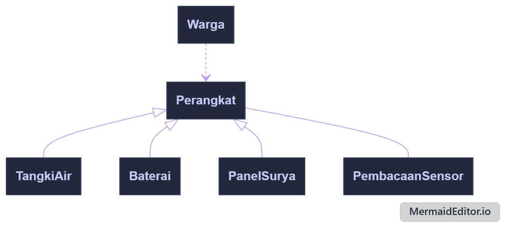

<i>Gambar 2. Diagram Kelas Use Case UC01</i>

 

| ID Kelas | Nama Kelas | Atribut | Metode/Operasi |
| :--- | :--- | :--- | :--- |
| C02 | Warga | idWarga, nama | pantauPemantauan() |
| C07 | Perangkat | idPerangkat, nama | statusTerbaru() (abstrak), pembacaanTerakhir() |
| C08 | TangkiAir | idTangki, volumeLiter, ambangRendah, ambangKritis | statusTerbaru(), statusAir() |
| C09 | Baterai | idBaterai, kapasitasPersen | statusTerbaru(), kapasitas() |
| C10 | PanelSurya | idPanel, dayaWatt | statusTerbaru(), dayaSaatIni() |
| C11 | PembacaanSensor | idPembacaan, nilai, satuan, waktu | catat() |

---

### 4.2.2 Use Case UC02

**Nama Use Case:** *Melihat Tagihan Iuran Final*

#### Identifikasi Kelas

| ID Kelas | Nama Kelas | Deskripsi Kelas |
| :--- | :--- | :--- |
| C02 | Warga | Pemilik tagihan yang melihat rincian iurannya. |
| C17 | Tagihan | Menyimpan data tagihan dan mengetahui status final serta rinciannya sendiri. |
| C14 | Periode | Menyimpan rentang periode tagihan (bulan/tahun). |

#### Diagram Kelas

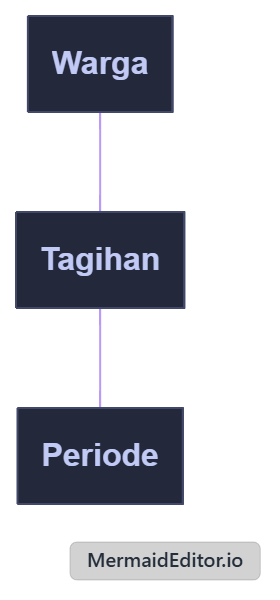

<i>Gambar 3. Diagram Kelas Use Case UC02</i>

 

| ID Kelas | Nama Kelas | Atribut | Metode/Operasi |
| :--- | :--- | :--- | :--- |
| C02 | Warga | idWarga, nama | lihatTagihan() |
| C17 | Tagihan | idTagihan, jumlahIuran, statusFinal, dataPemakaianDasar | sudahFinal(), rincian() |
| C14 | Periode | idPeriode, bulan, tahun | - |

### 4.2.3 Use Case UC03

**Nama Use Case:** *Mengirim Laporan Gangguan*

#### Identifikasi Kelas

| ID Kelas | Nama Kelas | Deskripsi Kelas |
| :--- | :--- | :--- |
| C02 | Warga | Menyimpan data akun warga yang mengirimkan laporan untuk memvalidasi status keanggotaan terdaftar. |
| C20 | LaporanGangguan | Menyimpan formulir laporan gangguan yang dibuat warga (jenis gangguan, deskripsi, foto pendukung) yang otomatis ditetapkan berstatus "Menunggu". |
| C21 | StatusLaporan | Enumerasi yang menyimpan nilai batas status laporan yang valid. |

#### Diagram Kelas

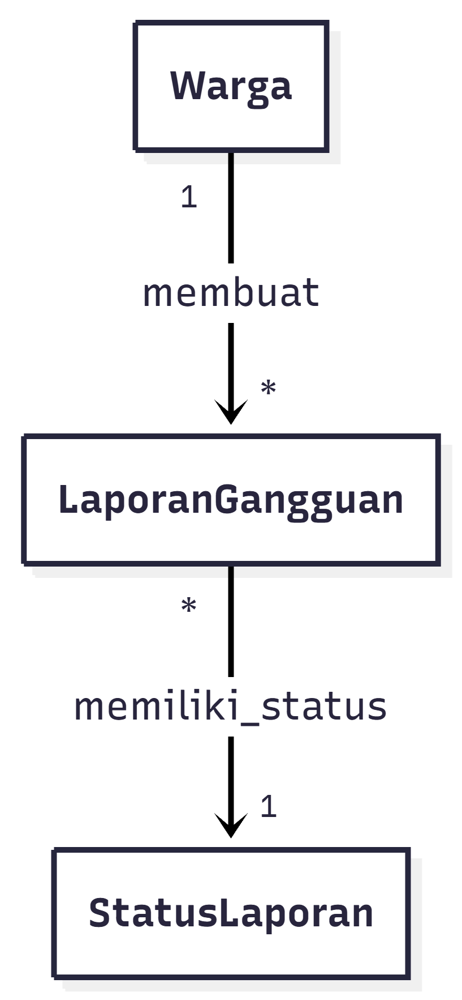

<i>Gambar 4. Diagram Kelas Use Case UC03</i>

 

| ID Kelas | Nama Kelas | Atribut | Metode/Operasi |
| :--- | :--- | :--- | :--- |
| C02 | Warga | idWarga, nama, statusTerdaftar | validasiKeanggotaan(), kirimLaporan() |
| C20 | LaporanGangguan | idLaporan, idWarga, jenisGangguan, deskripsi, fotoPendukung, waktuDibuat, status | setStatusMenunggu(), simpan() |
| C21 | StatusLaporan | MENUNGGU, SEDANG_DIPERBAIKI, SELESAI | - |

### 4.2.4 Use Case UC04

**Nama Use Case:** *Menelusuri Status Laporan Gangguan*

#### Identifikasi Kelas

| ID Kelas | Nama Kelas | Deskripsi Kelas |
| :--- | :--- | :--- |
| C02 | Warga | Aktor yang menelusuri daftar riwayat laporan gangguan berdasarkan identitasnya. |
| C20 | LaporanGangguan | Menyimpan data laporan yang pernah dikirim oleh warga beserta status terkininya untuk ditampilkan pada sistem. |
| C22 | RiwayatStatusLaporan | Menyimpan riwayat perkembangan status laporan gangguan dari waktu ke waktu. |

#### Diagram Kelas

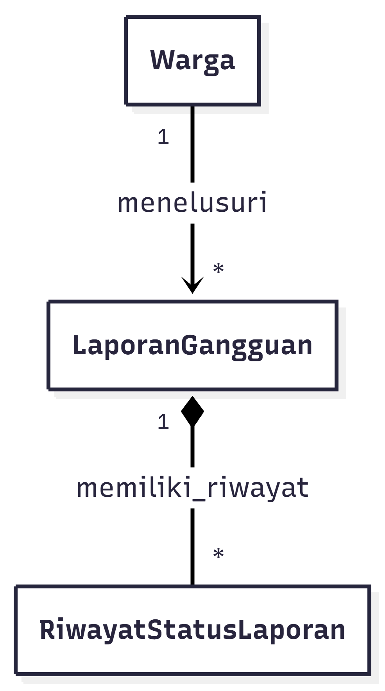

<i>Gambar 5. Diagram Kelas Use Case UC04</i>

 

| ID Kelas | Nama Kelas | Atribut | Metode/Operasi |
| :--- | :--- | :--- | :--- |
| C02 | Warga | idWarga, nama | lihatDaftarLaporan(), pilihLaporan() |
| C20 | LaporanGangguan | idLaporan, idWarga, jenisGangguan, deskripsi, statusLengkap | getLaporanByIdWarga(), getDetailLaporan() |
| C22 | RiwayatStatusLaporan | idRiwayat, idLaporan, status, timestamp | getRiwayatPerkembangan() |

### 4.2.5 Use Case 5

**Nama Use Case:** *Menerima Peringatan Dini Daya Kritis*

#### Identifikasi Kelas

| ID Kelas | Nama Kelas | Deskripsi Kelas |
| :--- | :--- | :--- |
| C03 | Teknisi | Akun teknisi yang bertanggung jawab dan menerima notifikasi. |
| C07 | Perangkat | Perangkat komunal yang dipantau, mis. pompa/tangki/panel. |
| C09 | Baterai | Komponen daya yang kapasitasnya dipantau. |
| C23 | PenugasanPerangkat | Relasi penugasan teknisi terhadap perangkat tertentu. |
| C25 | Notifikasi | Pesan peringatan yang dikirim sistem. |
| C26 | PeringatanDayaKritis | Notifikasi khusus untuk daya baterai di bawah ambang aman. |

#### Diagram Kelas

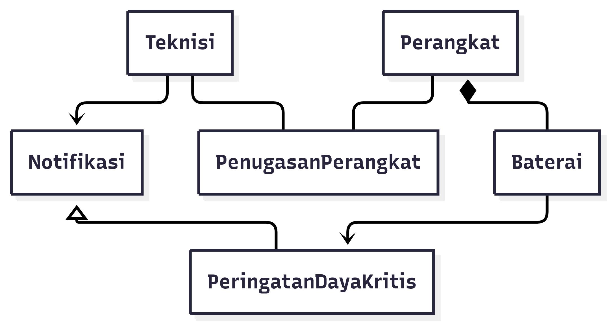

<i>Gambar 6. Diagram Kelas Use Case UC05</i>

 

| ID Kelas | Nama Kelas | Atribut | Metode/Operasi |
| :--- | :--- | :--- | :--- |
| C03 | Teknisi | idTeknisi, nama, kontak | terimaNotifikasi() |
| C07 | Perangkat | idPerangkat, nama, lokasi | - |
| C09 | Baterai | idBaterai, kapasitasPersen, ambangBatasAman | cekKapasitas() |
| C23 | PenugasanPerangkat | idPenugasan, idTeknisi, idPerangkat | verifikasiTanggungJawab() |
| C25 | Notifikasi | idNotifikasi, pesan, waktu, statusBaca | kirim(), tandaiDibaca() |
| C26 | PeringatanDayaKritis | level, kapasitasSaatIni | - |

### 4.2.6 Use Case 6

**Nama Use Case:** *Memantau Riwayat Kinerja Panel Surya*

#### Identifikasi Kelas

| ID Kelas | Nama Kelas | Deskripsi Kelas |
| :--- | :--- | :--- |
| C03 | Teknisi | Pengguna yang memantau riwayat kinerja panel surya. |
| C07 | Perangkat | Kelas umum untuk perangkat yang dipantau. |
| C10 | PanelSurya | Perangkat panel surya yang kinerjanya dianalisis. |
| C12 | DataHistorisKinerja | Data historis kinerja panel surya berdasarkan waktu. |
| C13 | RentangWaktu | Nilai rentang waktu yang dipilih teknisi. |

#### Diagram Kelas

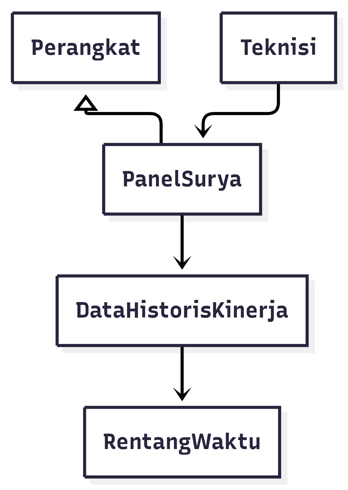

<i>Gambar 7. Diagram Kelas Use Case UC06</i>

 

| ID Kelas | Nama Kelas | Atribut | Metode/Operasi |
| :--- | :--- | :--- | :--- |
| C03 | Teknisi | idTeknisi, nama | pilihRentangWaktu(), lihatRiwayatKinerja() |
| C07 | Perangkat | idPerangkat, nama, tipe | - |
| C10 | PanelSurya | idPanel, kapasitas, lokasi | getDataKinerja() |
| C12 | DataHistorisKinerja | idData, waktu, dayaDihasilkan, energi | ambilBerdasarkanRentang() |
| C13 | RentangWaktu | waktuMulai, waktuSelesai | validasi() |

### 4.2.7 Use Case 7

**Nama Use Case:** *Memperbarui Status Penanganan Gangguan  *

#### Identifikasi Kelas

| ID Kelas | Nama Kelas | Deskripsi Kelas |
| :--- | :--- | :--- |
| C03 | Teknisi | Teknisi yang berwenang mengubah status laporan. |
| C20 | LaporanGangguan | Laporan gangguan yang ditangani. |
| C24 | PenugasanLaporan | Relasi penugasan teknisi terhadap laporan tertentu. |
| C22 | RiwayatStatusLaporan | Riwayat perubahan status beserta timestamp. |
| C21 | StatusLaporan | Enumerasi status laporan yang valid. |

#### Diagram Kelas

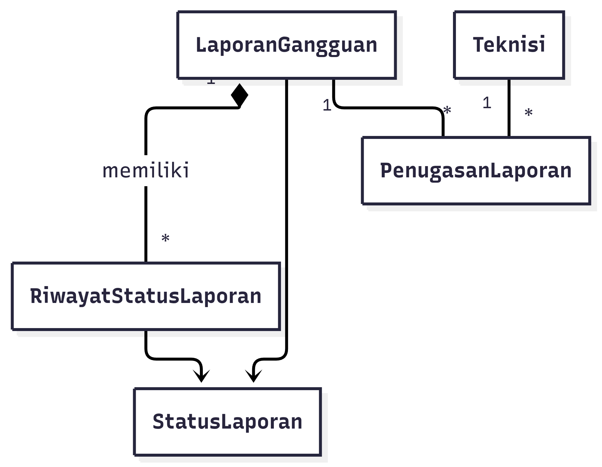

<i>Gambar 8. Diagram Kelas Use Case UC07</i>

 

| ID Kelas | Nama Kelas | Atribut | Metode/Operasi |
| :--- | :--- | :--- | :--- |
| C03 | Teknisi | idTeknisi, nama | ubahStatusLaporan() |
| C20 | LaporanGangguan | idLaporan, jenisGangguan, deskripsi, status, waktuDibuat | ubahStatus() |
| C24 | PenugasanLaporan | idPenugasan, idTeknisi, idLaporan, waktuPenugasan | verifikasi() |
| C22 | RiwayatStatusLaporan | idRiwayat, status, timestamp | catat() |
| C21 | StatusLaporan | MENUNGGU, SEDANG_DIPERBAIKI, SELESAI | - |

### 4.2.8 Use Case UC08

**Nama Use Case:** *Mencatat Kegiatan Pemeliharaan*

#### Identifikasi Kelas

| ID Kelas | Nama Kelas | Deskripsi Kelas |
| :--- | :--- | :--- |
| C03 | Teknisi | Akun petugas yang melakukan pengisian formulir pencatatan pemeliharaan. |
| C27 | CatatanPemeliharaan | Entri log yang menyimpan rincian perawatan fisik alat (waktu pelaksanaan, tindakan, catatan hasil). |
| C07 | Perangkat | Menyimpan detail alat komunal yang sedang dicatat riwayat perbaikannya oleh teknisi. |

#### Diagram Kelas

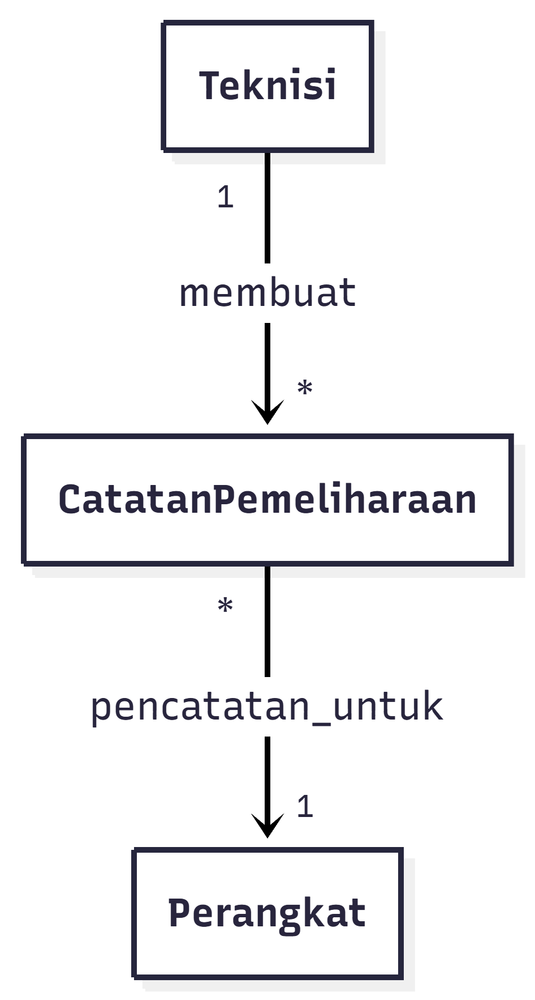

<i>Gambar 9. Diagram Kelas Use Case UC08</i>

 

| ID Kelas | Nama Kelas | Atribut | Metode/Operasi |
| :--- | :--- | :--- | :--- |
| C03 | Teknisi | idTeknisi, nama | buatCatatanPemeliharaan() |
| C27 | CatatanPemeliharaan | idCatatan, idTeknisi, idPerangkat, waktuPelaksanaan, tindakan, catatanHasil | validasiFormulir(), simpan() |
| C07 | Perangkat | idPerangkat, namaPerangkat, lokasi | getRiwayatPemeliharaan() |

### 4.2.9 Use Case UC09

**Nama Use Case:** *Menganalisis Pemakaian Komunal*

#### Identifikasi Kelas

| ID Kelas | Nama Kelas | Deskripsi Kelas |
| :--- | :--- | :--- |
| C04 | Pengurus | Pengguna yang berwenang mengakses dashboard administratif dan melihat analitik pemakaian komunal. |
| C14 | Periode | Merepresentasikan periode yang dipilih untuk mengelompokkan dan membandingkan data pemakaian. |
| C15 | DataPemakaian | Menyimpan data pemakaian air atau energi yang dapat dikelompokkan dan dianalisis berdasarkan periode. |

#### Diagram Kelas

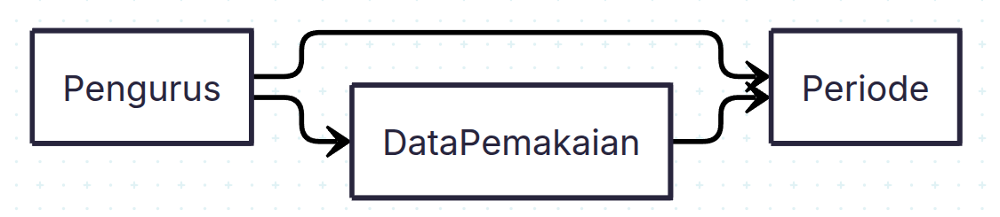

<i>Gambar 10. Diagram Kelas Use Case UC09</i>

 

| ID Kelas | Nama Kelas | Atribut | Metode/Operasi |
| :--- | :--- | :--- | :--- |
| C04 | Pengurus | idPengurus, nama | verifikasiKewenangan() |
| C14 | Periode | idPeriode, bulan, tahun | - |
| C15 | DataPemakaian | idPemakaian, idWarga, volumeAirM3, energiKWh, waktuCatat | isLengkap() |

### 4.2.10 Use Case 10 — Menghitung dan Menetapkan Iuran Warga *(Rafiandhi)*

**Nama Use Case:** *Menghitung dan Menetapkan Iuran Warga* — Aktor: **Pengurus** — KF: KF25, KF26, KF27, KF28, KF33 — Relasi: `<<include>> UC09`, `<<extend>> UC02`

**Ringkasan skenario (dari 3.4.10):** Pengurus memilih periode → sistem mengambil DataPemakaian & menghitung otomatis dengan AturanTarif yang sama untuk semua warga → pratinjau ditampilkan → Pengurus menekan Tetapkan Final → verifikasi kewenangan → status Periode/Tagihan menjadi FINAL. Alternatif: pengurus tidak berwenang (ditolak) dan data pemakaian belum lengkap (peringatan).

#### Identifikasi Kelas — UC10 (Rafiandhi)

| ID Kelas | Nama Kelas | Deskripsi Kelas |
| :--- | :--- | :--- |
| C04 | Pengurus | Aktor pengurus yang memilih periode, meninjau hasil, dan menetapkan final; memverifikasi kewenangannya sendiri. |
| C14 | Periode | Periode tagihan (bulan, tahun) dengan statusFinal; menjadi konteks perhitungan dan finalisasi. |
| C15 | DataPemakaian | Pemakaian air (m³) & energi (kWh) per warga per periode; sumber utama perhitungan. |
| C16 | AturanTarif | Tarif/aturan perhitungan tunggal per periode (tarifAirPerM3, tarifEnergiPerKWh, biayaTetap) — menjamin KF28. |
| C17 | Tagihan | Hasil perhitungan iuran per warga (jumlahIuran, dataPemakaianDasar, status); mengetahui sudahFinal() & rincian() sendiri. |
| C19 | KalkulatorIuran | Domain service yang menghitung otomatis, memvalidasi kelengkapan & kewenangan, dan menetapkan final. |
| C18 | StatusTagihan | Enumerasi status tagihan: DRAFT, FINAL. |
| C02 | Warga | Warga pemilik Tagihan (asosiasi Tagihan→Warga, DataPemakaian→Warga). |

> Pemetaan global: C10-01→C04, C10-02→C14, C10-03→C15, C10-04→C16, C10-05→C17, C10-06→C19, C10-07→C18, C10-08→C02.

#### Diagram Kelas — UC10

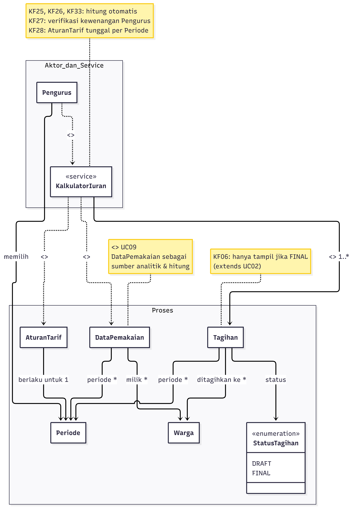

<i>Gambar 11. Diagram Kelas Use Case UC10 — Menghitung & Menetapkan Iuran </i>

 

| ID Kelas | Nama Kelas | Atribut | Metode/Operasi |
| :--- | :--- | :--- | :--- |
| C04 | Pengurus | idPengurus, nama, email | pilihPeriode(bulan, tahun): Periode, hitungIuran(periode: Periode): List<Tagihan>, tinjauHasil(daftar), tetapkanFinal(periode: Periode), verifikasiKewenangan(): boolean |
| C14 | Periode | idPeriode, bulan, tahun, statusFinal: boolean | isFinal(): boolean, tandaiFinal(): void |
| C15 | DataPemakaian | idPemakaian, idWarga, volumeAirM3, energiKWh, waktuCatat | isLengkap(): boolean |
| C16 | AturanTarif | idAturan, tarifAirPerM3, tarifEnergiPerKWh, biayaTetap, periodeId | terapkan(volume, energi): double, isValidUntukPeriode(p: Periode): boolean |
| C17 | Tagihan | idTagihan, idWarga, idPeriode, jumlahIuran, dataPemakaianDasar, status: StatusTagihan | hitungTotal(tarif, pemakaian): double, sudahFinal(): boolean, rincian(): String, tetapkanFinal(): void |
| C19 | KalkulatorIuran | — (service stateless) | hitung(periode): List<Tagihan>, pratinjau(periode): List<Tagihan>, validasiKelengkapan(periode): boolean, validasiKewenangan(pengurus): boolean, tetapkanFinal(periode, pengurus): void |
| C18 | StatusTagihan | DRAFT, FINAL | — |
| C02 | Warga | idWarga, nama | lihatTagihan(): Tagihan |

### 4.2.11 Use Case UC11

**Nama Use Case:** *Membuat Rekapitulasi Pemakaian dan Iuran*

#### Identifikasi Kelas

| ID Kelas | Nama Kelas | Deskripsi Kelas |
| :--- | :--- | :--- |
| C04 | Pengurus | Pengguna berwenang yang memilih periode dan membuat rekapitulasi administratif. |
| C14 | Periode | Merepresentasikan periode pemakaian dan iuran yang akan direkapitulasi. |
| C15 | DataPemakaian | Menyimpan data pemakaian air atau energi beserta status finalnya. |
| C17 | Tagihan | Menyimpan data iuran warga beserta status final untuk periode terkait. |
| C28 | Rekapitulasi | Merepresentasikan rekapitulasi pemakaian dan iuran yang dapat dihasilkan, diekspor, atau dicetak. |

#### Diagram Kelas

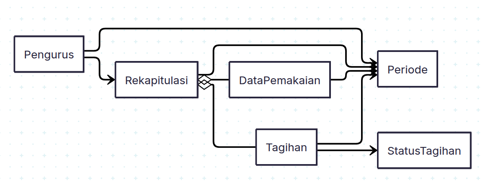

<i>Gambar 12. Diagram Kelas Use Case UC11</i>

 

| ID Kelas | Nama Kelas | Atribut | Metode/Operasi |
| :--- | :--- | :--- | :--- |
| C04 | Pengurus | idPengurus, nama | verifikasiKewenangan(), buatRekapitulasi() |
| C14 | Periode | idPeriode, bulan, tahun, statusFinal | isFinal() |
| C15 | DataPemakaian | idPemakaian, idWarga, volumeAirM3, energiKWh, waktuCatat | isLengkap() |
| C17 | Tagihan | idTagihan, idWarga, idPeriode, jumlahIuran, dataPemakaianDasar, status | sudahFinal(), rincian() |
| C18 | StatusTagihan | DRAFT, FINAL | - |
| C28 | Rekapitulasi | idRekap, idPeriode, totalPemakaianAir, totalPemakaianEnergi, totalIuran | generate(periode), ekspor(), cetak() |

### 4.2.12 Use Case UC12

**Nama Use Case:** *Melakukan Registrasi Akun*

#### Identifikasi Kelas

| ID Kelas | Nama Kelas | Deskripsi Kelas |
| :--- | :--- | :--- |
| C05 | CalonPengguna | Pendaftar yang mengisi data diri dan pilihan peran sebelum akun dibuat. |
| C01 | Akun | Superkelas abstrak yang menyimpan identitas dan status persetujuan akun. |
| C02 | Warga | Bentuk khusus akun untuk peran warga. |
| C03 | Teknisi | Bentuk khusus akun untuk peran teknisi. |
| C04 | Pengurus | Bentuk khusus akun untuk peran pengurus. |
| C06 | StatusAkun | Enumerasi status persetujuan akun yang valid. |

#### Diagram Kelas

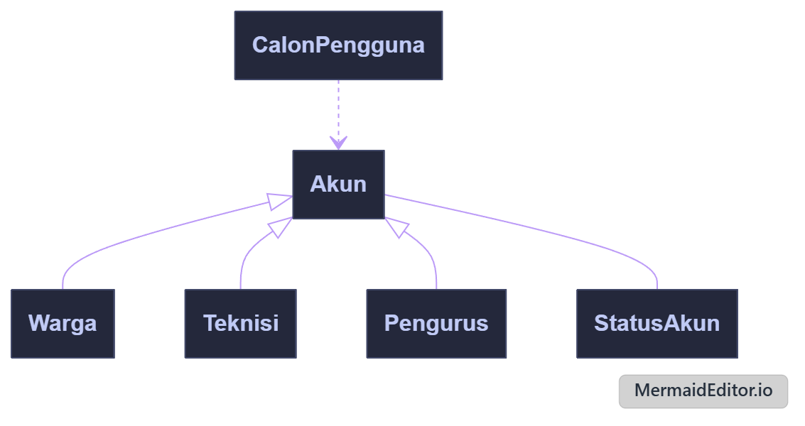

<i>Gambar 13. Diagram Kelas Use Case UC12</i>

 

| ID Kelas | Nama Kelas | Atribut | Metode/Operasi |
| :--- | :--- | :--- | :--- |
| C05 | CalonPengguna | nama, email, password, peranPilihan | daftarkan() |
| C01 | Akun | email, password, nama, statusAkun | statusAkun() |
| C02 | Warga | idWarga, nama | - |
| C03 | Teknisi | idTeknisi, nama | - |
| C04 | Pengurus | idPengurus, nama | - |
| C06 | StatusAkun | status | - |

---

### 4.2.13 Use Case UC13

**Nama Use Case:** *Melakukan Login Akun*

#### Identifikasi Kelas

| ID Kelas | Nama Kelas | Deskripsi Kelas |
| :--- | :--- | :--- |
| C01 | Akun | Superkelas abstrak yang memverifikasi kredensial dan statusnya sendiri. |
| C02 | Warga | Bentuk khusus akun warga; menjawab dashboard tujuan sendiri. |
| C03 | Teknisi | Bentuk khusus akun teknisi; menjawab dashboard tujuan sendiri. |
| C04 | Pengurus | Bentuk khusus akun pengurus; menjawab dashboard tujuan sendiri. |
| C06 | StatusAkun | Enumerasi status persetujuan akun yang valid. |

#### Diagram Kelas

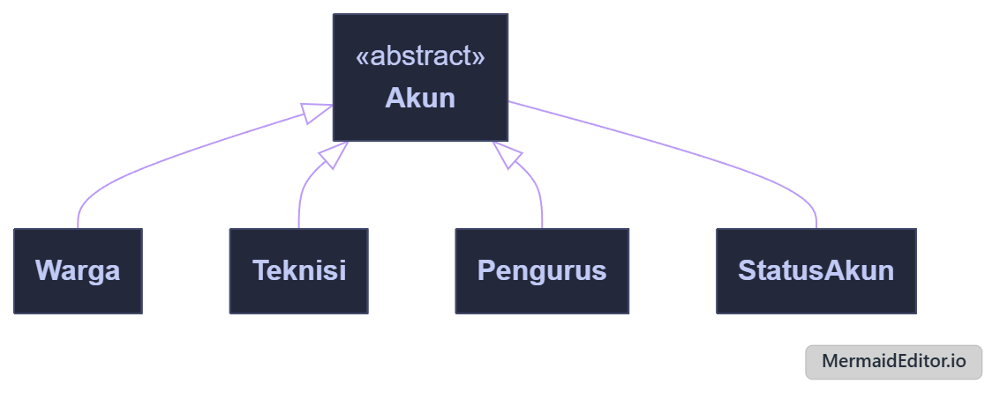

<i>Gambar 14. Diagram Kelas Use Case UC13</i>

 

| ID Kelas | Nama Kelas | Atribut | Metode/Operasi |
| :--- | :--- | :--- | :--- |
| C01 | Akun | email, password, statusAkun | cocokKredensial(email, password), sudahDisetujui(), dashboardTujuan() |
| C02 | Warga | idWarga, nama | dashboardTujuan() |
| C03 | Teknisi | idTeknisi, nama | dashboardTujuan() |
| C04 | Pengurus | idPengurus, nama | dashboardTujuan() |
| C06 | StatusAkun | status | - |

### 4.2.14 Use Case UC14

**Nama Use Case:** *Mengelola Persetujuan Akun*

#### Identifikasi Kelas

| ID Kelas | Nama Kelas | Deskripsi Kelas |
| :--- | :--- | :--- |
| C01 | Akun | Menyimpan identitas pengguna dan status persetujuan akun yang dapat diperbarui setelah proses peninjauan. |
| C04 | Pengurus | Bentuk khusus akun yang berwenang meninjau serta menyetujui atau menolak akun yang menunggu persetujuan. |
| C06 | StatusAkun | Merepresentasikan status persetujuan akun, seperti Menunggu Persetujuan, Disetujui, atau Ditolak. |

#### Diagram Kelas

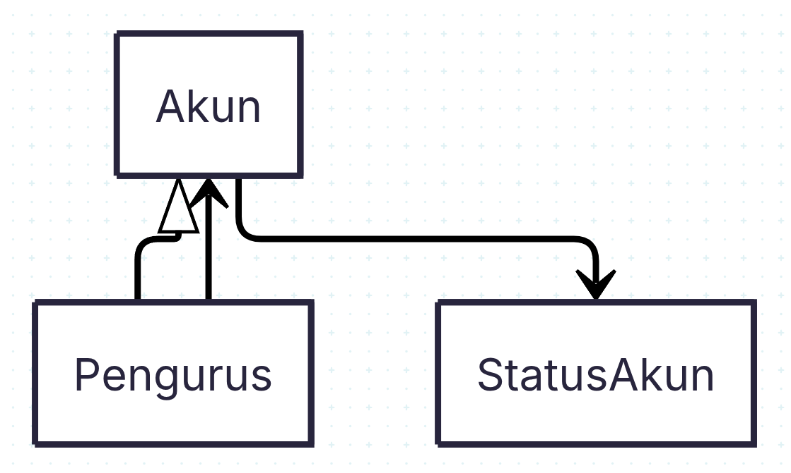

<i>Gambar 15. Diagram Kelas Use Case UC14</i>

 

| ID Kelas | Nama Kelas | Atribut | Metode/Operasi |
| :--- | :--- | :--- | :--- |
| C01 | Akun | email, password, nama, statusAkun | ubahStatus() |
| C04 | Pengurus | idPengurus, nama | lihatAkunMenunggu(), setujuiAkun(), tolakAkun() |
| C06 | StatusAkun | MENUNGGU, DISETUJUI, DITOLAK | - |

---

## 4.3 Diagram Kelas Keseluruhan 

<i>Gambar 16. Diagram Kelas Keseluruhan Fajar Tech (28 kelas, 14 UC terintegrasi)</i>

 

| ID Kelas | Nama Kelas | Atribut | Metode/Operasi |
| :--- | :--- | :--- | :--- |
| C01 | Akun | email, password, nama, statusAkun | cocokKredensial(email, password), sudahDisetujui(), dashboardTujuan() {abstract} |
| C02 | Warga | idWarga, nama | pantauPemantauan(), lihatTagihan(), lihatRiwayatLaporan() |
| C03 | Teknisi | idTeknisi, nama, kontak | terimaNotifikasi(), ubahStatusLaporan(), pilihRentangWaktu() |
| C04 | Pengurus | idPengurus, nama | verifikasiKewenangan(), hitungIuran(periode), tetapkanFinal(periode), buatRekapitulasi() |
| C05 | CalonPengguna | nama, email, password, peranPilihan | daftarkan(): Akun |
| C06 | StatusAkun | MENUNGGU, DISETUJUI, DITOLAK | — |
| C07 | Perangkat | idPerangkat, nama, lokasi | statusTerbaru() {abstract}, pembacaanTerakhir() |
| C08 | TangkiAir | idTangki, volumeLiter, ambangRendah, ambangKritis | statusAir(), statusTerbaru() |
| C09 | Baterai | idBaterai, kapasitasPersen, ambangBatasAman | cekKapasitas(), kapasitas() |
| C10 | PanelSurya | idPanel, dayaWatt, kapasitas, lokasi | dayaSaatIni(), getDataKinerja() |
| C11 | PembacaanSensor | idPembacaan, nilai, satuan, waktu | catat() |
| C12 | DataHistorisKinerja | idData, waktu, dayaDihasilkan, energi | ambilBerdasarkanRentang(r: RentangWaktu) |
| C13 | RentangWaktu | waktuMulai, waktuSelesai | validasi() |
| C14 | Periode | idPeriode, bulan, tahun, statusFinal | isFinal(), tandaiFinal() |
| C15 | DataPemakaian | idPemakaian, idWarga, volumeAirM3, energiKWh, waktuCatat | isLengkap() |
| C16 | AturanTarif | idAturan, tarifAirPerM3, tarifEnergiPerKWh, biayaTetap, periodeId | terapkan(volume, energi), isValidUntukPeriode() |
| C17 | Tagihan | idTagihan, idWarga, idPeriode, jumlahIuran, dataPemakaianDasar, status | hitungTotal(), sudahFinal(), rincian(), tetapkanFinal() |
| C18 | StatusTagihan | DRAFT, FINAL | — |
| C19 | KalkulatorIuran | — (service) | hitung(periode), pratinjau(periode), validasiKelengkapan(), validasiKewenangan(), tetapkanFinal() |
| C20 | LaporanGangguan | idLaporan, jenisGangguan, deskripsi, status, waktuDibuat | ubahStatus(s), simpan() |
| C21 | StatusLaporan | MENUNGGU, SEDANG_DIPERBAIKI, SELESAI | — |
| C22 | RiwayatStatusLaporan | idRiwayat, status, timestamp | catat() |
| C23 | PenugasanPerangkat | idPenugasan, idTeknisi, idPerangkat | verifikasiTanggungJawab() |
| C24 | PenugasanLaporan | idPenugasan, idTeknisi, idLaporan, waktuPenugasan | verifikasi() |
| C25 | Notifikasi | idNotifikasi, pesan, waktu, statusBaca | kirim(), tandaiDibaca() |
| C26 | PeringatanDayaKritis | level, kapasitasSaatIni | — (inherit kirim()) |
| C27 | CatatanPemeliharaan | idCatatan, waktuPelaksanaan, tindakan, catatanHasil | simpan(), validasi() |
| C28 | Rekapitulasi | idRekap, idPeriode, totalPemakaianAir, totalPemakaianEnergi, totalIuran | generate(periode), ekspor(), cetak() |

# BAB 5: Traceability
Cocokkan setiap kebutuhan fungsional, use case, dengan diagram kelas yang mendukung atau mengimplementasikan kebutuhan tersebut.

| ID Kelas | ID Use Case | ID KF |
| :--- | :--- | :--- |
| *C01* | *UC12, UC13, UC14* | *KF09, KF14, KF18, KF23, KF27* |
| *C02* | *UC01, UC02, UC03, UC04* | *KF01, KF02, KF03, KF04, KF05, KF06, KF07, KF08, KF09, KF10, KF11, KF34* |
| *C03* | *UC05, UC06, UC07, UC08* | *KF12, KF13, KF14, KF15, KF16, KF17, KF18, KF19, KF20, KF21, KF35* |
| *C04* | *UC09, UC10, UC11, UC14* | *KF22, KF23, KF24, KF25, KF26, KF27, KF28, KF29, KF30, KF31, KF32, KF33* |
| *C05* | *UC12* | *KF09, KF14* |
| *C06* | *UC12, UC13, UC14* | *KF09, KF14, KF18, KF23, KF27* |
| *C07* | *UC01, UC05, UC06, UC08* | *KF01, KF02, KF03, KF04, KF13, KF14, KF15, KF16, KF20, KF21* |
| *C08* | *UC01* | *KF01, KF02, KF03, KF04* |
| *C09* | *UC01, UC05* | *KF01, KF02, KF03, KF04, KF13, KF14* |
| *C10* | *UC01, UC06* | *KF01, KF02, KF03, KF04, KF15, KF16* |
| *C11* | *UC01* | *KF01, KF02, KF03, KF04* |
| *C12* | *UC06* | *KF15, KF16* |
| *C13* | *UC06* | *KF15, KF16* |
| *C14* | *UC02, UC09, UC10, UC11* | *KF05, KF06, KF22, KF23, KF24, KF25, KF26, KF27, KF28, KF29, KF30, KF31, KF32, KF33* |
| *C15* | *UC09, UC10, UC11* | *KF22, KF23, KF24, KF25, KF26, KF27, KF28, KF29, KF30, KF31, KF32, KF33* |
| *C16* | *UC10* | *KF25, KF26, KF27, KF28, KF33* |
| *C17* | *UC02, UC10* | *KF05, KF06, KF25, KF26, KF27, KF28, KF33* |
| *C18* | *UC02, UC10, UC11* | *KF05, KF06, KF25, KF26, KF27, KF28, KF29, KF30, KF31, KF32, KF33* |
| *C19* | *UC10* | *KF25, KF26, KF27, KF28, KF33* |
| *C20* | *UC03, UC04, UC07* | *KF07, KF08, KF09, KF10, KF11, KF12, KF17, KF18, KF19, KF34, KF35* |
| *C21* | *UC03, UC04, UC07* | *KF07, KF08, KF09, KF10, KF11, KF12, KF17, KF18, KF19, KF34, KF35* |
| *C22* | *UC04, UC07* | *KF11, KF12, KF17, KF18, KF19, KF34, KF35* |
| *C23* | *UC05* | *KF13, KF14* |
| *C24* | *UC07* | *KF12, KF17, KF18, KF19, KF35* |
| *C25* | *UC05* | *KF13, KF14* |
| *C26* | *UC05* | *KF13, KF14* |
| *C27* | *UC08* | *KF20, KF21* |
| *C28* | *UC11* | *KF29, KF30, KF31, KF32* |

---

# Referensi

- Diagram UML: [https://drive.google.com/file/d/1dWHSIYX9YLLHwaWSedQTZqx9cc3SbARq/view?usp=sharing](https://www.drawio./), [https://staruml.io/](https://staruml.io/)
- Use Case Diagram [Use Case Diagram](https://drive.google.com/file/d/1dWHSIYX9YLLHwaWSedQTZqx9cc3SbARq/view?usp=sharing)