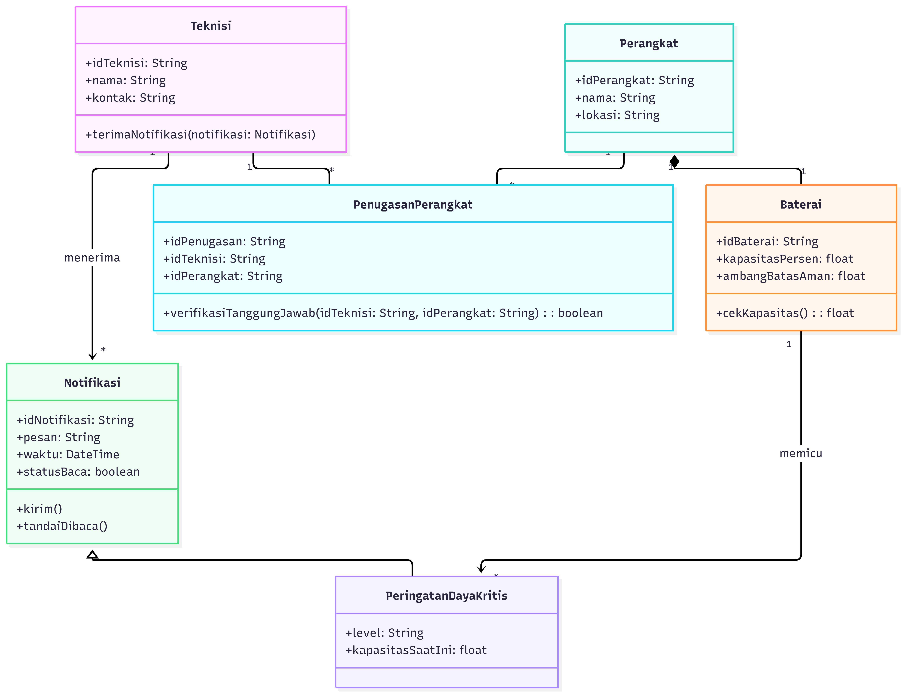
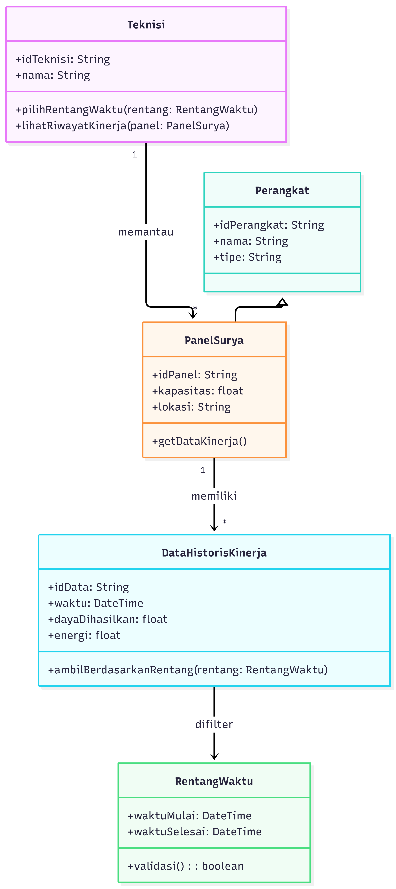
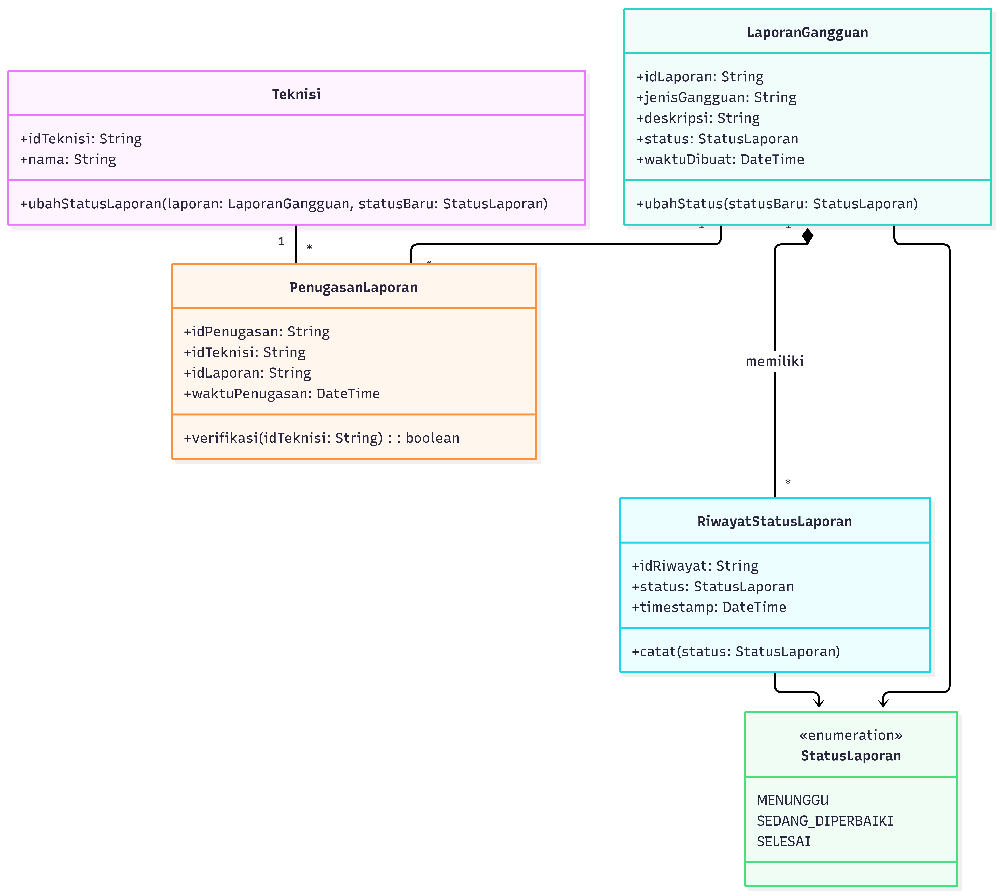

<h1>
IF2150 REKAYASA PERANGKAT LUNAK
 
TUGAS 4
 
CLASS DIAGRAM
</h1>
 

## *FAJAR TECH*

### Untuk: *Tigress / Agatha*

Dipersiapkan oleh:
| Informasi | Keterangan |
| --- | --- |
| Kelas | K-3 |
| Kelompok | 10  |

| NIM | Nama |
| --- | --- |
| *13525054* | *Raffi Fauzi Hermawan* |
| *13525030* | *Rionaldo Casey Pandhitha* |
| *13525129* | *Andro Irsa Syafiq* |
| *13525078* | *Muhammad Faiz Ramadhan* |
| *13525006* | *Muhammad Rafiandhi Suryadinata* |
---

## Daftar Perubahan

| Revisi | Deskripsi |
| :--- | :--- |
| *A* | *Deskripsikan perubahan yang dilakukan dari dokumen sebelumnya pada dokumen ini. Jika tidak terdapat perubahan, harap kosongkan tabel.* |
| *B* |  |
| *C* |  |

 
 

# BAB 1: Deskripsi Perangkat Lunak

Tuliskan overview perangkat lunak dalam narasi yang dapat memberikan gambaran tentang konteks perangkat lunak aplikasi Anda.

Pada bagian ini, Anda diperbolehkan untuk menyalin dari dokumen sebelumnya.

---

# BAB 2: Kebutuhan Fungsional

## 2.1 Kebutuhan Fungsional

Salin ulang seluruh Kebutuhan Fungsional (KF) yang telah dirumuskan pada dokumen sebelumnya, lengkap dengan ID KF, ID Kebutuhan (mengacu ke ID pada tabel Pemetaan Kebutuhan di dokumen *Requirement Gathering*), dan penjelasannya.

Pada bagian ini, Anda diperbolehkan untuk menyalin dari dokumen sebelumnya.

 ***Catatan***: *Kebutuhan ditulis mengikuti pola EARS. Pada contoh di bawah, sebagian besar KF dipicu oleh satu aksi pelanggan, sehingga memakai pola event-driven "Ketika ⟨pemicu⟩, sistem harus ⟨respons⟩".*

Tabel 2.1. Daftar Kebutuhan Fungsional

| ID KF | ID Kebutuhan | Penjelasan |
| :--- | :--- | :--- |
| *KF01* | *R01* | *Ketika pelanggan membuka halaman katalog, sistem harus menampilkan daftar produk yang tersedia.* |
| *KF02* | *R02* | *Ketika pelanggan memilih "Tambah ke Keranjang" pada suatu produk, sistem harus menyimpan produk tersebut ke dalam keranjang pelanggan.* |
| *KF03* | *R03* | *Ketika pelanggan menekan tombol checkout, sistem harus menampilkan pilihan metode pembayaran yang tersedia.* |
| *KF04* | *R04* | *Ketika pelanggan memilih metode pembayaran, sistem harus mengirimkan permintaan otorisasi beserta nominal tagihan dan ID pesanan ke payment gateway (dummy).* |
| *KF05* | *R04* | *Ketika payment gateway (dummy) mengembalikan status pembayaran berhasil, sistem harus memperbarui status pesanan menjadi "Lunas" dan menampilkan notifikasi pembayaran berhasil.* |
| *KF06* | *R05* | *Ketika pelanggan membuka menu riwayat pesanan, sistem harus menampilkan daftar pesanan beserta statusnya.* |
| *KFXX* | *...* | *...* |

---

# BAB 3: Model Use Case

## 3.1 Identifikasi Aktor

Tuliskan kembali daftar aktor yang terlibat dan deskripsi perannya dalam perangkat lunak (P/L). Deskripsi peran harus menjelaskan wewenang aktor tersebut dalam perangkat lunak. Perlu diingat bahwa aktor yang dimaksud adalah pengguna yang berinteraksi langsung dengan P/L. Komponen seperti database, payment gateway, atau library bukan aktor.

Pada bagian ini, Anda diperbolehkan untuk menyalin dari dokumen sebelumnya.

| Aktor | Deskripsi |
| :--- | :--- |
| *Pelanggan* | *Pengguna yang memesan produk, mengelola keranjang, dan menyelesaikan pembayaran melalui sistem.* |
| *...* | *...* |

## 3.2 Identifikasi Use Case

Use case berfungsi untuk mendeskripsikan interaksi aktor-aktor yang terlibat dengan sistem. Isi daftar use case dan deskripsi singkatnya dalam tabel di bawah.

Pada bagian ini, Anda diperbolehkan untuk menyalin dari dokumen sebelumnya.

| ID UC | Nama Use Case | Deskripsi Singkat | Aktor | ID KF |
| :--- | :--- | :--- | :--- | :--- |
| *UC01* | *Memesan Produk* | *Pelanggan memilih produk hingga pesanan tersimpan di sistem.* | *Pelanggan* | *KF01, KF02* |
| *UC02* | *Melihat Keranjang* | *Pelanggan melihat daftar item yang telah dipilih sebelum checkout.* | *Pelanggan* | *KF02* |
| *UC03* | *Melakukan Pembayaran* | *Pelanggan menyelesaikan pembayaran atas pesanan yang dibuat.* | *Pelanggan* | *KF03, KF04, KF05* |
| *UC04* | *Memilih Metode Pembayaran* | *Pelanggan memilih metode pembayaran alternatif (kartu atau e-wallet).* | *Pelanggan* | *KF03* |
| *UC05* | *Melihat Riwayat Pesanan* | *Pelanggan melihat daftar pesanan yang pernah dibuat beserta statusnya.* | *Pelanggan* | *KF06* |
| *...* | *...* | *...* | *...* | *...* |

## 3.3 Use Case Diagram
Buatlah diagram use case keseluruhan berdasarkan identifikasi use case beserta aktor yang melakukan use case tersebut. Perhatikan garis `<<extend>>` dan `<<include>>`.

Pada bagian ini, Anda diperbolehkan untuk menyalin dari dokumen sebelumnya.

 

<i>Gambar 1. Use Case Diagram</i>

 

## 3.4 Skenario Use Case
Salin ulang skenario **setiap** use case (skenario normal dan alternatif) dari dokumen *Use Case & Scenario Use Case*. Skenario ini menjadi dasar penentuan atribut dan metode/operasi kelas pada BAB 4.

Pada bagian ini, Anda diperbolehkan untuk menyalin dari dokumen sebelumnya.

### 3.4.1 Skenario UC01

**Nama Use Case:** *Memesan Produk*

**Skenario Normal**

| No | Aksi Aktor | Reaksi Perangkat Lunak |
| :--- | :--- | :--- |
| 1 | *Pelanggan memilih produk dari katalog* | *Sistem menampilkan detail produk dan menambahkannya ke keranjang* |
| 2 | *Pelanggan menekan tombol checkout* | *Sistem membuat pesanan baru dari isi keranjang dan menampilkan ringkasan pesanan* |
| ... | *...* | *...* |

**Skenario Alternatif 1: Produk Tidak Tersedia**

| No | Aksi Aktor | Reaksi Perangkat Lunak |
| :--- | :--- | :--- |
| 1 | *Pelanggan memilih produk dari katalog* | *Sistem menampilkan pesan "Produk tidak tersedia" karena stok habis* |
| 2 | *Pelanggan memilih produk lain* | *Sistem kembali ke langkah 1 skenario normal* |
| ... | *...* | *...* |

### 3.4.3 Skenario UC03

**Nama Use Case:** *Melakukan Pembayaran*

**Skenario Normal**

| No | Aksi Aktor | Reaksi Perangkat Lunak |
| :--- | :--- | :--- |
| 1 | *Pelanggan menekan tombol "Bayar" pada ringkasan pesanan* | *Sistem menampilkan pilihan metode pembayaran yang tersedia (mis. Kartu, E-Wallet)* |
| 2 | *Pelanggan memilih salah satu metode pembayaran* | *Sistem mengirimkan permintaan otorisasi ke payment gateway (dummy) sesuai metode yang dipilih* |
| 3 | *-* | *Payment gateway (dummy) mengembalikan status pembayaran berhasil; sistem memperbarui status pesanan menjadi "Lunas" dan menampilkan notifikasi pembayaran berhasil* |
| ... | *...* | *...* |

**Skenario Alternatif 1: Pembayaran Dummy Gagal**

| No | Aksi Aktor | Reaksi Perangkat Lunak |
| :--- | :--- | :--- |
| 1 | *Pelanggan menekan tombol "Bayar" pada ringkasan pesanan* | *Sistem menampilkan pilihan metode pembayaran yang tersedia* |
| 2 | *Pelanggan memilih salah satu metode pembayaran* | *Sistem mengirimkan permintaan otorisasi ke payment gateway (dummy), yang mengembalikan status gagal (mis. saldo e-wallet dummy tidak mencukupi)* |
| 3 | *Pelanggan memilih untuk mencoba lagi atau memilih metode lain* | *Sistem kembali ke langkah 1 skenario normal* |
| ... | *...* | *...* |

*Lanjutkan pola 3.4.x ini untuk setiap ID UC pada 3.2, sampai seluruh use case tercakup.*

---

# BAB 4: Diagram Kelas
Bagian ini berisi identifikasi kelas dan pemodelan struktur kelas yang diperlukan untuk merealisasikan use case pada BAB 3. Gunakan skenario use case (3.4) sebagai dasar untuk menentukan kelas, atribut, metode, dan hubungan antarkelas.

## 4.1 Identifikasi Kelas (Keseluruhan - Rafiandhi)
Identifikasi seluruh kelas yang diperlukan berdasarkan use case dan skenarionya. Satu kelas boleh terkait dengan lebih dari satu use case. Tabel ini adalah hasil integrasi tanpa duplikasi dari seluruh diagram per-UC (4.2.1–4.2.14).

| ID Kelas | Nama Kelas | Deskripsi Kelas | ID Use Case |
| :--- | :--- | :--- | :--- |
| C01 | Akun | Superkelas abstrak akun sistem; menyimpan kredensial dan status persetujuan, menentukan dashboard tujuan via late binding. | UC12, UC13, UC14 |
| C02 | Warga | Akun warga; memantau air/energi, melihat tagihan final, mengirim & menelusuri laporan. | UC01, UC02, UC03, UC04 |
| C03 | Teknisi | Akun teknisi; menerima peringatan daya kritis, memantau panel, update status & catat pemeliharaan. | UC05, UC06, UC07, UC08 |
| C04 | Pengurus | Akun pengurus; menganalisis pemakaian komunal, menghitung/menetapkan iuran, rekapitulasi, approval akun. | UC09, UC10, UC11, UC14 |
| C05 | CalonPengguna | Data pendaftaran sebelum menjadi Akun; menyimpan nama, email, password, peran pilihan. | UC12 |
| C06 | StatusAkun | Enumerasi status persetujuan akun: MENUNGGU, DISETUJUI, DITOLAK. | UC12, UC13, UC14 |
| C07 | Perangkat | Superkelas abstrak perangkat komunal; mendefinisikan statusTerbaru() dan pembacaanTerakhir(). | UC01, UC05, UC06, UC08 |
| C08 | TangkiAir | Perangkat tangki dengan volumeLiter dan ambang Rendah/Kritis; mengklasifikasikan statusAir(). | UC01 |
| C09 | Baterai | Perangkat baterai dengan kapasitasPersen dan ambangBatasAman; cekKapasitas(). | UC01, UC05 |
| C10 | PanelSurya | Perangkat panel surya dengan dayaWatt; dayaSaatIni() dan getDataKinerja(). | UC01, UC06 |
| C11 | PembacaanSensor | Satu pembacaan sensor (nilai, satuan, waktu) yang dicatat berkala. | UC01 |
| C12 | DataHistorisKinerja | Data historis kinerja panel surya (waktu, dayaDihasilkan, energi) untuk grafik. | UC06 |
| C13 | RentangWaktu | Value object rentang waktu (waktuMulai, waktuSelesai) untuk filter. | UC06 |
| C14 | Periode | Rentang periode tagihan (bulan, tahun) dengan flag statusFinal. | UC02, UC09, UC10, UC11 |
| C15 | DataPemakaian | Pemakaian air (m3) & energi (kWh) per warga per periode; sumber hitung iuran & analitik. | UC09, UC10, UC11 |
| C16 | AturanTarif | Aturan tarif per periode yang sama untuk seluruh warga (tarifAirPerM3, tarifEnergiPerKWh, biayaTetap). | UC10 |
| C17 | Tagihan | Tagihan iuran per warga per periode (jumlahIuran, dataPemakaianDasar, status). | UC02, UC10 |
| C18 | StatusTagihan | Enumerasi status tagihan: DRAFT, FINAL. | UC02, UC10, UC11 |
| C19 | KalkulatorIuran | Domain service yang menghitung tagihan otomatis dari DataPemakaian + AturanTarif. | UC10 |
| C20 | LaporanGangguan | Laporan gangguan (jenis, deskripsi, status, waktuDibuat) yang dikirim warga. | UC03, UC04, UC07 |
| C21 | StatusLaporan | Enumerasi status laporan: MENUNGGU, SEDANG_DIPERBAIKI, SELESAI. | UC03, UC04, UC07 |
| C22 | RiwayatStatusLaporan | Catatan perubahan status laporan beserta timestamp. | UC04, UC07 |
| C23 | PenugasanPerangkat | Relasi penugasan Teknisi terhadap Perangkat tertentu. | UC05 |
| C24 | PenugasanLaporan | Relasi penugasan Teknisi terhadap LaporanGangguan tertentu. | UC07 |
| C25 | Notifikasi | Superkelas pesan notifikasi (pesan, waktu, statusBaca) dengan kirim(). | UC05 |
| C26 | PeringatanDayaKritis | Subkelas Notifikasi khusus baterai di bawah ambang aman. | UC05 |
| C27 | CatatanPemeliharaan | Catatan kegiatan pemeliharaan (perangkat, waktu, tindakan, hasil). | UC08 |
| C28 | Rekapitulasi | Dokumen agregat pemakaian & iuran final per periode yang dapat diekspor/cetak. | UC11 |

> **Konsistensi:** Nama kelas, atribut, dan metode diseragamkan lintas UC. Kelas yang muncul di beberapa UC (mis. Akun, Perangkat, Periode, Tagihan) direpresentasikan sebagai satu kelas global tanpa duplikasi, dengan generalisasi (Akun←Warga/Teknisi/Pengurus, Perangkat←TangkiAir/Baterai/PanelSurya, Notifikasi←PeringatanDayaKritis) dan dependensi yang konsisten.

Pastikan setiap kelas memiliki tanggung jawab yang jelas dan memang diperlukan untuk merealisasikan fungsi yang dimodelkan. Hindari kelas yang tidak memiliki keterkaitan dengan KF atau use case manapun.

## 4.2 Diagram Kelas per Use Case
Buat diagram kelas untuk setiap use case pada 3.2.

### 4.2.0 Use Case Template

**Nama Use Case:** *Memesan Produk* — *contoh template, abaikan untuk penilaian*

#### Identifikasi Kelas

| ID Kelas | Nama Kelas | Deskripsi Kelas |
| :--- | :--- | :--- |
| *C01* | *Pelanggan* | *Menyimpan data akun pelanggan yang membuat pesanan.* |
| *C02* | *Pesanan* | *Menyimpan data pesanan yang dibuat dari isi keranjang.* |
| *C03* | *Keranjang* | *Menyimpan sementara item yang dipilih sebelum checkout.* |
| *...* | *...* | *...* |

#### Diagram Kelas

<i>Gambar 2. Diagram Kelas Use Case UC01</i>

 

Pada diagram kelas, cukup tampilkan nama kelas saja. Atribut dan metode/operasi milik setiap kelas dapat dituliskan pada tabel di bawah ini. Pastikan hubungan antarkelas menggunakan jenis relasi yang sesuai (asosiasi, agregasi, komposisi, generalisasi, atau dependensi).

| ID Kelas | Nama Kelas | Atribut | Metode/Operasi |
| :--- | :--- | :--- | :--- |
| *C02* | *Pesanan* | *idPesanan, total, status* | *buatPesanan(), hitungTotal()* |
| *C03* | *Keranjang* | *daftarItem* | *tambahItem(), checkout()* |
| *...* | *...* | *...* | *...* |

> Lanjutkan pola **4.2.x** untuk setiap use case pada 3.2.

### 4.2.1 Use Case 1

**Nama Use Case:** *Memantau Ketersediaan Air dan Energi*

#### Identifikasi Kelas

| ID Kelas | Nama Kelas | Deskripsi Kelas |
| :--- | :--- | :--- |
| C01-01 | Warga | Pemilik akun berperan warga yang memantau dashboard air dan energi. |
| C01-02 | Perangkat | Superkelas abstrak seluruh perangkat komunal; menjawab pesan status terkini (late binding). |
| C01-03 | TangkiAir | Menyimpan volume air dan ambang batas; mengklasifikasikan status air (Normal/Rendah/Kritis). |
| C01-04 | Baterai | Menyimpan kapasitas baterai dalam persen. |
| C01-05 | PanelSurya | Menyimpan daya keluaran panel surya dalam Watt. |
| C01-06 | PembacaanSensor | Merepresentasikan satu pembacaan sensor (nilai, satuan, waktu) yang dicatat berkala. |

#### Diagram Kelas

<i>Gambar X. Diagram Kelas Use Case UC01</i>

 

| ID Kelas | Nama Kelas | Atribut | Metode/Operasi |
| :--- | :--- | :--- | :--- |
| C01-01 | Warga | idWarga, nama | pantauPemantauan() |
| C01-02 | Perangkat | idPerangkat, nama | statusTerbaru() (abstrak), pembacaanTerakhir() |
| C01-03 | TangkiAir | idTangki, volumeLiter, ambangRendah, ambangKritis | statusTerbaru(), statusAir() |
| C01-04 | Baterai | idBaterai, kapasitasPersen | statusTerbaru(), kapasitas() |
| C01-05 | PanelSurya | idPanel, dayaWatt | statusTerbaru(), dayaSaatIni() |
| C01-06 | PembacaanSensor | idPembacaan, nilai, satuan, waktu | catat() |

---

### 4.2.2 Use Case 2

**Nama Use Case:** *Melihat Tagihan Iuran Final*

#### Identifikasi Kelas

| ID Kelas | Nama Kelas | Deskripsi Kelas |
| :--- | :--- | :--- |
| C02-01 | Warga | Pemilik tagihan yang melihat rincian iurannya. |
| C02-02 | Tagihan | Menyimpan data tagihan dan mengetahui status final serta rinciannya sendiri. |
| C02-03 | Periode | Menyimpan rentang periode tagihan (bulan/tahun). |

#### Diagram Kelas

<i>Gambar X. Diagram Kelas Use Case UC02</i>

 

| ID Kelas | Nama Kelas | Atribut | Metode/Operasi |
| :--- | :--- | :--- | :--- |
| C02-01 | Warga | idWarga, nama | lihatTagihan() |
| C02-02 | Tagihan | idTagihan, jumlahIuran, statusFinal, dataPemakaianDasar | sudahFinal(), rincian() |
| C02-03 | Periode | idPeriode, bulan, tahun | - |

### 4.2.5 Use Case 5

**Nama Use Case:** *Menerima Peringatan Dini Daya Kritis*

#### Identifikasi Kelas

| ID Kelas | Nama Kelas | Deskripsi Kelas |
| :--- | :--- | :--- |
| C05-01 | Teknisi | Akun teknisi yang bertanggung jawab dan menerima notifikasi. |
| C05-02 | Perangkat | Perangkat komunal yang dipantau, mis. pompa/tangki/panel. |
| C05-03 | Baterai | Komponen daya yang kapasitasnya dipantau. |
| C05-04 | PenugasanPerangkat | Relasi penugasan teknisi terhadap perangkat tertentu. |
| C05-05 | Notifikasi | Pesan peringatan yang dikirim sistem. |
| C05-06 | PeringatanDayaKritis | Notifikasi khusus untuk daya baterai di bawah ambang aman. |

#### Diagram Kelas

<i>Gambar 2. Diagram Kelas Use Case UC01</i>

 

| ID Kelas | Nama Kelas | Atribut | Metode/Operasi |
| :--- | :--- | :--- | :--- |
| C05-01 | Teknisi | idTeknisi, nama, kontak | terimaNotifikasi() |
| C05-02 | Perangkat | idPerangkat, nama, lokasi | - |
| C05-03 | Baterai | idBaterai, kapasitasPersen, ambangBatasAman | cekKapasitas() |
| C05-04 | PenugasanPerangkat | idPenugasan, idTeknisi, idPerangkat | verifikasiTanggungJawab() |
| C05-05 | Notifikasi | idNotifikasi, pesan, waktu, statusBaca | kirim(), tandaiDibaca() |
| C05-06 | PeringatanDayaKritis | level, kapasitasSaatIni | - |

### 4.2.6 Use Case 6

**Nama Use Case:** *Memantau Riwayat Kinerja Panel Surya*

#### Identifikasi Kelas

| ID Kelas | Nama Kelas | Deskripsi Kelas |
| :--- | :--- | :--- |
| C06-01 | Teknisi | Pengguna yang memantau riwayat kinerja panel surya. |
| C06-02 | Perangkat | Kelas umum untuk perangkat yang dipantau. |
| C06-03 | PanelSurya | Perangkat panel surya yang kinerjanya dianalisis. |
| C06-04 | DataHistorisKinerja | Data historis kinerja panel surya berdasarkan waktu. |
| C06-05 | RentangWaktu | Nilai rentang waktu yang dipilih teknisi. |

#### Diagram Kelas

<i>Gambar 2. Diagram Kelas Use Case UC01</i>

 

| ID Kelas | Nama Kelas | Atribut | Metode/Operasi |
| :--- | :--- | :--- | :--- |
| C06-01 | Teknisi | idTeknisi, nama | pilihRentangWaktu(), lihatRiwayatKinerja() |
| C06-02 | Perangkat | idPerangkat, nama, tipe | - |
| C06-03 | PanelSurya | idPanel, kapasitas, lokasi | getDataKinerja() |
| C06-04 | DataHistorisKinerja | idData, waktu, dayaDihasilkan, energi | ambilBerdasarkanRentang() |
| C06-05 | RentangWaktu | waktuMulai, waktuSelesai | validasi() |

### 4.2.7 Use Case 7

**Nama Use Case:** *Memperbarui Status Penanganan Gangguan  *

#### Identifikasi Kelas

| ID Kelas | Nama Kelas | Deskripsi Kelas |
| :--- | :--- | :--- |
| C07-01 | Teknisi | Teknisi yang berwenang mengubah status laporan. |
| C07-02 | LaporanGangguan | Laporan gangguan yang ditangani. |
| C07-03 | PenugasanLaporan | Relasi penugasan teknisi terhadap laporan tertentu. |
| C07-04 | RiwayatStatusLaporan | Riwayat perubahan status beserta timestamp. |
| C07-05 | StatusLaporan | Enumerasi status laporan yang valid. |

#### Diagram Kelas

<i>Gambar 2. Diagram Kelas Use Case UC01</i>

 

| ID Kelas | Nama Kelas | Atribut | Metode/Operasi |
| :--- | :--- | :--- | :--- |
| C07-01 | Teknisi | idTeknisi, nama | ubahStatusLaporan() |
| C07-02 | LaporanGangguan | idLaporan, jenisGangguan, deskripsi, status, waktuDibuat | ubahStatus() |
| C07-03 | PenugasanLaporan | idPenugasan, idTeknisi, idLaporan, waktuPenugasan | verifikasi() |
| C07-04 | RiwayatStatusLaporan | idRiwayat, status, timestamp | catat() |
| C07-05 | StatusLaporan | MENUNGGU, SEDANG_DIPERBAIKI, SELESAI | - |

---

### 4.2.8 Use Case 8

> **Catatan integrasi (Rafiandhi):** UC08 ditangani Andro. Kelas global terkait telah diintegrasikan pada Bab 4.1 (C27 CatatanPemeliharaan → C07 Perangkat, C03 Teknisi). Diagram per-UC disiapkan pemilik UC.

### 4.2.9 Use Case 9 — Menganalisis Pemakaian Komunal *(Rionaldo)*

> **Catatan integrasi (Rafiandhi):** UC09 ditangani Rionaldo. UC10 `<<include>>` UC09 (lihat Gambar UC10). Kelas global C14 Periode, C15 DataPemakaian digunakan bersama. Diagram per-UC disiapkan pemilik UC.

### 4.2.10 Use Case 10 — Menghitung dan Menetapkan Iuran Warga *(Rafiandhi)*

**Nama Use Case:** *Menghitung dan Menetapkan Iuran Warga* — Aktor: **Pengurus** — KF: KF25, KF26, KF27, KF28, KF33 — Relasi: `<<include>> UC09`, `<<extend>> UC02`

**Ringkasan skenario (dari 3.4.10):** Pengurus memilih periode → sistem mengambil DataPemakaian & menghitung otomatis dengan AturanTarif yang sama untuk semua warga → pratinjau ditampilkan → Pengurus menekan Tetapkan Final → verifikasi kewenangan → status Periode/Tagihan menjadi FINAL. Alternatif: pengurus tidak berwenang (ditolak) dan data pemakaian belum lengkap (peringatan).

#### Identifikasi Kelas

| ID Kelas | Nama Kelas | Deskripsi Kelas |
| :--- | :--- | :--- |
| C10-01 | Pengurus | Aktor pengurus yang memilih periode, meninjau hasil, dan menetapkan final; memverifikasi kewenangannya sendiri. |
| C10-02 | Periode | Periode tagihan (bulan, tahun) dengan statusFinal; menjadi konteks perhitungan dan finalisasi. |
| C10-03 | DataPemakaian | Pemakaian air (m³) & energi (kWh) per warga per periode; sumber utama perhitungan. |
| C10-04 | AturanTarif | Tarif/aturan perhitungan tunggal per periode (tarifAirPerM3, tarifEnergiPerKWh, biayaTetap) — menjamin KF28. |
| C10-05 | Tagihan | Hasil perhitungan iuran per warga (jumlahIuran, dataPemakaianDasar, status); mengetahui sudahFinal() & rincian() sendiri. |
| C10-06 | KalkulatorIuran | Domain service yang menghitung otomatis, memvalidasi kelengkapan & kewenangan, dan menetapkan final. |
| C10-07 | StatusTagihan | Enumerasi status tagihan: DRAFT, FINAL. |
| C10-08 | Warga | Warga pemilik Tagihan (asosiasi Tagihan→Warga, DataPemakaian→Warga). |

> Pemetaan global: C10-01→C04, C10-02→C14, C10-03→C15, C10-04→C16, C10-05→C17, C10-06→C19, C10-07→C18, C10-08→C02.

#### Diagram Kelas

<i>Gambar 10. Diagram Kelas Use Case UC10 — Menghitung & Menetapkan Iuran (Rafiandhi) — update sesuai diagram terbaru</i>

 

*Deskripsi visual (sinkron `UC10.png` terbaru):* Diagram terbagi 2 *package*: `Aktor_dan_Service` (atas) berisi `Pengurus` dan `«service» KalkulatorIuran`; `Proses` (bawah) berisi `AturanTarif`, `DataPemakaian`, `Tagihan` (baris atas) dan `Periode`, `Warga`, `«enumeration» StatusTagihan {DRAFT, FINAL}` (baris bawah). *Note kuning atas* terhubung via garis putus-putus ke `KalkulatorIuran`: `KF25, KF26, KF33: hitung otomatis | KF27: verifikasi kewenangan Pengurus | KF28: AturanTarif tunggal per Periode`.

*Hubungan kunci (sesuai garis pada gambar):* `Pengurus --memilih--> Periode` (asosiasi solid dari package atas ke `Periode` di package bawah, label `memilih` di kiri); `Pengurus ..> KalkulatorIuran` (dependensi putus-putus, stereotipe `<>` pada gambar = `<<use>>`); `KalkulatorIuran ..> AturanTarif` dan `KalkulatorIuran ..> DataPemakaian` (dependensi putus-putus `<>` = `<<reads>>/<<use>>`); `KalkulatorIuran --<> 1..*--> Tagihan` (solid ke `Tagihan`, label `<> 1..*` = `<<creates>> 1..*`); `AturanTarif --berlaku untuk 1--> Periode`; `DataPemakaian --periode *--> Periode` & `DataPemakaian --milik *--> Warga`; `Tagihan --periode *--> Periode` & `Tagihan --ditagihkan ke *--> Warga` & `Tagihan --status--> StatusTagihan`; *Note kuning* `<> UC09 — DataPemakaian sebagai sumber analitik & hitung` (putus-putus → `DataPemakaian`, merepresentasikan `<<include>> UC09`); *Note kuning* `KF06: hanya tampil jika FINAL (extends UC02)` (putus-putus → `Tagihan`, merepresentasikan `<<extend>> UC02`).

| ID Kelas | Nama Kelas | Atribut | Metode/Operasi |
| :--- | :--- | :--- | :--- |
| C10-01 | Pengurus | idPengurus, nama, email | pilihPeriode(bulan, tahun): Periode, hitungIuran(periode: Periode): List<Tagihan>, tinjauHasil(daftar), tetapkanFinal(periode: Periode), verifikasiKewenangan(): boolean |
| C10-02 | Periode | idPeriode, bulan, tahun, statusFinal: boolean | isFinal(): boolean, tandaiFinal(): void |
| C10-03 | DataPemakaian | idPemakaian, idWarga, volumeAirM3, energiKWh, waktuCatat | isLengkap(): boolean |
| C10-04 | AturanTarif | idAturan, tarifAirPerM3, tarifEnergiPerKWh, biayaTetap, periodeId | terapkan(volume, energi): double, isValidUntukPeriode(p: Periode): boolean |
| C10-05 | Tagihan | idTagihan, idWarga, idPeriode, jumlahIuran, dataPemakaianDasar, status: StatusTagihan | hitungTotal(tarif, pemakaian): double, sudahFinal(): boolean, rincian(): String, tetapkanFinal(): void |
| C10-06 | KalkulatorIuran | — (service stateless) | hitung(periode): List<Tagihan>, pratinjau(periode): List<Tagihan>, validasiKelengkapan(periode): boolean, validasiKewenangan(pengurus): boolean, tetapkanFinal(periode, pengurus): void |
| C10-07 | StatusTagihan | DRAFT, FINAL | — |
| C10-08 | Warga | idWarga, nama | lihatTagihan(): Tagihan |

*Justifikasi KF & skenario alternatif (trace ke note kuning):* KF25 & KF33 → `KalkulatorIuran.hitung()` otomatis dari `DataPemakaian` + `AturanTarif` (note atas); KF26 → `pratinjau()` + `Pengurus.tinjauHasil()` sebelum final; KF27 → `validasiKewenangan(pengurus)` / `Pengurus.verifikasiKewenangan()` sebelum `tetapkanFinal()` — alternatif 1: tidak berwenang → ditolak (note atas); KF28 → `AturanTarif --berlaku untuk 1--> Periode` (satu aturan tunggal per periode, note atas); `<<include>> UC09` → `DataPemakaian` dipakai bersama untuk analitik & hitung (note tengah); KF06 via `<<extend>> UC02` → `Tagihan.sudahFinal()` sebagai gate — hanya tampil jika `FINAL` (note kanan → `Tagihan`); Alternatif 2 data belum lengkap → `validasiKelengkapan()` → peringatan, tidak lanjut ke `tetapkanFinal()`.

### 4.2.11 Use Case 11 — Membuat Rekapitulasi Pemakaian dan Iuran *(Rionaldo)*

> **Catatan integrasi (Rafiandhi):** UC11 ditangani Rionaldo. Kelas global C28 Rekapitulasi → C14 Periode, mengagregasi C15 DataPemakaian & C17 Tagihan yang sudah FINAL (KF32). Diagram per-UC disiapkan pemilik UC.

### 4.2.12 Use Case 12

**Nama Use Case:** *Melakukan Registrasi Akun*

#### Identifikasi Kelas

| ID Kelas | Nama Kelas | Deskripsi Kelas |
| :--- | :--- | :--- |
| C12-01 | CalonPengguna | Pendaftar yang mengisi data diri dan pilihan peran sebelum akun dibuat. |
| C12-02 | Akun | Superkelas abstrak yang menyimpan identitas dan status persetujuan akun. |
| C12-03 | Warga | Bentuk khusus akun untuk peran warga. |
| C12-04 | Teknisi | Bentuk khusus akun untuk peran teknisi. |
| C12-05 | Pengurus | Bentuk khusus akun untuk peran pengurus. |
| C12-06 | StatusAkun | Enumerasi status persetujuan akun yang valid. |

#### Diagram Kelas

<i>Gambar X. Diagram Kelas Use Case UC12</i>

 

| ID Kelas | Nama Kelas | Atribut | Metode/Operasi |
| :--- | :--- | :--- | :--- |
| C12-01 | CalonPengguna | nama, email, password, peranPilihan | daftarkan() |
| C12-02 | Akun | email, password, nama, statusAkun | statusAkun() |
| C12-03 | Warga | idWarga, nama | - |
| C12-04 | Teknisi | idTeknisi, nama | - |
| C12-05 | Pengurus | idPengurus, nama | - |
| C12-06 | StatusAkun | status | - |

---

### 4.2.13 Use Case 13

**Nama Use Case:** *Melakukan Login Akun*

#### Identifikasi Kelas

| ID Kelas | Nama Kelas | Deskripsi Kelas |
| :--- | :--- | :--- |
| C13-01 | Akun | Superkelas abstrak yang memverifikasi kredensial dan statusnya sendiri. |
| C13-02 | Warga | Bentuk khusus akun warga; menjawab dashboard tujuan sendiri. |
| C13-03 | Teknisi | Bentuk khusus akun teknisi; menjawab dashboard tujuan sendiri. |
| C13-04 | Pengurus | Bentuk khusus akun pengurus; menjawab dashboard tujuan sendiri. |
| C13-05 | StatusAkun | Enumerasi status persetujuan akun yang valid. |

#### Diagram Kelas

<i>Gambar X. Diagram Kelas Use Case UC13</i>

 

| ID Kelas | Nama Kelas | Atribut | Metode/Operasi |
| :--- | :--- | :--- | :--- |
| C13-01 | Akun | email, password, statusAkun | cocokKredensial(email, password), sudahDisetujui(), dashboardTujuan() |
| C13-02 | Warga | idWarga, nama | dashboardTujuan() |
| C13-03 | Teknisi | idTeknisi, nama | dashboardTujuan() |
| C13-04 | Pengurus | idPengurus, nama | dashboardTujuan() |
| C13-05 | StatusAkun | status | - |

### 4.2.14 Use Case 14 — Mengelola Persetujuan Akun *(Rionaldo)*

> **Catatan integrasi (Rafiandhi):** UC14 ditangani Rionaldo. Kelas global C01 Akun, C04 Pengurus, C06 StatusAkun. Diagram per-UC disiapkan pemilik UC.

---

## 4.3 Diagram Kelas Keseluruhan (Integrasi — Rafiandhi)

<i>Gambar 15. Diagram Kelas Keseluruhan Fajar Tech (28 kelas, 14 UC terintegrasi)</i>

 

| ID Kelas | Nama Kelas | Atribut | Metode/Operasi |
| :--- | :--- | :--- | :--- |
| C01 | Akun | email, password, nama, statusAkun | cocokKredensial(email, password), sudahDisetujui(), dashboardTujuan() {abstract} |
| C02 | Warga | idWarga, nama | pantauPemantauan(), lihatTagihan(), lihatRiwayatLaporan() |
| C03 | Teknisi | idTeknisi, nama, kontak | terimaNotifikasi(), ubahStatusLaporan(), pilihRentangWaktu() |
| C04 | Pengurus | idPengurus, nama | verifikasiKewenangan(), hitungIuran(periode), tetapkanFinal(periode), buatRekapitulasi() |
| C05 | CalonPengguna | nama, email, password, peranPilihan | daftarkan(): Akun |
| C06 | StatusAkun | MENUNGGU, DISETUJUI, DITOLAK | — |
| C07 | Perangkat | idPerangkat, nama, lokasi | statusTerbaru() {abstract}, pembacaanTerakhir() |
| C08 | TangkiAir | idTangki, volumeLiter, ambangRendah, ambangKritis | statusAir(), statusTerbaru() |
| C09 | Baterai | idBaterai, kapasitasPersen, ambangBatasAman | cekKapasitas(), kapasitas() |
| C10 | PanelSurya | idPanel, dayaWatt, kapasitas, lokasi | dayaSaatIni(), getDataKinerja() |
| C11 | PembacaanSensor | idPembacaan, nilai, satuan, waktu | catat() |
| C12 | DataHistorisKinerja | idData, waktu, dayaDihasilkan, energi | ambilBerdasarkanRentang(r: RentangWaktu) |
| C13 | RentangWaktu | waktuMulai, waktuSelesai | validasi() |
| C14 | Periode | idPeriode, bulan, tahun, statusFinal | isFinal(), tandaiFinal() |
| C15 | DataPemakaian | idPemakaian, idWarga, volumeAirM3, energiKWh, waktuCatat | isLengkap() |
| C16 | AturanTarif | idAturan, tarifAirPerM3, tarifEnergiPerKWh, biayaTetap, periodeId | terapkan(volume, energi), isValidUntukPeriode() |
| C17 | Tagihan | idTagihan, idWarga, idPeriode, jumlahIuran, dataPemakaianDasar, status | hitungTotal(), sudahFinal(), rincian(), tetapkanFinal() |
| C18 | StatusTagihan | DRAFT, FINAL | — |
| C19 | KalkulatorIuran | — (service) | hitung(periode), pratinjau(periode), validasiKelengkapan(), validasiKewenangan(), tetapkanFinal() |
| C20 | LaporanGangguan | idLaporan, jenisGangguan, deskripsi, status, waktuDibuat | ubahStatus(s), simpan() |
| C21 | StatusLaporan | MENUNGGU, SEDANG_DIPERBAIKI, SELESAI | — |
| C22 | RiwayatStatusLaporan | idRiwayat, status, timestamp | catat() |
| C23 | PenugasanPerangkat | idPenugasan, idTeknisi, idPerangkat | verifikasiTanggungJawab() |
| C24 | PenugasanLaporan | idPenugasan, idTeknisi, idLaporan, waktuPenugasan | verifikasi() |
| C25 | Notifikasi | idNotifikasi, pesan, waktu, statusBaca | kirim(), tandaiDibaca() |
| C26 | PeringatanDayaKritis | level, kapasitasSaatIni | — (inherit kirim()) |
| C27 | CatatanPemeliharaan | idCatatan, waktuPelaksanaan, tindakan, catatanHasil | simpan(), validasi() |
| C28 | Rekapitulasi | idRekap, idPeriode, totalPemakaianAir, totalPemakaianEnergi, totalIuran | generate(periode), ekspor(), cetak() |

### 4.4 Catatan Konsistensi & Final Review (Rafiandhi)

- **Tanpa duplikasi:** Warga/Teknisi/Pengurus/Perangkat/Periode/Tagihan yang muncul di >1 UC hanya satu kali pada diagram keseluruhan dengan generalisasi.
- **Penamaan seragam:** `idWarga/idPeriode/idTagihan`, `sudahFinal()/tandaiFinal()`, `verifikasiKewenangan()/validasiKelengkapan()` konsisten lintas UC10, UC02, UC11.
- **Relasi UML benar:** Generalisasi (Akun, Perangkat, Notifikasi), Asosiasi (`Periode—Tagihan`), Komposisi implisit (`Laporan—Riwayat`), Dependensi `<<uses>>`/`<<creates>>`/`<<reads>>` untuk service KalkulatorIuran.
- **Traceability UC10:** `<<include>> UC09` (DataPemakaian bersama) dan `<<extend>> UC02` (Tagihan FINAL) tergambar pada UC10 dan dipertahankan pada overall via shared classes.
- **File diagram:** `docs/M4/assets/diagram/UC10.png` (UC10 — Gambar 10 terbaru, 3881×5590), `docs/M4/assets/diagram/overall.png` (keseluruhan), sumber PUML di `docs/M4/assets/diagram/source/`.

---

# BAB 5: Traceability
Cocokkan setiap kebutuhan fungsional, use case, dengan diagram kelas yang mendukung atau mengimplementasikan kebutuhan tersebut.

| ID Kelas | ID Use Case | ID KF |
| :--- | :--- | :--- |
| *C01* | *UC01, UC05* | *KF01, KF06* |
| *C02* | *UC01, UC03, UC05* | *KF01, KF02, KF05, KF06* |
| *C03* | *UC01, UC02* | *KF01, KF02* |
| *C04* | *UC03, UC04* | *KF03* |
| *C05* | *UC03, UC04* | *KF03* |
| *C06* | *UC03, UC04* | *KF03, KF04* |
| *C07* | *UC03, UC05* | *KF04, KF05* |
| *...* | *...* | *...* |

---

# Referensi

- Diagram UML: [https://www.drawio.com/](https://www.drawio.com/), [https://staruml.io/](https://staruml.io/)