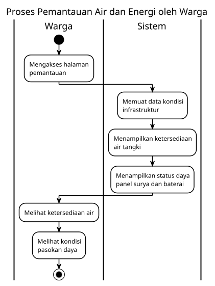
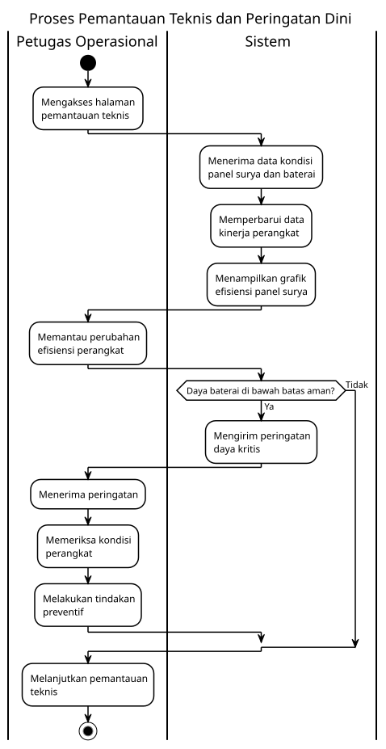
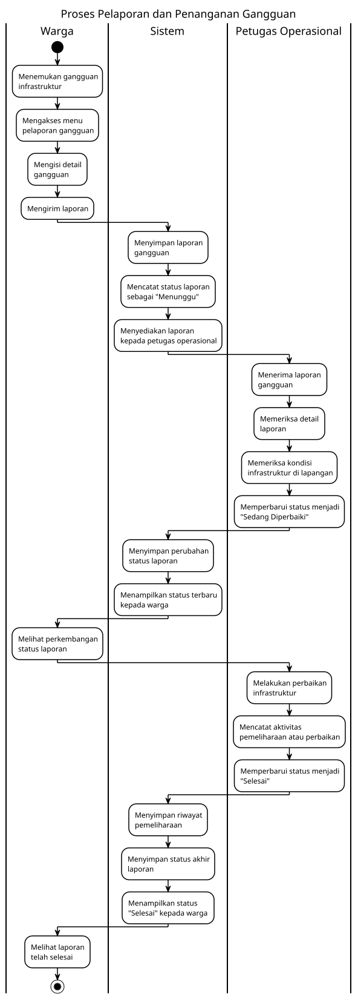
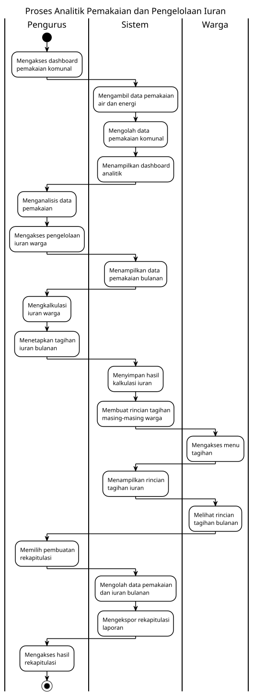

<h1>
IF2150 REKAYASA PERANGKAT LUNAK
 
TUGAS 5
 
SPESIFIKASI KEBUTUHAN PERANGKAT LUNAK (SKPL)
</h1>
 

## *FAJAR TECH*

### Untuk: *Tigress / Agatha*

Dipersiapkan oleh:
| Informasi | Keterangan |
| --- | --- |
| Kelas | K-3 |
| Kelompok | 10  |

| NIM | Nama |
| --- | --- |
| *13525054* | *Raffi Fauzi Hermawan* |
| *13525030* | *Rionaldo Casey Pandhitha* |
| *13525129* | *Andro Irsa Syafiq* |
| *13525078* | *Muhammad Faiz Ramadhan* |
| *13525006* | *Muhammad Rafiandhi Suryadinata* |
---

## Daftar Perubahan

| Revisi | Deskripsi |
| :--- | :--- |
| *A* | *Kompilasi dokumen SKPL Milestone 5 (BAB 1–6) dari dokumen Milestone 1–4 dengan revisi hasil asistensi, penulisan kebutuhan fungsional dalam format EARS, serta penambahan matriks traceability.* |

 

# BAB 1: Pendahuluan

## 1.1 Tujuan Penulisan Dokumen
Dokumen Spesifikasi Kebutuhan Perangkat Lunak (SKPL) ini disusun untuk merangkum secara formal seluruh kebutuhan fungsional dan non-fungsional, model use case, serta model kelas dari perangkat lunak Fajar Tech dalam satu dokumen acuan yang utuh dan tertelusur. Dokumen ini digunakan oleh: (1) tim pengembang Kelompok FAJAR67 sebagai dasar implementasi, pengujian, dan validasi perangkat lunak serta (2) asisten mata kuliah IF2150 Rekayasa Perangkat Lunak sebagai bahan penilaian dan asistensi.

## 1.2 Lingkup Masalah
Fajar Tech adalah platform berbasis web untuk memantau dan mengelola infrastruktur air serta energi surya komunal di tingkat komunitas, yang mencakup pemantauan ketersediaan air tangki dan status daya surya secara real-time, pelaporan gangguan beserta penanganannya, analitik pemakaian komunal, hingga perhitungan iuran warga dan rekapitulasi laporan, guna mewujudkan pengelolaan infrastruktur air dan energi yang lebih terukur, transparan, dan berkelanjutan yang berkesusaian dengan tujuan SDG 6 dan SDG 7.

## 1.3 Definisi, Istilah, dan Singkatan

| Singkatan, Akronim, atau Istilah | Penjelasan |
| :--- | :--- |
| *P/L* | *Singkatan dari Perangkat Lunak, yaitu aplikasi yang memberikan perintah kepada komputer untuk menjalankan tugas tertentu.* |
| *SKPL* | *Singkatan dari Spesifikasi Kebutuhan Perangkat Lunak, yaitu dokumen yang merangkum kriteria-kriteria yang diperlukan untuk membangun aplikasi menjalankan tugasnya.* |
| *KF* | *Singkatan dari Kebutuhan Fungsional.* |
| *KNF* | *Singkatan dari Kebutuhan Non-Fungsional.* |
| *UC* | *Singkatan dari Use Case.* |
| *EARS* | *Easy Approach to Requirements Syntax, yaitu pola penulisan kebutuhan agar konsisten dan mudah diuji.* |
| *RG* | *Singkatan dari Requirement Gathering.* |

## 1.4 Aturan Penomoran

| Hal/Bagian | Penomoran | Keterangan |
| :--- | :--- | :--- |
| *Kebutuhan Fungsional* | *KFXX* | XX adalah nomor kebutuhan fungsional |
| *Kebutuhan Non-Fungsional* | *KNFXX* | XX adalah nomor kebutuhan non-fungsional |
| *Aktor* | *AXX* | XX adalah nomor aktor |
| *Use Case* | *UCXX* | XX adalah nomor use case |
| *Kelas* | *CXX* | XX adalah nomor kelas |
| *Requirement Gathering* | *RXX* | XX adalah nomor requirement gathering |

## 1.5 Referensi
1. Dokumen Milestone 1 Kelompok K03-G10.
2. Dokumen Milestone 2 Kelompok K03-G10.
3. Dokumen Milestone 3 Kelompok K03-G10.
4. Dokumen Milestone 4 Kelompok K03-G10.
5. Wirfs-Brock, R. & McKean, D., *Object Design: Roles, Responsibilities, and Collaborations*.
6. Mavin, A., Wilkinson, W., Herd, A., et al. (2009). *EARS: Easy Approach to Requirements Syntax*.

## 1.6 Deskripsi Umum Dokumen (Ikhtisar)
Dokumen ini disusun dengan sistematika sebagai berikut. BAB 2 mendeskripsikan proses bisnis sistem, lingkup perangkat lunak beserta keterkaitannya dengan perangkat pengukuran di lapangan, jenis pengguna dan kebutuhannya, batasan, serta lingkungan operasi perangkat lunak. BAB 3 merinci seluruh kebutuhan fungsional dalam format EARS dan kebutuhan non-fungsional beserta parameternya. BAB 4 mempresentasikan pemodelan use case yang berisi identifikasi aktor, identifikasi use case, diagram use case, dan skenario setiap use case. BAB 5 mempresentasikan pemodelan kelas yang berisi identifikasi kelas, diagram kelas per use case lengkap dengan atribut dan metode, serta diagram kelas keseluruhan. BAB 6 menyajikan matriks traceability yang menautkan setiap kelas dengan use case dan kebutuhan fungsional yang direalisasikannya.

---

# BAB 2: Deskripsi Perangkat Lunak

## 2.1 Deskripsi Umum Sistem
Perangkat lunak kami dibuat agar dapat memantau dan mengelola air dan juga surya. Sistem ini dirancang dengan memfokuskan pada platform utama dan satu-satunya melalui website. Website dipilih dikarenakan dapat diakses oleh warga melalui device manapun. Beberapa fitur yang terdapat pada website antara lain adalah melihat ketersediaan air, status daya surya, tagihan iuran, analitik penggunaan komunal, pengelolaan iuran warga, dan platform laporan gangguan serta status perbaikan dari laporan yang masuk.

Dari kacamata pengguna, perangkat lunak yang diusulkan ini berfungsi sebagai pusat kendali dan informasi yang memungkinkan operator fasilitas desa dan stakeholder untuk memantau status pompa air, tingkat keterisian tangki, serta juga daya panel surya dan baterai secara real-time. Selain itu, warga juga dapat mencari informasi yang mudah dipahami mengenai ketersediaan air, kondisi pasokan energi, rincian iuran, serta perkembangan laporan gangguan.

Alur kerja sistem ini yaitu menjadi jembatan antar dunia fisik dan digital dalam pengelolaan air dan energi komunal. Perangkat keras di lapangan seperti sensor pada tangki penampungan, pompa air, dan panel surya dapat mengirimkan data aktual ke platform web. Sistem kemudian memproses data tersebut menjadi informasi yang siap digunakan yaitu, tampilan ketersediaan air dan status daya pada dasbor warga, notifikasi peringatan pada teknisi ketika metrik daya sudah hampir habis, serta menyediakan data pemakaian bagi pengurus untuk keperluan analitik dan kalkulasi iuran.

Harapan dari penerapan solusi ini adalah terciptanya pengelolaan infrastruktur air dan energi komunal yang lebih terukur, transparan, dan berkelanjutan di tingkat komunitas. Dengan pemrosesan yang lebih terdigitalisasi, warga dapat memperoleh kepastian informasi tanpa harus bertanya langsung kepada pengurus, teknisi dapat menangani masalah di lapangan dengan lebih taktis, serta pengurus dapat mengelola data lebih cepat dalam mengambil keputusan komunitas dan kalkulasi iuran.

Proses bisnis Fajar Tech melibatkan Warga, Teknisi, Pengurus, dan Sistem dalam empat aliran utama: (1) pemantauan ketersediaan air dan daya kelistrikan, (2) pemantauan teknis dan peringatan dini, (3) pelaporan dan penanganan gangguan, serta (4) analitik pemakaian dan pengelolaan iuran. Rangkaian aktivitas pada keempat aliran tersebut digambarkan pada diagram aktivitas berikut.

<i>Gambar 1. Swimlane Diagram Pemantauan Air dan Energi oleh Warga</i>

<i>Gambar 2. Swimlane Diagram Pemantauan Teknis dan Peringatan Dini</i>

<i>Gambar 3. Swimlane Diagram Pelaporan dan Penanganan Gangguan</i>

<i>Gambar 4. Swimlane Diagram Analitik Pemakaian dan Pengelolaan Iuran</i>

## 2.2 Deskripsi Umum Perangkat Lunak
Fajar Tech merupakan aplikasi web tunggal yang menjadi pusat kendali dan informasi pengelolaan air serta energi komunal. Perangkat lunak berinteraksi dengan perangkat pengukuran di lapangan (sensor volume tangki penampungan, pompa air, panel surya, dan baterai) yang mengirimkan data aktual secara berkala ke platform; sistem menerima data tersebut, menyimpannya dengan satuan pengukuran yang konsisten, dan menyajikannya sebagai informasi real-time pada dasbor sesuai peran pengguna. Selain itu, perangkat lunak mengirimkan notifikasi peringatan dini secara otomatis ke perangkat teknisi yang terdaftar dan bertanggung jawab bila kapasitas daya berada di bawah ambang batas aman, serta menghasilkan dokumen rekapitulasi pemakaian dan iuran yang dapat diekspor atau dicetak oleh pengurus. Fajar Tech tidak menggunakan layanan pihak ketiga eksternal seperti payment gateway: penetapan tarif dan verifikasi pembayaran iuran dilakukan oleh pengurus di dalam sistem berdasarkan data pemakaian dan bukti transfer yang diunggah, sehingga seluruh keterkaitan sistem eksternal terbatas pada perangkat pengukuran lapangan dan perangkat penerima notifikasi.

## 2.3 Pengguna dan Kebutuhan Pengguna Perangkat Lunak

| Pengguna | Kebutuhan |
| :-- | :-- |
| Warga | Pengguna ini bertindak sebagai pihak yang menggunakan sistem untuk memantau air dan listrik dari infrastruktur komunal. Karakteristik dari pengguna ini adalah bersifat non-teknis dan mengutamakan kemudahan mengakses informasi ketersediaan air, status daya, tagihan iuran, serta perkembangan laporan gangguan yang mereka ajukan. |
| Teknisi | Pengguna ini bertindak sebagai pihak yang bertanggung jawab memantau kondisi fisik pompa air, tangki, panel surya, baterai secara langsung di lapangan, dan memasukkan statusnya pada sistem. Karakteristik dari pengguna ini adalah mengutamakan informasi teknis dan real-time untuk melakukan tindakan preventif atau perbaikan sebelum terjadi kegagalan sistem. |
| Pengurus | Pengguna ini bertindak sebagai pihak yang dapat mengakses dashboard pemakaian air dan energi komunal untuk tujuan pengelolaan administratif komunitas seperti pencatatan iuran, pemantauan pemakaian komunal, dan pengawasan tindak lanjut laporan gangguan. Karakteristik dari pengguna ini adalah mengutamakan gambaran menyeluruh untuk pengambilan keputusan dan menjaga transparansi terhadap warga. |

## 2.4 Batasan Perangkat Lunak
Batasan yang harus dituliskan, di antaranya:
1. *P/L hanya berfokus pada platform utama berbasis website dan diakses melalui web browser, tidak memiliki aplikasi terinstall (seperti .apk atau .exe).*
2. *P/L bergantung pada ketersediaan data pemantauan fisik yang dikirimkan secara berkala oleh perangkat keras (sensor, mikrokontroler pada tangki dan panel surya) di lapangan.*
3. *P/L beroperasi di lokasi yang memiliki cakupan sinyal komunikasi yang memadai atau akses Wi-Fi terpusat untuk kelancaran pembaruan data sensor.*
4. *P/L hanya menangani pencatatan dan kalkulasi iuran warga, dan tidak terintegrasi dengan Payment Gateway untuk memproses transaksi pembayaran secara digital.*
5. *P/L mengekspor berkas rekapitulasi ke dalam format dokumen universal seperti PDF atau CSV.*

## 2.5 Lingkungan Operasi Perangkat Lunak

| Komponen | Spesifikasi |
| :--- | :--- |
| *Server* | *[Node.js atau PHP, dijalankan pada layanan cloud hosting / VPS]* |
| *Client* | *[Web Browser modern (Google Chrome, Mozilla Firefox, Safari, Microsoft Edge).]* |
| *DBMS* | *[PostgreSQL atau MySQL]* |
| *OS* | *[Cross-platform (Windows, Linux, macOS, Android, iOS) melalui browser]* |
| *Perangkat Keras* | *[Mikrokontroler IoT pada fasilitas komunitas (untuk mengirim data metrik operasional)]* |

---

# BAB 3: Deskripsi Kebutuhan Perangkat Lunak

## 3.1 Kebutuhan Fungsional (KF)

Tabel 3.1. Kebutuhan Fungsional

| ID KF | ID Kebutuhan | Penjelasan |
| :--- | :--- | :--- |
| *KF01* | *R01* | *Ketika warga membuka dashboard utama, sistem harus menampilkan volume/level air pada tangki penampungan secara real-time.* |
| *KF02* | *R02* | *Sistem harus mengklasifikasikan dan menampilkan status ketersediaan air (Normal, Rendah, Kritis) berdasarkan ambang batas yang telah dikonfigurasi.* |
| *KF03* | *R04* | *Ketika warga membuka dashboard utama, sistem harus menampilkan kapasitas baterai (%) dan daya keluaran panel surya (Watt) secara real-time.* |
| *KF04* | *R05* | *Sistem harus menyimpan dan menampilkan parameter daya menggunakan satuan pengukuran yang konsisten (seperti Watt dan persen) di seluruh antarmuka.* |
| *KF05* | *R07* | *Ketika warga mengakses menu tagihan, sistem harus menampilkan rincian iuran periode berjalan yang mencakup periode tagihan, data pemakaian, dan total iuran.* |
| *KF06* | *R09* | *Sistem harus membatasi visibilitas tagihan kepada warga hanya jika status perhitungan iuran periode tersebut telah ditetapkan sebagai final oleh pengurus.* |
| *KF07* | *R11* | *Ketika warga membuka fitur pelaporan, sistem harus menyediakan formulir gangguan yang mencakup input jenis kendala, deskripsi, dan foto pendukung.* |
| *KF08* | *R11* | *Ketika pengguna menekan tombol kirim formulir, sistem harus menyimpan laporan gangguan tersebut sebagai entri data baru* |
| *KF09* | *R12* | *Ketika laporan gangguan dikirim, sistem harus memvalidasi bahwa pengirim merupakan warga terdaftar sebelum memproses penyimpanan.* |
| *KF10* | *R13* | *Ketika laporan gangguan baru berhasil disimpan, sistem harus menetapkan status awal laporan tersebut menjadi "Menunggu" secara otomatis.* |
| *KF11* | *R15* | *Ketika pelapor membuka halaman riwayat, sistem harus menampilkan status terkini dan rekam jejak perkembangan laporan gangguan miliknya.* |
| *KF12* | *R16* | *Sistem harus membatasi nilai status laporan gangguan secara mutlak pada tiga pilihan: Menunggu, Sedang Diperbaiki, atau Selesai.* |
| *KF13* | *R18* | *Ketika kapasitas daya baterai menyentuh atau turun di bawah ambang batas aman, sistem harus mengirimkan notifikasi otomatis kepada teknisi.* |
| *KF14* | *R20* | *Sistem harus mengirimkan notifikasi peringatan daya kritis hanya kepada akun teknisi terdaftar yang ditugaskan pada perangkat terkait.* |
| *KF15* | *R22* | *Ketika teknisi memilih suatu rentang waktu, sistem harus menampilkan grafik tren kinerja panel surya sesuai durasi tersebut.* |
| *KF16* | *R23* | *Sistem harus menyimpan log data kinerja perangkat keras secara berkala sebagai basis historis.* |
| *KF17* | *R25* | *Ketika teknisi membuka detail laporan, sistem harus menyediakan fungsi pembaruan status untuk mencatat progres penanganan lapangan.* |
| *KF18* | *R26* | *Ketika pengguna mencoba mengubah status laporan, sistem harus memverifikasi bahwa pengguna tersebut adalah teknisi dengan hak penugasan yang sesuai.* |
| *KF19* | *R27* | *Sistem harus memastikan perubahan status laporan gangguan hanya dapat dilakukan secara berurutan sesuai tahapan, yaitu dari Menunggu, kemudian Sedang Diperbaiki, dan terakhir Selesai.* |
| *KF20* | *R29* | *Ketika teknisi membuka menu pemeliharaan, sistem harus menyediakan formulir pencatatan yang memuat ID perangkat, waktu, tindakan, dan hasil akhir.* |
| *KF21* | *R30* | *Ketika formulir pemeliharaan disimpan, sistem harus mengarsipkan data tersebut ke dalam riwayat perangkat yang dapat ditelusuri.* |
| *KF22* | *R33* | *Ketika pengurus mengakses dashboard administratif, sistem harus menampilkan data agregat dan riwayat pemakaian air serta energi komunal.* |
| *KF23* | *R34* | *Ketika pengguna mencoba membuka modul administratif, sistem harus memblokir akses jika pengguna tidak memiliki kredensial pengurus.* |
| *KF24* | *R35* | *Sistem harus mengelompokkan dan mengindeks seluruh data pemakaian warga berdasarkan periode waktu (contoh: bulanan) secara konsisten.* |
| *KF25* | *R37* | *Ketika pengurus menginisiasi perhitungan, sistem harus mengkalkulasi iuran warga berdasarkan data pemakaian pada periode yang dipilih.* |
| *KF26* | *R37* | *Ketika proses kalkulasi iuran selesai, sistem harus menampilkan pratinjau hasil perhitungan kepada pengurus untuk proses peninjauan.* |
| *KF27* | *R39* | *Ketika tombol penetapan hasil perhitungan iuran ditekan, sistem harus memverifikasi hak akses administratif pengguna sebelum mengunci data tagihan.* |
| *KF28* | *R40* | *Sistem harus memberlakukan tarif atau aturan perhitungan yang seragam kepada seluruh warga dalam satu periode tagihan yang sama.* |
| *KF29* | *R42* | *Ketika pengurus menginisiasi modul rekapitulasi, sistem harus menampilkan opsi pemilihan periode pemakaian dan iuran.* |
| *KF30* | *R42* | *Ketika pengurus mengonfirmasi pembuatan rekapitulasi, sistem harus membuat (ekspor/cetak) dokumen rekap data pemakaian dan iuran berdasarkan periode terpilih.* |
| *KF31* | *R43* | *Ketika pengguna membuat rekapitulasi administratif, sistem harus memvalidasi kewenangan tingkat pengurus.* |
| *KF32* | *R44* | *Ketika pengurus membuat dokumen rekapitulasi, sistem harus menggunakan data pemakaian dan iuran yang telah berstatus final untuk periode terkait.* |
| *KF33* | *R10* | *Sistem harus menghitung kewajiban iuran setiap warga secara otomatis menggunakan parameter data pemakaian aktual dan tarif periode terkait.* |
| *KF34* | *R17* | *Ketika pengguna menggunakan fitur pencarian laporan, sistem harus memfilter daftar tiket gangguan secara spesifik berdasarkan ID pelapor.* |
| *KF35* | *R28* | *Ketika sistem mendeteksi perubahan status laporan, sistem harus mencatat dan menyimpan timestamp perubahan tersebut.* |

## 3.2 Kebutuhan Non-Fungsional (KNF)

Tabel 3.2. Kebutuhan Non-Fungsional

| ID KNF | ID Kebutuhan | Parameter | Deskripsi Kebutuhan |
| :--- | :--- | :--- | :--- |
| *KNF01* | *R12, R26, R34, R39, R43* | *Security* | *Selama pengguna menggunakan sistem, sistem harus membatasi akses fitur yang muncul pada dashboard pengguna sesuai dengan kewenangannya.* |
| *KNF02* | *R07, R11, R15, R29, R33* | *Security* | *Ketika pengguna membuka data pada sebuah fitur, sistem harus menampilkan data sesuai kewenangan pengguna tersebut.* |
| *KNF03* | *R13, R18, R20* | *Reliability* | *Ketika koneksi jaringan terputus saat pengiriman data, sistem harus menyimpan data tersebut secara sementara untuk dikirim ulang secara otomatis setelah koneksi pulih.* |
| *KNF04* | *R23, R30* | *Reliability* | *Ketika sistem menerima data riwayat kinerja perangkat, sistem harus mampu menampilkannya kembali paling lama 5 detik setelah pengguna membuka halaman riwayat.* |
| *KNF05* | *R18, R20* | *Safety* | *Ketika menerima data kondisi baterai melewati batas aman, sistem harus mengirimkan peringatan kepada teknisi dalam waktu maksimal 3 detik.* |
| *KNF06* | *R01, R04, R33* | *Availability* | *Sistem harus mempertahankan ketersediaan akses (uptime) setidaknya 99% setiap bulan selama jam operasional komunitas.* |
| *KNF07* | *R01, R04, R07, R11, R15* | *Ergonomy* | *Sistem harus menyediakan antarmuka pengguna (UI) yang mudah dioperasikan oleh warga tanpa mewajibkan panduan pelatihan khusus.* |
| *KNF08* | *R22, R25, R29* | *Ergonomy* | *Sistem harus merender antarmuka pencatatan lapangan secara responsif ketika diakses melalui perangkat smartphone teknisi.* |
| *KNF09* | *R01, R11, R33* | *Portability* | *Sistem harus dapat diakses secara langsung melalui berbagai web browser modern tanpa mengharuskan pengguna menginstal aplikasi tambahan.* |
| *KNF10* | *R45* | *Portability* | *Sistem harus mengekspor berkas rekapitulasi ke dalam format dokumen yang universal, yaitu PDF atau CSV.* |
| *KNF11* | *R03, R06* | *Response time* | *Sistem harus memperbarui nilai input sensor pada dashboard pengguna dalam waktu maksimal 2 detik.* |
| *KNF12* | *R41* | *Response time* | *Sistem harus menyelesaikan kalkulasi otomatis seluruh iuran komunal dalam waktu maksimal 5 detik.* |
| *KNF13* | *R03, R06* | *Memory* | *Sistem harus mengeksekusi firmware pembacaan sensor dengan penggunaan memori yang tidak melewati batas kapasitas memori internal mikrokontroler.* |

---

# BAB 4: Pemodelan Use Case

## 4.1 Identifikasi Aktor

| ID Aktor | Aktor | Deskripsi |
| :--- | :--- | :--- |
| A01 | Warga | Pengguna non-teknis yang menggunakan sistem untuk memantau ketersediaan air dan energi komunal, melihat tagihan iuran final, mengirim laporan gangguan, serta menelusuri perkembangan laporan yang pernah dikirim. |
| A02 | Teknisi | Pengguna yang bertanggung jawab terhadap pemantauan dan penanganan teknis perangkat komunal, termasuk menerima peringatan daya kritis, memantau riwayat kinerja panel surya, memperbarui status penanganan gangguan, dan mencatat kegiatan pemeliharaan. |
| A03 | Pengurus | Pengguna yang memiliki kewenangan administratif untuk menganalisis pemakaian komunal, menghitung dan menetapkan iuran warga, membuat rekapitulasi pemakaian dan iuran, serta mengelola persetujuan registrasi akun. |
| A04 | Calon Pengguna | Pengguna yang belum memiliki akun aktif dan melakukan registrasi dengan mengisi data diri serta memilih peran sebelum akun dapat disetujui oleh pengurus. |

## 4.2 Identifikasi Use Case

| ID UC | Nama Use Case | Deskripsi Singkat | Aktor | ID KF |
| :--- | :--- | :--- | :--- | :--- |
| UC01 | Memantau Ketersediaan Air dan Energi | Warga melihat informasi ketersediaan air, kapasitas baterai, dan daya panel surya melalui dashboard. | Warga | KF01, KF02, KF03, KF04 |
| UC02 | Melihat Tagihan Iuran Final | Warga melihat rincian tagihan iuran yang telah ditetapkan final oleh pengurus. | Warga | KF05, KF06 |
| UC03 | Mengirim Laporan Gangguan | Warga mengisi dan mengirim laporan gangguan infrastruktur komunal. | Warga | KF07, KF08, KF09, KF10 |
| UC04 | Menelusuri Status Laporan Gangguan | Warga melihat status terkini dan riwayat perkembangan laporan gangguan yang pernah dikirim. | Warga | KF11, KF34 |
| UC05 | Menerima Peringatan Dini Daya Kritis | Teknisi menerima notifikasi otomatis ketika kapasitas baterai mencapai atau berada di bawah ambang batas aman. | Teknisi | KF13, KF14 |
| UC06 | Memantau Riwayat Kinerja Panel Surya | Teknisi melihat grafik riwayat kinerja panel surya berdasarkan rentang waktu yang dipilih. | Teknisi | KF15, KF16 |
| UC07 | Memperbarui Status Penanganan Gangguan | Teknisi yang berwenang memperbarui status laporan gangguan sesuai progres penanganan. | Teknisi | KF12, KF17, KF18, KF19, KF35 |
| UC08 | Mencatat Kegiatan Pemeliharaan | Teknisi mencatat kegiatan pemeliharaan atau perbaikan perangkat ke dalam sistem. | Teknisi | KF20, KF21 |
| UC09 | Menganalisis Pemakaian Komunal | Pengurus melihat data agregat dan riwayat pemakaian air serta energi komunal berdasarkan periode. | Pengurus | KF22, KF23, KF24 |
| UC10 | Menghitung dan Menetapkan Iuran Warga | Pengurus menghitung iuran berdasarkan data pemakaian dan aturan tarif periode terkait, meninjau hasilnya, lalu menetapkannya sebagai final. | Pengurus | KF25, KF26, KF27, KF28, KF33 |
| UC11 | Membuat Rekapitulasi Pemakaian dan Iuran | Pengurus menghasilkan rekapitulasi pemakaian dan iuran dari data final untuk periode yang dipilih. | Pengurus | KF29, KF30, KF31, KF32 |
| UC12 | Melakukan Registrasi Akun | Calon pengguna mendaftarkan data diri dan pilihan peran sehingga akun berstatus menunggu persetujuan. | Calon Pengguna | —* |
| UC13 | Melakukan Login Akun | Pengguna terdaftar memasukkan kredensial untuk mengakses sistem sesuai peran dan status persetujuan akun. | Warga, Teknisi, Pengurus | —* |
| UC14 | Mengelola Persetujuan Akun | Pengurus meninjau permintaan registrasi dan menyetujui atau menolak akun calon pengguna. | Pengurus | —* |

\* UC12–UC14 dipertahankan karena merupakan hasil revisi asistensi M3 dan telah dimodelkan pada M4. Namun, dokumen Requirement Gathering M2 serta daftar KF pada M4 saat ini belum memiliki kebutuhan fungsional khusus untuk registrasi, login, dan persetujuan akun. 

## 4.3 Use Case Diagram

Use Case Diagram berikut menggunakan versi terakhir dari dokumen *Class Diagram* M4 dan mencakup keseluruhan use case UC01 sampai UC14. Diagram juga mempertahankan relasi antarpenggunaan (*include/extend*) yang telah direvisi berdasarkan hasil asistensi sebelumnya.

<i>Gambar 5. Use Case Diagram Fajar Tech</i>

## 4.4 Skenario Use Case

### 4.4.1 Skenario UC01

**Nama Use Case:** *Memantau Ketersediaan Air dan Energi*

**Skenario Normal**

| No | Aksi Aktor | Reaksi Perangkat Lunak |
| :--- | :--- | :--- |
| 1 | Warga membuka dashboard utama. | Sistem menampilkan volume/level air tangki berdasarkan data terbaru. |
| 2 | - | Sistem menampilkan klasifikasi status ketersediaan air, yaitu Normal, Rendah, atau Kritis. |
| 3 | - | Sistem menampilkan kapasitas baterai dalam persen dan daya panel surya dalam Watt. |

**Skenario Alternatif 1: Data Sensor Tidak Tersedia**

| No | Aksi Aktor | Reaksi Perangkat Lunak |
| :--- | :--- | :--- |
| 1 | Warga membuka dashboard utama. | Sistem tidak menerima data sensor terbaru. |
| 2 | - | Sistem menampilkan data terakhir yang tersimpan beserta waktu pembacaan terakhir dan pemberitahuan bahwa data terbaru belum tersedia. |

### 4.4.2 Skenario UC02

**Nama Use Case:** *Melihat Tagihan Iuran Final*

**Skenario Normal**

| No | Aksi Aktor | Reaksi Perangkat Lunak |
| :--- | :--- | :--- |
| 1 | Warga membuka menu tagihan iuran. | Sistem menampilkan daftar periode tagihan yang tersedia. |
| 2 | Warga memilih periode tagihan. | Sistem memeriksa status tagihan pada periode tersebut. |
| 3 | - | Sistem menampilkan tagihan yang telah berstatus final beserta rincian periode, data pemakaian dasar perhitungan, dan jumlah iuran. |

**Skenario Alternatif 1: Tagihan Belum Ditetapkan Final**

| No | Aksi Aktor | Reaksi Perangkat Lunak |
| :--- | :--- | :--- |
| 1 | Warga memilih periode tagihan. | Sistem memeriksa status perhitungan iuran pada periode tersebut. |
| 2 | - | Sistem mendeteksi bahwa tagihan belum berstatus final dan menampilkan informasi bahwa tagihan final belum tersedia. |

### 4.4.3 Skenario UC03

**Nama Use Case:** *Mengirim Laporan Gangguan*

**Skenario Normal**

| No | Aksi Aktor | Reaksi Perangkat Lunak |
| :--- | :--- | :--- |
| 1 | Warga membuka menu pelaporan gangguan. | Sistem menampilkan formulir laporan yang mencakup jenis gangguan, deskripsi, dan informasi pendukung. |
| 2 | Warga mengisi formulir dan menekan tombol kirim. | Sistem memvalidasi bahwa pengirim merupakan warga yang terdaftar pada komunitas terkait. |
| 3 | - | Sistem menetapkan status awal laporan menjadi "Menunggu". |
| 4 | - | Sistem menyimpan laporan sebagai entri baru. |
| 5 | - | Sistem menampilkan notifikasi bahwa laporan berhasil dikirim. |

**Skenario Alternatif 1: Warga Tidak Terdaftar**

| No | Aksi Aktor | Reaksi Perangkat Lunak |
| :--- | :--- | :--- |
| 1 | Warga menekan tombol kirim pada formulir laporan. | Sistem memvalidasi status keanggotaan pengirim. |
| 2 | - | Sistem mendeteksi bahwa pengirim bukan warga terdaftar pada komunitas terkait. |
| 3 | - | Sistem menolak pengiriman laporan dan menampilkan pesan bahwa pengguna tidak memiliki otorisasi. |

### 4.4.4 Skenario UC04

**Nama Use Case:** *Menelusuri Status Laporan Gangguan*

**Skenario Normal**

| No | Aksi Aktor | Reaksi Perangkat Lunak |
| :--- | :--- | :--- |
| 1 | Warga membuka halaman riwayat laporan gangguan. | Sistem mencari laporan berdasarkan identitas warga. |
| 2 | - | Sistem menampilkan daftar laporan gangguan milik warga tersebut. |
| 3 | Warga memilih salah satu laporan. | Sistem menampilkan status terkini laporan yang dipilih. |
| 4 | Warga membuka detail perkembangan laporan. | Sistem menampilkan riwayat perubahan status laporan beserta waktunya. |

**Skenario Alternatif 1: Laporan Tidak Ditemukan**

| No | Aksi Aktor | Reaksi Perangkat Lunak |
| :--- | :--- | :--- |
| 1 | Warga membuka halaman riwayat laporan gangguan. | Sistem mencari laporan berdasarkan identitas warga. |
| 2 | - | Sistem tidak menemukan laporan yang terkait dengan identitas warga tersebut. |
| 3 | - | Sistem menampilkan informasi bahwa belum ada laporan gangguan yang dapat ditampilkan. |

### 4.4.5 Skenario UC05

**Nama Use Case:** *Menerima Peringatan Dini Daya Kritis*

**Skenario Normal**

| No | Aksi Aktor | Reaksi Perangkat Lunak |
| :--- | :--- | :--- |
| 1 | - | Sistem mendeteksi kapasitas baterai mencapai atau berada di bawah ambang batas aman. |
| 2 | - | Sistem menentukan teknisi terdaftar yang bertanggung jawab atas perangkat terkait. |
| 3 | - | Sistem mengirimkan notifikasi otomatis peringatan daya kritis kepada teknisi tersebut. |
| 4 | Teknisi membuka notifikasi peringatan. | Sistem menampilkan detail peringatan, termasuk perangkat terkait, kapasitas baterai, dan waktu terjadinya kondisi kritis. |

**Skenario Alternatif 1: Koneksi Jaringan Terputus**

| No | Aksi Aktor | Reaksi Perangkat Lunak |
| :--- | :--- | :--- |
| 1 | - | Sistem mendeteksi kondisi daya kritis ketika koneksi jaringan sedang terputus. |
| 2 | - | Sistem menyimpan data peringatan sementara. |
| 3 | - | Sistem mengirim ulang notifikasi kepada teknisi setelah koneksi kembali tersedia. |

### 4.4.6 Skenario UC06

**Nama Use Case:** *Memantau Riwayat Kinerja Panel Surya*

**Skenario Normal**

| No | Aksi Aktor | Reaksi Perangkat Lunak |
| :--- | :--- | :--- |
| 1 | Teknisi membuka halaman pemantauan perangkat. | Sistem menampilkan halaman riwayat kinerja panel surya. |
| 2 | Teknisi memilih rentang waktu. | Sistem mengambil data historis pada rentang waktu yang dipilih. |
| 3 | - | Sistem menampilkan grafik dan tren kinerja panel surya berdasarkan data historis tersebut. |

**Skenario Alternatif 1: Data Historis Belum Tersedia**

| No | Aksi Aktor | Reaksi Perangkat Lunak |
| :--- | :--- | :--- |
| 1 | Teknisi memilih rentang waktu. | Sistem memeriksa ketersediaan data historis pada rentang waktu tersebut. |
| 2 | - | Sistem tidak menemukan data dan menampilkan pesan bahwa data historis belum tersedia. |

### 4.4.7 Skenario UC07

**Nama Use Case:** *Memperbarui Status Penanganan Gangguan*

**Skenario Normal**

| No | Aksi Aktor | Reaksi Perangkat Lunak |
| :--- | :--- | :--- |
| 1 | Teknisi membuka daftar laporan yang ditugaskan kepadanya. | Sistem menampilkan laporan gangguan yang dapat ditindaklanjuti oleh teknisi tersebut. |
| 2 | Teknisi memilih salah satu laporan. | Sistem menampilkan detail laporan dan status penanganan terkini. |
| 3 | Teknisi memilih status baru sesuai progres penanganan. | Sistem memverifikasi bahwa teknisi memiliki penugasan atas laporan tersebut. |
| 4 | - | Sistem memvalidasi bahwa perubahan mengikuti tahapan status yang diperbolehkan. |
| 5 | - | Sistem menyimpan status baru dan mencatat timestamp perubahan. |

**Skenario Alternatif 1: Teknisi Tidak Berwenang**

| No | Aksi Aktor | Reaksi Perangkat Lunak |
| :--- | :--- | :--- |
| 1 | Teknisi mencoba mengubah status laporan yang tidak ditugaskan kepadanya. | Sistem memverifikasi penugasan teknisi. |
| 2 | - | Sistem menolak perubahan dan menampilkan pesan bahwa teknisi tidak berwenang atas laporan tersebut. |

**Skenario Alternatif 2: Perubahan Status Tidak Valid**

| No | Aksi Aktor | Reaksi Perangkat Lunak |
| :--- | :--- | :--- |
| 1 | Teknisi memilih perubahan status yang tidak mengikuti tahapan penanganan yang diperbolehkan. | Sistem memeriksa urutan status laporan. |
| 2 | - | Sistem menolak perubahan dan menampilkan status yang dapat dipilih sesuai kondisi laporan saat ini. |

### 4.4.8 Skenario UC08

**Nama Use Case:** *Mencatat Kegiatan Pemeliharaan*

**Skenario Normal**

| No | Aksi Aktor | Reaksi Perangkat Lunak |
| :--- | :--- | :--- |
| 1 | Teknisi membuka menu pencatatan pemeliharaan. | Sistem menampilkan formulir yang mencakup perangkat, waktu pelaksanaan, tindakan, dan catatan hasil. |
| 2 | Teknisi mengisi formulir dan menekan tombol simpan. | Sistem memvalidasi kelengkapan isian. |
| 3 | - | Sistem menyimpan catatan pemeliharaan sebagai riwayat yang dapat ditelusuri berdasarkan perangkat dan waktu. |
| 4 | - | Sistem menampilkan notifikasi bahwa catatan pemeliharaan berhasil disimpan. |

**Skenario Alternatif 1: Formulir Tidak Lengkap**

| No | Aksi Aktor | Reaksi Perangkat Lunak |
| :--- | :--- | :--- |
| 1 | Teknisi menekan tombol simpan ketika masih terdapat kolom wajib yang kosong. | Sistem memvalidasi kelengkapan masukan. |
| 2 | - | Sistem membatalkan penyimpanan dan menandai kolom yang harus dilengkapi. |

### 4.4.9 Skenario UC09

**Nama Use Case:** *Menganalisis Pemakaian Komunal*

**Skenario Normal**

| No | Aksi Aktor | Reaksi Perangkat Lunak |
| :--- | :--- | :--- |
| 1 | Pengurus membuka dashboard administratif. | Sistem memverifikasi peran pengguna sebagai pengurus. |
| 2 | Pengurus memilih periode analisis. | Sistem mengambil dan mengelompokkan data pemakaian air serta energi pada periode tersebut. |
| 3 | - | Sistem menampilkan data agregat dan riwayat pemakaian dalam bentuk yang dapat dianalisis oleh pengurus. |

**Skenario Alternatif 1: Pengguna Bukan Pengurus**

| No | Aksi Aktor | Reaksi Perangkat Lunak |
| :--- | :--- | :--- |
| 1 | Warga atau Teknisi mencoba membuka dashboard administratif. | Sistem memeriksa kewenangan pengguna. |
| 2 | - | Sistem menolak akses dan menampilkan informasi bahwa fitur hanya tersedia untuk pengurus. |

### 4.4.10 Skenario UC10

**Nama Use Case:** *Menghitung dan Menetapkan Iuran Warga*

**Skenario Normal**

| No | Aksi Aktor | Reaksi Perangkat Lunak |
| :--- | :--- | :--- |
| 1 | Pengurus membuka menu perhitungan iuran dan memilih periode. | Sistem mengambil data pemakaian warga untuk periode yang dipilih. |
| 2 | - | Sistem menghitung iuran setiap warga secara otomatis menggunakan aturan tarif yang berlaku pada periode tersebut. |
| 3 | - | Sistem menampilkan hasil perhitungan iuran kepada pengurus untuk ditinjau. |
| 4 | Pengurus meninjau hasil dan menekan tombol "Tetapkan Final". | Sistem memverifikasi kewenangan pengurus. |
| 5 | - | Sistem menetapkan hasil perhitungan iuran periode tersebut sebagai final. |
| 6 | - | Sistem menampilkan notifikasi bahwa iuran berhasil ditetapkan final. |

**Skenario Alternatif 1: Pengurus Tidak Berwenang**

| No | Aksi Aktor | Reaksi Perangkat Lunak |
| :--- | :--- | :--- |
| 1 | Pengurus menekan tombol "Tetapkan Final". | Sistem memverifikasi kewenangan pengurus. |
| 2 | - | Sistem mendeteksi bahwa akun tidak memiliki kewenangan untuk melakukan finalisasi. |
| 3 | - | Sistem menolak penetapan final dan menampilkan pesan otorisasi. |

**Skenario Alternatif 2: Data Pemakaian Belum Lengkap**

| No | Aksi Aktor | Reaksi Perangkat Lunak |
| :--- | :--- | :--- |
| 1 | Pengurus memilih periode perhitungan iuran. | Sistem memeriksa kelengkapan data pemakaian warga pada periode tersebut. |
| 2 | - | Sistem mendeteksi bahwa data pemakaian sebagian warga belum lengkap. |
| 3 | - | Sistem menghentikan perhitungan dan menampilkan informasi bahwa data harus dilengkapi terlebih dahulu. |

### 4.4.11 Skenario UC11

**Nama Use Case:** *Membuat Rekapitulasi Pemakaian dan Iuran*

**Skenario Normal**

| No | Aksi Aktor | Reaksi Perangkat Lunak |
| :--- | :--- | :--- |
| 1 | Pengurus membuka menu rekapitulasi pemakaian dan iuran. | Sistem memverifikasi kewenangan pengurus dan menampilkan pilihan periode. |
| 2 | Pengurus memilih periode rekapitulasi. | Sistem mengambil data pemakaian dan iuran pada periode yang dipilih. |
| 3 | - | Sistem memeriksa bahwa data yang digunakan untuk rekapitulasi telah berstatus final. |
| 4 | Pengurus memilih untuk membuat rekapitulasi. | Sistem menghasilkan rekapitulasi berdasarkan data pada periode tersebut. |
| 5 | Pengurus memilih ekspor atau cetak. | Sistem menghasilkan dokumen rekapitulasi yang dapat diekspor atau dicetak. |

**Skenario Alternatif 1: Data Belum Final**

| No | Aksi Aktor | Reaksi Perangkat Lunak |
| :--- | :--- | :--- |
| 1 | Pengurus memilih periode rekapitulasi. | Sistem mengambil data pemakaian dan iuran pada periode yang dipilih. |
| 2 | - | Sistem menemukan data yang belum berstatus final. |
| 3 | - | Sistem menolak pembuatan rekapitulasi dan menampilkan informasi bahwa rekapitulasi hanya dapat dibuat menggunakan data final. |

**Skenario Alternatif 2: Pengguna Tidak Berwenang**

| No | Aksi Aktor | Reaksi Perangkat Lunak |
| :--- | :--- | :--- |
| 1 | Pengguna yang bukan pengurus mencoba membuka menu rekapitulasi. | Sistem memeriksa kewenangan pengguna. |
| 2 | - | Sistem menolak akses ke menu rekapitulasi. |

### 4.4.12 Skenario UC12

**Nama Use Case:** *Melakukan Registrasi Akun*

**Skenario Normal**

| No | Aksi Aktor | Reaksi Perangkat Lunak |
| :--- | :--- | :--- |
| 1 | Calon Pengguna membuka halaman registrasi. | Sistem menampilkan formulir pendaftaran yang berisi nama, email, password, dan pilihan peran. |
| 2 | Calon Pengguna mengisi data dan menekan tombol daftar. | Sistem memvalidasi kelengkapan data dan memastikan email belum terdaftar. |
| 3 | - | Sistem menyimpan data pendaftaran dengan status "Menunggu Persetujuan". |
| 4 | - | Sistem menampilkan notifikasi bahwa registrasi berhasil dan akun harus menunggu persetujuan pengurus. |

**Skenario Alternatif 1: Email Sudah Terdaftar**

| No | Aksi Aktor | Reaksi Perangkat Lunak |
| :--- | :--- | :--- |
| 1 | Calon Pengguna menekan tombol daftar. | Sistem memvalidasi data pendaftaran. |
| 2 | - | Sistem mendeteksi bahwa email telah digunakan oleh akun lain. |
| 3 | - | Sistem menolak pendaftaran dan meminta calon pengguna menggunakan email lain. |

**Skenario Alternatif 2: Data Registrasi Tidak Lengkap**

| No | Aksi Aktor | Reaksi Perangkat Lunak |
| :--- | :--- | :--- |
| 1 | Calon Pengguna menekan tombol daftar ketika masih terdapat data wajib yang kosong. | Sistem memvalidasi kelengkapan formulir. |
| 2 | - | Sistem membatalkan pendaftaran dan menandai data yang harus dilengkapi. |

### 4.4.13 Skenario UC13

**Nama Use Case:** *Melakukan Login Akun*

**Skenario Normal**

| No | Aksi Aktor | Reaksi Perangkat Lunak |
| :--- | :--- | :--- |
| 1 | Warga, Teknisi, atau Pengurus membuka halaman login. | Sistem menampilkan formulir email dan password. |
| 2 | Pengguna memasukkan kredensial dan menekan tombol login. | Sistem memverifikasi kecocokan email dan password. |
| 3 | - | Sistem memastikan status akun pengguna adalah "Disetujui". |
| 4 | - | Sistem mengarahkan pengguna ke dashboard sesuai perannya. |

**Skenario Alternatif 1: Akun Masih Menunggu Persetujuan**

| No | Aksi Aktor | Reaksi Perangkat Lunak |
| :--- | :--- | :--- |
| 1 | Pengguna memasukkan kredensial yang benar dan menekan tombol login. | Sistem memverifikasi kredensial dan status akun. |
| 2 | - | Sistem mendeteksi bahwa status akun masih "Menunggu Persetujuan". |
| 3 | - | Sistem menolak akses dan menampilkan informasi bahwa akun masih dalam proses peninjauan pengurus. |

**Skenario Alternatif 2: Akun Ditolak**

| No | Aksi Aktor | Reaksi Perangkat Lunak |
| :--- | :--- | :--- |
| 1 | Pengguna memasukkan kredensial akun yang berstatus ditolak. | Sistem memverifikasi kredensial dan status akun. |
| 2 | - | Sistem mendeteksi bahwa status akun adalah "Ditolak". |
| 3 | - | Sistem menolak akses dan menampilkan informasi bahwa akun tidak memperoleh persetujuan. |

**Skenario Alternatif 3: Kredensial Salah**

| No | Aksi Aktor | Reaksi Perangkat Lunak |
| :--- | :--- | :--- |
| 1 | Pengguna memasukkan email atau password yang tidak sesuai. | Sistem memverifikasi kredensial. |
| 2 | - | Sistem tidak menemukan kombinasi kredensial yang valid. |
| 3 | - | Sistem menolak akses dan menampilkan pesan bahwa email atau password salah. |

### 4.4.14 Skenario UC14

**Nama Use Case:** *Mengelola Persetujuan Akun*

**Skenario Normal**

| No | Aksi Aktor | Reaksi Perangkat Lunak |
| :--- | :--- | :--- |
| 1 | Pengurus membuka halaman manajemen akun. | Sistem memverifikasi kewenangan pengurus dan menampilkan daftar akun berstatus "Menunggu Persetujuan". |
| 2 | Pengurus memilih salah satu akun dan menekan tombol "Setujui". | Sistem memvalidasi aksi persetujuan. |
| 3 | - | Sistem mengubah status akun menjadi "Disetujui". |
| 4 | - | Sistem menampilkan notifikasi bahwa akun berhasil disetujui dan memperbarui daftar akun yang menunggu persetujuan. |

**Skenario Alternatif 1: Pengurus Menolak Akun**

| No | Aksi Aktor | Reaksi Perangkat Lunak |
| :--- | :--- | :--- |
| 1 | Pengurus memilih akun yang sedang ditinjau dan menekan tombol "Tolak". | Sistem memvalidasi aksi penolakan. |
| 2 | - | Sistem mengubah status akun menjadi "Ditolak". |
| 3 | - | Sistem menampilkan notifikasi bahwa pendaftaran akun telah ditolak dan memperbarui daftar akun yang menunggu persetujuan. |

**Skenario Alternatif 2: Pengguna Bukan Pengurus**

| No | Aksi Aktor | Reaksi Perangkat Lunak |
| :--- | :--- | :--- |
| 1 | Warga atau Teknisi mencoba membuka halaman manajemen persetujuan akun. | Sistem memeriksa kewenangan pengguna. |
| 2 | - | Sistem menolak akses dan menampilkan informasi bahwa fitur hanya tersedia untuk pengurus. |

---

# BAB 5: Pemodelan Kelas

## 5.1 Identifikasi Kelas

| ID Kelas | Nama Kelas | Deskripsi Kelas | ID Use Case |
| :--- | :--- | :--- | :--- |
| C01 | Akun | Superkelas abstrak akun sistem; menyimpan kredensial dan status persetujuan, menentukan dashboard tujuan via late binding. | UC12, UC13, UC14 |
| C02 | Warga | Akun warga; memantau air/energi, melihat tagihan final, mengirim & menelusuri laporan. | UC01, UC02, UC03, UC04, UC10, UC12, UC13 |
| C03 | Teknisi | Akun teknisi; menerima peringatan daya kritis, memantau panel, update status & catat pemeliharaan. | UC05, UC06, UC07, UC08, UC12, UC13 |
| C04 | Pengurus | Akun pengurus; menganalisis pemakaian komunal, menghitung/menetapkan iuran, rekapitulasi, approval akun. | UC09, UC10, UC11, UC12, UC13, UC14 |
| C05 | CalonPengguna | Data pendaftaran sebelum menjadi Akun; menyimpan nama, email, password, peran pilihan. | UC12 |
| C06 | StatusAkun | Enumerasi status persetujuan akun: MENUNGGU, DISETUJUI, DITOLAK. | UC12, UC13, UC14 |
| C07 | Perangkat | Superkelas abstrak perangkat komunal; mendefinisikan statusTerbaru() dan pembacaanTerakhir(). | UC01, UC05, UC06, UC08 |
| C08 | TangkiAir | Perangkat tangki dengan volumeLiter dan ambang Rendah/Kritis; mengklasifikasikan statusAir(). | UC01 |
| C09 | Baterai | Perangkat baterai dengan kapasitasPersen dan ambangBatasAman; cekKapasitas(). | UC01, UC05 |
| C10 | PanelSurya | Perangkat panel surya dengan dayaWatt; dayaSaatIni() dan getDataKinerja(). | UC01, UC06 |
| C11 | PembacaanSensor | Satu pembacaan sensor (nilai, satuan, waktu) yang dicatat berkala. | UC01 |
| C12 | DataHistorisKinerja | Data historis kinerja panel surya (waktu, dayaDihasilkan, energi) untuk grafik. | UC06 |
| C13 | RentangWaktu | Value object rentang waktu (waktuMulai, waktuSelesai) untuk filter. | UC06 |
| C14 | Periode | Rentang periode tagihan (bulan, tahun) dengan flag statusFinal. | UC02, UC09, UC10, UC11 |
| C15 | DataPemakaian | Pemakaian air (m3) & energi (kWh) per warga per periode; sumber hitung iuran & analitik. | UC09, UC10, UC11 |
| C16 | AturanTarif | Aturan tarif per periode yang sama untuk seluruh warga (tarifAirPerM3, tarifEnergiPerKWh, biayaTetap). | UC10 |
| C17 | Tagihan | Tagihan iuran per warga per periode (jumlahIuran, dataPemakaianDasar, status). | UC02, UC10, UC11 |
| C18 | StatusTagihan | Enumerasi status tagihan: DRAFT, FINAL. | UC10, UC11 |
| C19 | KalkulatorIuran | Domain service yang menghitung tagihan otomatis dari DataPemakaian + AturanTarif. | UC10 |
| C20 | LaporanGangguan | Laporan gangguan (jenis, deskripsi, status, waktuDibuat) yang dikirim warga. | UC03, UC04, UC07 |
| C21 | StatusLaporan | Enumerasi status laporan: MENUNGGU, SEDANG_DIPERBAIKI, SELESAI. | UC03, UC07 |
| C22 | RiwayatStatusLaporan | Catatan perubahan status laporan beserta timestamp. | UC04, UC07 |
| C23 | PenugasanPerangkat | Relasi penugasan Teknisi terhadap Perangkat tertentu. | UC05 |
| C24 | PenugasanLaporan | Relasi penugasan Teknisi terhadap LaporanGangguan tertentu. | UC07 |
| C25 | Notifikasi | Superkelas pesan notifikasi (pesan, waktu, statusBaca) dengan kirim(). | UC05 |
| C26 | PeringatanDayaKritis | Subkelas Notifikasi khusus baterai di bawah ambang aman. | UC05 |
| C27 | CatatanPemeliharaan | Catatan kegiatan pemeliharaan (perangkat, waktu, tindakan, hasil). | UC08 |
| C28 | Rekapitulasi | Dokumen agregat pemakaian & iuran final per periode yang dapat diekspor/cetak. | UC11 |

## 5.2 Diagram Kelas per Use Case
Salin ulang diagram kelas untuk setiap use case dari BAB 4.2 dokumen *Class Diagram*, lengkap dengan tabel atribut dan metode/operasinya.

### 5.2.1 Use Case UC01

**Nama Use Case:** *Memantau Ketersediaan Air dan Energi*

#### Identifikasi Kelas

| ID Kelas | Nama Kelas | Deskripsi Kelas |
| :--- | :--- | :--- |
| C02 | Warga | Pemilik akun berperan warga yang memantau dashboard air dan energi. |
| C07 | Perangkat | Superkelas abstrak seluruh perangkat komunal; menjawab pesan status terkini (late binding). |
| C08 | TangkiAir | Menyimpan volume air dan ambang batas; mengklasifikasikan status air (Normal/Rendah/Kritis). |
| C09 | Baterai | Menyimpan kapasitas baterai dalam persen. |
| C10 | PanelSurya | Menyimpan daya keluaran panel surya dalam Watt. |
| C11 | PembacaanSensor | Merepresentasikan satu pembacaan sensor (nilai, satuan, waktu) yang dicatat berkala. |

#### Diagram Kelas

<i>Gambar 6. Diagram Kelas Use Case UC01</i>

 

| ID Kelas | Nama Kelas | Atribut | Metode/Operasi |
| :--- | :--- | :--- | :--- |
| C02 | Warga | idWarga, nama | pantauPemantauan() |
| C07 | Perangkat | idPerangkat, nama | statusTerbaru() (abstrak), pembacaanTerakhir() |
| C08 | TangkiAir | idTangki, volumeLiter, ambangRendah, ambangKritis | statusTerbaru(), statusAir() |
| C09 | Baterai | idBaterai, kapasitasPersen | statusTerbaru(), kapasitas() |
| C10 | PanelSurya | idPanel, dayaWatt | statusTerbaru(), dayaSaatIni() |
| C11 | PembacaanSensor | idPembacaan, nilai, satuan, waktu | catat() |

---

### 5.2.2 Use Case UC02

**Nama Use Case:** *Melihat Tagihan Iuran Final*

#### Identifikasi Kelas

| ID Kelas | Nama Kelas | Deskripsi Kelas |
| :--- | :--- | :--- |
| C02 | Warga | Pemilik tagihan yang melihat rincian iurannya. |
| C17 | Tagihan | Menyimpan data tagihan dan mengetahui status final serta rinciannya sendiri. |
| C14 | Periode | Menyimpan rentang periode tagihan (bulan/tahun). |

#### Diagram Kelas

<i>Gambar 7. Diagram Kelas Use Case UC02</i>

 

| ID Kelas | Nama Kelas | Atribut | Metode/Operasi |
| :--- | :--- | :--- | :--- |
| C02 | Warga | idWarga, nama | lihatTagihan() |
| C17 | Tagihan | idTagihan, jumlahIuran, statusFinal, dataPemakaianDasar | sudahFinal(), rincian() |
| C14 | Periode | idPeriode, bulan, tahun | - |

### 5.2.3 Use Case UC03

**Nama Use Case:** *Mengirim Laporan Gangguan*

#### Identifikasi Kelas

| ID Kelas | Nama Kelas | Deskripsi Kelas |
| :--- | :--- | :--- |
| C02 | Warga | Menyimpan data akun warga yang mengirimkan laporan untuk memvalidasi status keanggotaan terdaftar. |
| C20 | LaporanGangguan | Menyimpan formulir laporan gangguan yang dibuat warga (jenis gangguan, deskripsi, foto pendukung) yang otomatis ditetapkan berstatus "Menunggu". |
| C21 | StatusLaporan | Enumerasi yang menyimpan nilai batas status laporan yang valid. |

#### Diagram Kelas

<i>Gambar 8. Diagram Kelas Use Case UC03</i>

 

| ID Kelas | Nama Kelas | Atribut | Metode/Operasi |
| :--- | :--- | :--- | :--- |
| C02 | Warga | idWarga, nama, statusTerdaftar | validasiKeanggotaan(), kirimLaporan() |
| C20 | LaporanGangguan | idLaporan, idWarga, jenisGangguan, deskripsi, fotoPendukung, waktuDibuat, status | setStatusMenunggu(), simpan() |
| C21 | StatusLaporan | MENUNGGU, SEDANG_DIPERBAIKI, SELESAI | - |

### 5.2.4 Use Case UC04

**Nama Use Case:** *Menelusuri Status Laporan Gangguan*

#### Identifikasi Kelas

| ID Kelas | Nama Kelas | Deskripsi Kelas |
| :--- | :--- | :--- |
| C02 | Warga | Aktor yang menelusuri daftar riwayat laporan gangguan berdasarkan identitasnya. |
| C20 | LaporanGangguan | Menyimpan data laporan yang pernah dikirim oleh warga beserta status terkininya untuk ditampilkan pada sistem. |
| C22 | RiwayatStatusLaporan | Menyimpan riwayat perkembangan status laporan gangguan dari waktu ke waktu. |

#### Diagram Kelas

<i>Gambar 9. Diagram Kelas Use Case UC04</i>

 

| ID Kelas | Nama Kelas | Atribut | Metode/Operasi |
| :--- | :--- | :--- | :--- |
| C02 | Warga | idWarga, nama | lihatDaftarLaporan(), pilihLaporan() |
| C20 | LaporanGangguan | idLaporan, idWarga, jenisGangguan, deskripsi, statusLengkap | getLaporanByIdWarga(), getDetailLaporan() |
| C22 | RiwayatStatusLaporan | idRiwayat, idLaporan, status, timestamp | getRiwayatPerkembangan() |

### 5.2.5 Use Case UC05

**Nama Use Case:** *Menerima Peringatan Dini Daya Kritis*

#### Identifikasi Kelas

| ID Kelas | Nama Kelas | Deskripsi Kelas |
| :--- | :--- | :--- |
| C03 | Teknisi | Akun teknisi yang bertanggung jawab dan menerima notifikasi. |
| C07 | Perangkat | Perangkat komunal yang dipantau, mis. pompa/tangki/panel. |
| C09 | Baterai | Komponen daya yang kapasitasnya dipantau. |
| C23 | PenugasanPerangkat | Relasi penugasan teknisi terhadap perangkat tertentu. |
| C25 | Notifikasi | Pesan peringatan yang dikirim sistem. |
| C26 | PeringatanDayaKritis | Notifikasi khusus untuk daya baterai di bawah ambang aman. |

#### Diagram Kelas

<i>Gambar 10. Diagram Kelas Use Case UC05</i>

 

| ID Kelas | Nama Kelas | Atribut | Metode/Operasi |
| :--- | :--- | :--- | :--- |
| C03 | Teknisi | idTeknisi, nama, kontak | terimaNotifikasi() |
| C07 | Perangkat | idPerangkat, nama, lokasi | - |
| C09 | Baterai | idBaterai, kapasitasPersen, ambangBatasAman | cekKapasitas() |
| C23 | PenugasanPerangkat | idPenugasan, idTeknisi, idPerangkat | verifikasiTanggungJawab() |
| C25 | Notifikasi | idNotifikasi, pesan, waktu, statusBaca | kirim(), tandaiDibaca() |
| C26 | PeringatanDayaKritis | level, kapasitasSaatIni | - |

### 5.2.6 Use Case UC06

**Nama Use Case:** *Memantau Riwayat Kinerja Panel Surya*

#### Identifikasi Kelas

| ID Kelas | Nama Kelas | Deskripsi Kelas |
| :--- | :--- | :--- |
| C03 | Teknisi | Pengguna yang memantau riwayat kinerja panel surya. |
| C07 | Perangkat | Kelas umum untuk perangkat yang dipantau. |
| C10 | PanelSurya | Perangkat panel surya yang kinerjanya dianalisis. |
| C12 | DataHistorisKinerja | Data historis kinerja panel surya berdasarkan waktu. |
| C13 | RentangWaktu | Nilai rentang waktu yang dipilih teknisi. |

#### Diagram Kelas

<i>Gambar 11. Diagram Kelas Use Case UC06</i>

 

| ID Kelas | Nama Kelas | Atribut | Metode/Operasi |
| :--- | :--- | :--- | :--- |
| C03 | Teknisi | idTeknisi, nama | pilihRentangWaktu(), lihatRiwayatKinerja() |
| C07 | Perangkat | idPerangkat, nama, tipe | - |
| C10 | PanelSurya | idPanel, kapasitas, lokasi | getDataKinerja() |
| C12 | DataHistorisKinerja | idData, waktu, dayaDihasilkan, energi | ambilBerdasarkanRentang() |
| C13 | RentangWaktu | waktuMulai, waktuSelesai | validasi() |

### 5.2.7 Use Case UC07

**Nama Use Case:** *Memperbarui Status Penanganan Gangguan*

#### Identifikasi Kelas

| ID Kelas | Nama Kelas | Deskripsi Kelas |
| :--- | :--- | :--- |
| C03 | Teknisi | Teknisi yang berwenang mengubah status laporan. |
| C20 | LaporanGangguan | Laporan gangguan yang ditangani. |
| C24 | PenugasanLaporan | Relasi penugasan teknisi terhadap laporan tertentu. |
| C22 | RiwayatStatusLaporan | Riwayat perubahan status beserta timestamp. |
| C21 | StatusLaporan | Enumerasi status laporan yang valid. |

#### Diagram Kelas

<i>Gambar 12. Diagram Kelas Use Case UC07</i>

 

| ID Kelas | Nama Kelas | Atribut | Metode/Operasi |
| :--- | :--- | :--- | :--- |
| C03 | Teknisi | idTeknisi, nama | ubahStatusLaporan() |
| C20 | LaporanGangguan | idLaporan, jenisGangguan, deskripsi, status, waktuDibuat | ubahStatus() |
| C24 | PenugasanLaporan | idPenugasan, idTeknisi, idLaporan, waktuPenugasan | verifikasi() |
| C22 | RiwayatStatusLaporan | idRiwayat, status, timestamp | catat() |
| C21 | StatusLaporan | MENUNGGU, SEDANG_DIPERBAIKI, SELESAI | - |

### 5.2.8 Use Case UC08

**Nama Use Case:** *Mencatat Kegiatan Pemeliharaan*

#### Identifikasi Kelas

| ID Kelas | Nama Kelas | Deskripsi Kelas |
| :--- | :--- | :--- |
| C03 | Teknisi | Akun petugas yang melakukan pengisian formulir pencatatan pemeliharaan. |
| C27 | CatatanPemeliharaan | Entri log yang menyimpan rincian perawatan fisik alat (waktu pelaksanaan, tindakan, catatan hasil). |
| C07 | Perangkat | Menyimpan detail alat komunal yang sedang dicatat riwayat perbaikannya oleh teknisi. |

#### Diagram Kelas

<i>Gambar 13. Diagram Kelas Use Case UC08</i>

 

| ID Kelas | Nama Kelas | Atribut | Metode/Operasi |
| :--- | :--- | :--- | :--- |
| C03 | Teknisi | idTeknisi, nama | buatCatatanPemeliharaan() |
| C27 | CatatanPemeliharaan | idCatatan, idTeknisi, idPerangkat, waktuPelaksanaan, tindakan, catatanHasil | validasiFormulir(), simpan() |
| C07 | Perangkat | idPerangkat, namaPerangkat, lokasi | getRiwayatPemeliharaan() |

### 5.2.9 Use Case UC09

**Nama Use Case:** *Menganalisis Pemakaian Komunal*

#### Identifikasi Kelas

| ID Kelas | Nama Kelas | Deskripsi Kelas |
| :--- | :--- | :--- |
| C04 | Pengurus | Pengguna yang berwenang mengakses dashboard administratif dan melihat analitik pemakaian komunal. |
| C14 | Periode | Merepresentasikan periode yang dipilih untuk mengelompokkan dan membandingkan data pemakaian. |
| C15 | DataPemakaian | Menyimpan data pemakaian air atau energi yang dapat dikelompokkan dan dianalisis berdasarkan periode. |

#### Diagram Kelas

<i>Gambar 14. Diagram Kelas Use Case UC09</i>

 

| ID Kelas | Nama Kelas | Atribut | Metode/Operasi |
| :--- | :--- | :--- | :--- |
| C04 | Pengurus | idPengurus, nama | verifikasiKewenangan() |
| C14 | Periode | idPeriode, bulan, tahun | - |
| C15 | DataPemakaian | idPemakaian, idWarga, volumeAirM3, energiKWh, waktuCatat | isLengkap() |

### 5.2.10 Use Case UC10

**Nama Use Case:** *Menghitung dan Menetapkan Iuran Warga* — Aktor: **Pengurus** — KF: KF25, KF26, KF27, KF28, KF33 — Relasi: `<<include>> UC09`, `<<extend>> UC02`

**Ringkasan skenario (dari 3.4.10):** Pengurus memilih periode → sistem mengambil DataPemakaian & menghitung otomatis dengan AturanTarif yang sama untuk semua warga → pratinjau ditampilkan → Pengurus menekan Tetapkan Final → verifikasi kewenangan → status Periode/Tagihan menjadi FINAL. Alternatif: pengurus tidak berwenang (ditolak) dan data pemakaian belum lengkap (peringatan).

#### Identifikasi Kelas — UC10

| ID Kelas | Nama Kelas | Deskripsi Kelas |
| :--- | :--- | :--- |
| C04 | Pengurus | Aktor pengurus yang memilih periode, meninjau hasil, dan menetapkan final; memverifikasi kewenangannya sendiri. |
| C14 | Periode | Periode tagihan (bulan, tahun) dengan statusFinal; menjadi konteks perhitungan dan finalisasi. |
| C15 | DataPemakaian | Pemakaian air (m³) & energi (kWh) per warga per periode; sumber utama perhitungan. |
| C16 | AturanTarif | Tarif/aturan perhitungan tunggal per periode (tarifAirPerM3, tarifEnergiPerKWh, biayaTetap) — menjamin KF28. |
| C17 | Tagihan | Hasil perhitungan iuran per warga (jumlahIuran, dataPemakaianDasar, status); mengetahui sudahFinal() & rincian() sendiri. |
| C19 | KalkulatorIuran | Domain service yang menghitung otomatis, memvalidasi kelengkapan & kewenangan, dan menetapkan final. |
| C18 | StatusTagihan | Enumerasi status tagihan: DRAFT, FINAL. |
| C02 | Warga | Warga pemilik Tagihan (asosiasi Tagihan→Warga, DataPemakaian→Warga). |

> Pemetaan global: C10-01→C04, C10-02→C14, C10-03→C15, C10-04→C16, C10-05→C17, C10-06→C19, C10-07→C18, C10-08→C02.

#### Diagram Kelas — UC10

<i>Gambar 15. Diagram Kelas Use Case UC10 — Menghitung & Menetapkan Iuran </i>

 

| ID Kelas | Nama Kelas | Atribut | Metode/Operasi |
| :--- | :--- | :--- | :--- |
| C04 | Pengurus | idPengurus, nama, email | pilihPeriode(bulan, tahun): Periode, hitungIuran(periode: Periode): List<Tagihan>, tinjauHasil(daftar), tetapkanFinal(periode: Periode), verifikasiKewenangan(): boolean |
| C14 | Periode | idPeriode, bulan, tahun, statusFinal: boolean | isFinal(): boolean, tandaiFinal(): void |
| C15 | DataPemakaian | idPemakaian, idWarga, volumeAirM3, energiKWh, waktuCatat | isLengkap(): boolean |
| C16 | AturanTarif | idAturan, tarifAirPerM3, tarifEnergiPerKWh, biayaTetap, periodeId | terapkan(volume, energi): double, isValidUntukPeriode(p: Periode): boolean |
| C17 | Tagihan | idTagihan, idWarga, idPeriode, jumlahIuran, dataPemakaianDasar, status: StatusTagihan | hitungTotal(tarif, pemakaian): double, sudahFinal(): boolean, rincian(): String, tetapkanFinal(): void |
| C19 | KalkulatorIuran | — (service stateless) | hitung(periode): List<Tagihan>, pratinjau(periode): List<Tagihan>, validasiKelengkapan(periode): boolean, validasiKewenangan(pengurus): boolean, tetapkanFinal(periode, pengurus): void |
| C18 | StatusTagihan | DRAFT, FINAL | — |
| C02 | Warga | idWarga, nama | lihatTagihan(): Tagihan |

### 5.2.11 Use Case UC11

**Nama Use Case:** *Membuat Rekapitulasi Pemakaian dan Iuran*

#### Identifikasi Kelas

| ID Kelas | Nama Kelas | Deskripsi Kelas |
| :--- | :--- | :--- |
| C04 | Pengurus | Pengguna berwenang yang memilih periode dan membuat rekapitulasi administratif. |
| C14 | Periode | Merepresentasikan periode pemakaian dan iuran yang akan direkapitulasi. |
| C15 | DataPemakaian | Menyimpan data pemakaian air atau energi beserta status finalnya. |
| C17 | Tagihan | Menyimpan data iuran warga beserta status final untuk periode terkait. |
| C18 | StatusTagihan | Enumerasi status tagihan (DRAFT/FINAL) yang menentukan apakah data iuran dapat direkapitulasi. |
| C28 | Rekapitulasi | Merepresentasikan rekapitulasi pemakaian dan iuran yang dapat dihasilkan, diekspor, atau dicetak. |

#### Diagram Kelas

<i>Gambar 16. Diagram Kelas Use Case UC11</i>

 

| ID Kelas | Nama Kelas | Atribut | Metode/Operasi |
| :--- | :--- | :--- | :--- |
| C04 | Pengurus | idPengurus, nama | verifikasiKewenangan(), buatRekapitulasi() |
| C14 | Periode | idPeriode, bulan, tahun, statusFinal | isFinal() |
| C15 | DataPemakaian | idPemakaian, idWarga, volumeAirM3, energiKWh, waktuCatat | isLengkap() |
| C17 | Tagihan | idTagihan, idWarga, idPeriode, jumlahIuran, dataPemakaianDasar, status | sudahFinal(), rincian() |
| C18 | StatusTagihan | DRAFT, FINAL | - |
| C28 | Rekapitulasi | idRekap, idPeriode, totalPemakaianAir, totalPemakaianEnergi, totalIuran | generate(periode), ekspor(), cetak() |

### 5.2.12 Use Case UC12

**Nama Use Case:** *Melakukan Registrasi Akun*

#### Identifikasi Kelas

| ID Kelas | Nama Kelas | Deskripsi Kelas |
| :--- | :--- | :--- |
| C05 | CalonPengguna | Pendaftar yang mengisi data diri dan pilihan peran sebelum akun dibuat. |
| C01 | Akun | Superkelas abstrak yang menyimpan identitas dan status persetujuan akun. |
| C02 | Warga | Bentuk khusus akun untuk peran warga. |
| C03 | Teknisi | Bentuk khusus akun untuk peran teknisi. |
| C04 | Pengurus | Bentuk khusus akun untuk peran pengurus. |
| C06 | StatusAkun | Enumerasi status persetujuan akun yang valid. |

#### Diagram Kelas

<i>Gambar 17. Diagram Kelas Use Case UC12</i>

 

| ID Kelas | Nama Kelas | Atribut | Metode/Operasi |
| :--- | :--- | :--- | :--- |
| C05 | CalonPengguna | nama, email, password, peranPilihan | daftarkan() |
| C01 | Akun | email, password, nama, statusAkun | statusAkun() |
| C02 | Warga | idWarga, nama | - |
| C03 | Teknisi | idTeknisi, nama | - |
| C04 | Pengurus | idPengurus, nama | - |
| C06 | StatusAkun | status | - |

---

### 5.2.13 Use Case UC13

**Nama Use Case:** *Melakukan Login Akun*

#### Identifikasi Kelas

| ID Kelas | Nama Kelas | Deskripsi Kelas |
| :--- | :--- | :--- |
| C01 | Akun | Superkelas abstrak yang memverifikasi kredensial dan statusnya sendiri. |
| C02 | Warga | Bentuk khusus akun warga; menjawab dashboard tujuan sendiri. |
| C03 | Teknisi | Bentuk khusus akun teknisi; menjawab dashboard tujuan sendiri. |
| C04 | Pengurus | Bentuk khusus akun pengurus; menjawab dashboard tujuan sendiri. |
| C06 | StatusAkun | Enumerasi status persetujuan akun yang valid. |

#### Diagram Kelas

<i>Gambar 18. Diagram Kelas Use Case UC13</i>

 

| ID Kelas | Nama Kelas | Atribut | Metode/Operasi |
| :--- | :--- | :--- | :--- |
| C01 | Akun | email, password, statusAkun | cocokKredensial(email, password), sudahDisetujui(), dashboardTujuan() |
| C02 | Warga | idWarga, nama | dashboardTujuan() |
| C03 | Teknisi | idTeknisi, nama | dashboardTujuan() |
| C04 | Pengurus | idPengurus, nama | dashboardTujuan() |
| C06 | StatusAkun | status | - |

### 5.2.14 Use Case UC14

**Nama Use Case:** *Mengelola Persetujuan Akun*

#### Identifikasi Kelas

| ID Kelas | Nama Kelas | Deskripsi Kelas |
| :--- | :--- | :--- |
| C01 | Akun | Menyimpan identitas pengguna dan status persetujuan akun yang dapat diperbarui setelah proses peninjauan. |
| C04 | Pengurus | Bentuk khusus akun yang berwenang meninjau serta menyetujui atau menolak akun yang menunggu persetujuan. |
| C06 | StatusAkun | Merepresentasikan status persetujuan akun, seperti Menunggu Persetujuan, Disetujui, atau Ditolak. |

#### Diagram Kelas

<i>Gambar 19. Diagram Kelas Use Case UC14</i>

 

| ID Kelas | Nama Kelas | Atribut | Metode/Operasi |
| :--- | :--- | :--- | :--- |
| C01 | Akun | email, password, nama, statusAkun | ubahStatus() |
| C04 | Pengurus | idPengurus, nama | lihatAkunMenunggu(), setujuiAkun(), tolakAkun() |
| C06 | StatusAkun | MENUNGGU, DISETUJUI, DITOLAK | - |

---

## 5.3 Diagram Kelas Keseluruhan 

<i>Gambar 20. Diagram Kelas Keseluruhan Fajar Tech (28 kelas, 14 UC terintegrasi)</i>

 

| ID Kelas | Nama Kelas | Atribut | Metode/Operasi |
| :--- | :--- | :--- | :--- |
| C01 | Akun | email, password, nama, statusAkun | cocokKredensial(email, password), sudahDisetujui(), dashboardTujuan() {abstract} |
| C02 | Warga | idWarga, nama | pantauPemantauan(), lihatTagihan(), lihatRiwayatLaporan() |
| C03 | Teknisi | idTeknisi, nama, kontak | terimaNotifikasi(), ubahStatusLaporan(), pilihRentangWaktu() |
| C04 | Pengurus | idPengurus, nama | verifikasiKewenangan(), hitungIuran(periode), tetapkanFinal(periode), buatRekapitulasi() |
| C05 | CalonPengguna | nama, email, password, peranPilihan | daftarkan(): Akun |
| C06 | StatusAkun | MENUNGGU, DISETUJUI, DITOLAK | — |
| C07 | Perangkat | idPerangkat, nama, lokasi | statusTerbaru() {abstract}, pembacaanTerakhir() |
| C08 | TangkiAir | idTangki, volumeLiter, ambangRendah, ambangKritis | statusAir(), statusTerbaru() |
| C09 | Baterai | idBaterai, kapasitasPersen, ambangBatasAman | cekKapasitas(), kapasitas() |
| C10 | PanelSurya | idPanel, dayaWatt, kapasitas, lokasi | dayaSaatIni(), getDataKinerja() |
| C11 | PembacaanSensor | idPembacaan, nilai, satuan, waktu | catat() |
| C12 | DataHistorisKinerja | idData, waktu, dayaDihasilkan, energi | ambilBerdasarkanRentang(r: RentangWaktu) |
| C13 | RentangWaktu | waktuMulai, waktuSelesai | validasi() |
| C14 | Periode | idPeriode, bulan, tahun, statusFinal | isFinal(), tandaiFinal() |
| C15 | DataPemakaian | idPemakaian, idWarga, volumeAirM3, energiKWh, waktuCatat | isLengkap() |
| C16 | AturanTarif | idAturan, tarifAirPerM3, tarifEnergiPerKWh, biayaTetap, periodeId | terapkan(volume, energi), isValidUntukPeriode() |
| C17 | Tagihan | idTagihan, idWarga, idPeriode, jumlahIuran, dataPemakaianDasar, status | hitungTotal(), sudahFinal(), rincian(), tetapkanFinal() |
| C18 | StatusTagihan | DRAFT, FINAL | — |
| C19 | KalkulatorIuran | — (service) | hitung(periode), pratinjau(periode), validasiKelengkapan(), validasiKewenangan(), tetapkanFinal() |
| C20 | LaporanGangguan | idLaporan, jenisGangguan, deskripsi, status, waktuDibuat | ubahStatus(s), simpan() |
| C21 | StatusLaporan | MENUNGGU, SEDANG_DIPERBAIKI, SELESAI | — |
| C22 | RiwayatStatusLaporan | idRiwayat, status, timestamp | catat() |
| C23 | PenugasanPerangkat | idPenugasan, idTeknisi, idPerangkat | verifikasiTanggungJawab() |
| C24 | PenugasanLaporan | idPenugasan, idTeknisi, idLaporan, waktuPenugasan | verifikasi() |
| C25 | Notifikasi | idNotifikasi, pesan, waktu, statusBaca | kirim(), tandaiDibaca() |
| C26 | PeringatanDayaKritis | level, kapasitasSaatIni | — (inherit kirim()) |
| C27 | CatatanPemeliharaan | idCatatan, waktuPelaksanaan, tindakan, catatanHasil | simpan(), validasi() |
| C28 | Rekapitulasi | idRekap, idPeriode, totalPemakaianAir, totalPemakaianEnergi, totalIuran | generate(periode), ekspor(), cetak() |

# BAB 6: Traceability

## 6.1 Traceability Kelas → Use Case → KF

Tabel 6.1. Traceability Kelas terhadap Use Case dan Kebutuhan Fungsional

| ID Kelas | Nama Kelas | ID Use Case | ID KF |
| :--- | :--- | :--- | :--- |
| C01 | Akun | UC12, UC13, UC14 | —* |
| C02 | Warga | UC01, UC02, UC03, UC04, UC10, UC12, UC13 | KF01, KF02, KF03, KF04, KF05, KF06, KF07, KF08, KF09, KF10, KF11, KF25, KF26, KF27, KF28, KF33, KF34 |
| C03 | Teknisi | UC05, UC06, UC07, UC08, UC12, UC13 | KF12, KF13, KF14, KF15, KF16, KF17, KF18, KF19, KF20, KF21, KF35 |
| C04 | Pengurus | UC09, UC10, UC11, UC12, UC13, UC14 | KF22, KF23, KF24, KF25, KF26, KF27, KF28, KF29, KF30, KF31, KF32, KF33 |
| C05 | CalonPengguna | UC12 | —* |
| C06 | StatusAkun | UC12, UC13, UC14 | —* |
| C07 | Perangkat | UC01, UC05, UC06, UC08 | KF01, KF02, KF03, KF04, KF13, KF14, KF15, KF16, KF20, KF21 |
| C08 | TangkiAir | UC01 | KF01, KF02, KF03, KF04 |
| C09 | Baterai | UC01, UC05 | KF01, KF02, KF03, KF04, KF13, KF14 |
| C10 | PanelSurya | UC01, UC06 | KF01, KF02, KF03, KF04, KF15, KF16 |
| C11 | PembacaanSensor | UC01 | KF01, KF02, KF03, KF04 |
| C12 | DataHistorisKinerja | UC06 | KF15, KF16 |
| C13 | RentangWaktu | UC06 | KF15, KF16 |
| C14 | Periode | UC02, UC09, UC10, UC11 | KF05, KF06, KF22, KF23, KF24, KF25, KF26, KF27, KF28, KF29, KF30, KF31, KF32, KF33 |
| C15 | DataPemakaian | UC09, UC10, UC11 | KF22, KF23, KF24, KF25, KF26, KF27, KF28, KF29, KF30, KF31, KF32, KF33 |
| C16 | AturanTarif | UC10 | KF25, KF26, KF27, KF28, KF33 |
| C17 | Tagihan | UC02, UC10, UC11 | KF05, KF06, KF25, KF26, KF27, KF28, KF29, KF30, KF31, KF32, KF33 |
| C18 | StatusTagihan | UC10, UC11 | KF25, KF26, KF27, KF28, KF29, KF30, KF31, KF32, KF33 |
| C19 | KalkulatorIuran | UC10 | KF25, KF26, KF27, KF28, KF33 |
| C20 | LaporanGangguan | UC03, UC04, UC07 | KF07, KF08, KF09, KF10, KF11, KF12, KF17, KF18, KF19, KF34, KF35 |
| C21 | StatusLaporan | UC03, UC07 | KF07, KF08, KF09, KF10, KF12, KF17, KF18, KF19, KF35 |
| C22 | RiwayatStatusLaporan | UC04, UC07 | KF11, KF12, KF17, KF18, KF19, KF34, KF35 |
| C23 | PenugasanPerangkat | UC05 | KF13, KF14 |
| C24 | PenugasanLaporan | UC07 | KF12, KF17, KF18, KF19, KF35 |
| C25 | Notifikasi | UC05 | KF13, KF14 |
| C26 | PeringatanDayaKritis | UC05 | KF13, KF14 |
| C27 | CatatanPemeliharaan | UC08 | KF20, KF21 |
| C28 | Rekapitulasi | UC11 | KF29, KF30, KF31, KF32 |

\* UC12–UC14 belum memiliki kebutuhan fungsional khusus (lihat catatan Bab 4.2), sehingga kelas yang hanya terkait UC tersebut (C01, C05, C06) tidak memiliki ID KF.

## 6.2 Traceability KF → Use Case → Kelas

Tabel 6.2. Traceability Kebutuhan Fungsional terhadap Use Case dan Kelas

| ID KF | ID Use Case | ID Kelas |
| :--- | :--- | :--- |
| KF01 | UC01 | C02, C07, C08, C09, C10, C11 |
| KF02 | UC01 | C02, C07, C08, C09, C10, C11 |
| KF03 | UC01 | C02, C07, C08, C09, C10, C11 |
| KF04 | UC01 | C02, C07, C08, C09, C10, C11 |
| KF05 | UC02 | C02, C14, C17 |
| KF06 | UC02 | C02, C14, C17 |
| KF07 | UC03 | C02, C20, C21 |
| KF08 | UC03 | C02, C20, C21 |
| KF09 | UC03 | C02, C20, C21 |
| KF10 | UC03 | C02, C20, C21 |
| KF11 | UC04 | C02, C20, C22 |
| KF12 | UC07 | C03, C20, C21, C22, C24 |
| KF13 | UC05 | C03, C07, C09, C23, C25, C26 |
| KF14 | UC05 | C03, C07, C09, C23, C25, C26 |
| KF15 | UC06 | C03, C07, C10, C12, C13 |
| KF16 | UC06 | C03, C07, C10, C12, C13 |
| KF17 | UC07 | C03, C20, C21, C22, C24 |
| KF18 | UC07 | C03, C20, C21, C22, C24 |
| KF19 | UC07 | C03, C20, C21, C22, C24 |
| KF20 | UC08 | C03, C07, C27 |
| KF21 | UC08 | C03, C07, C27 |
| KF22 | UC09 | C04, C14, C15 |
| KF23 | UC09 | C04, C14, C15 |
| KF24 | UC09 | C04, C14, C15 |
| KF25 | UC10 | C02, C04, C14, C15, C16, C17, C18, C19 |
| KF26 | UC10 | C02, C04, C14, C15, C16, C17, C18, C19 |
| KF27 | UC10 | C02, C04, C14, C15, C16, C17, C18, C19 |
| KF28 | UC10 | C02, C04, C14, C15, C16, C17, C18, C19 |
| KF29 | UC11 | C04, C14, C15, C17, C18, C28 |
| KF30 | UC11 | C04, C14, C15, C17, C18, C28 |
| KF31 | UC11 | C04, C14, C15, C17, C18, C28 |
| KF32 | UC11 | C04, C14, C15, C17, C18, C28 |
| KF33 | UC10 | C02, C04, C14, C15, C16, C17, C18, C19 |
| KF34 | UC04 | C02, C20, C22 |
| KF35 | UC07 | C03, C20, C21, C22, C24 |

---

# Referensi
- Diagram UML: [draw.io](https://app.diagrams.net/), [StarUML](https://staruml.io/)
- Use Case Diagram: [Use Case Diagram](https://drive.google.com/file/d/1dWHSIYX9YLLHwaWSedQTZqx9cc3SbARq/view?usp=sharing)
