<h1>
IF2150 REKAYASA PERANGKAT LUNAK
 
TUGAS 5
 
SPESIFIKASI KEBUTUHAN PERANGKAT LUNAK (SKPL)
</h1>
 

## *Nama Perangkat Lunak*

### Untuk: *[Nama Asisten]*

Dipersiapkan oleh:
| Informasi | Keterangan |
| --- | --- |
| Kelas | *\[Kelas\]* |
| Kelompok | *\[Nomor Kelompok\]*  |

| NIM | Nama |
|---|---|
| *[NIM 1]* | *[Nama Anggota 1]* |
| *[NIM 2]* | *[Nama Anggota 2]* |
| *[NIM 3]* | *[Nama Anggota 3]* |
| *[NIM 4]* | *[Nama Anggota 4]* |
| *[NIM 5]* | *[Nama Anggota 5]* |
---

## Daftar Perubahan

| Revisi | Deskripsi |
| :--- | :--- |
| *A* | *Deskripsikan perubahan yang dilakukan dari dokumen sebelumnya pada dokumen ini. Jika tidak terdapat perubahan, harap kosongkan tabel.* |
| *B* |  |
| *C* |  |
| ... |  |

 

# BAB 1: Pendahuluan

## 1.1 Tujuan Penulisan Dokumen
Tuliskan dengan ringkas tujuan dokumen SKPL ini dibuat dan siapa saja yang akan menggunakan dokumen ini.

## 1.2 Lingkup Masalah
Tuliskan dengan ringkas nama aplikasi dan deskripsi singkatnya. Bagian ini maksimal berisi satu paragraf, dapat diringkas dari BAB 1 *Analisis Permasalahan* pada dokumen *Topic Brainstorming*.

## 1.3 Definisi, Istilah, dan Singkatan
Semua definisi dan singkatan yang digunakan dalam dokumen ini beserta penjelasannya.

Tabel 1.3. Definisi Istilah dan Singkatan

| Singkatan, Akronim, atau Istilah | Penjelasan |
| :--- | :--- |
| *P/L* | *Singkatan dari Perangkat Lunak, yaitu aplikasi yang memberikan perintah kepada komputer untuk menjalankan tugas tertentu.* |
| *SKPL* | *Singkatan dari Spesifikasi Kebutuhan Perangkat Lunak, yaitu dokumen yang merangkum kriteria-kriteria yang diperlukan untuk membangun aplikasi menjalankan tugasnya.* |
| *KF* | *Singkatan dari Kebutuhan Fungsional.* |
| *KNF* | *Singkatan dari Kebutuhan Non-Fungsional.* |
| *UC* | *Singkatan dari Use Case.* |
| *EARS* | *Easy Approach to Requirements Syntax, yaitu pola penulisan kebutuhan agar konsisten dan mudah diuji.* |
| *...* | *...* |

## 1.4 Aturan Penomoran
Tuliskan aturan penomoran (ID) yang digunakan dalam dokumen ini. Gunakan pola ID yang **sama** dengan yang sudah dipakai pada dokumen-dokumen sebelumnya, jangan membuat pola baru di dokumen ini.

Tabel 1.4. Aturan Penomoran

| Hal/Bagian | Penomoran | Keterangan |
| :--- | :--- | :--- |
| *Kebutuhan Fungsional* | *KFXX* | |
| *Kebutuhan Non-Fungsional* | *KNFXX* | |
| *Aktor* | *AXX* | |
| *Use Case* | *UCXX* | |
| *Kelas* | *CXX* | |
| *...* | *...* |

## 1.5 Referensi
Dokumentasi P/L yang dirujuk oleh dokumen ini. Referensi dapat berupa buku, panduan, ataupun dokumentasi lain yang dipakai dalam pengembangan P/L ini.

## 1.6 Deskripsi Umum Dokumen (Ikhtisar)
Tuliskan sistematika pembahasan dokumen SKPL ini secara runut (misalnya: BAB 2 membahas deskripsi umum P/L, BAB 3 membahas kebutuhan fungsional dan non-fungsional, dst).

---

# BAB 2: Deskripsi Perangkat Lunak

## 2.1 Deskripsi Umum Sistem
Bagian ini dapat disalin dari BAB 1.1 *Deskripsi Umum Sistem* pada dokumen *Requirement Gathering*, disesuaikan bila ada perubahan alur bisnis. Lengkapi dengan gambaran proses bisnis dalam bentuk *Activity Diagram* (boleh disalin dan diperbarui dari 3.3 *Model Proses Bisnis* pada dokumen *Topic Brainstorming*).

<i>Gambar 1. Contoh Activity Diagram Proses Bisnis</i>

## 2.2 Deskripsi Umum Perangkat Lunak
Diisi dengan deskripsi umum perangkat lunak untuk mendukung proses bisnis yang telah diuraikan pada sub-bab sebelumnya. Uraian harus menunjukkan lingkup perangkat lunak, mencakup keterkaitan perangkat lunak dengan sistem lain di luar (misalnya *Payment Gateway* atau layanan pihak ketiga lain yang dipakai).

*Contoh narasi:* "*[Nama P/L]* merupakan aplikasi *[deskripsi singkat]* yang berinteraksi dengan *Payment Gateway (dummy)* untuk memproses otorisasi pembayaran. Sistem menerima input dari *Pelanggan* melalui antarmuka aplikasi dan mengirimkan permintaan transaksi ke *Payment Gateway* setiap kali pelanggan melakukan checkout."

## 2.3 Pengguna dan Kebutuhan Pengguna Perangkat Lunak
Tuliskan seluruh jenis pengguna (*role*/aktor) yang terlibat dalam perangkat lunak (P/L), beserta kebutuhannya secara umum. Bagian ini dapat disalin dari 1.2 *Deskripsi Pengguna Perangkat Lunak* (dokumen Requirement Gathering) atau 3.1 *Identifikasi Aktor* (dokumen Use Case), pastikan sudah konsisten dengan aktor final yang dipakai di BAB 4.

| Pengguna | Kebutuhan |
| :--- | :--- |
| *Pelanggan* | *Pelanggan harus dapat memesan produk, mengelola keranjang, dan menyelesaikan pembayaran melalui sistem.* |
| *...* | *...* |

## 2.4 Batasan Perangkat Lunak
Batasan yang harus dituliskan, di antaranya:
1. *P/L harus memakai file data/API dari sistem lain (sebutkan, misal Payment Gateway dummy).*
2. *P/L harus memakai format data yang sama dengan sistem lain.*
3. *P/L harus berfungsi pada platform tertentu (misal: web browser modern, atau desktop Windows dan Linux).*
4. *...*

## 2.5 Lingkungan Operasi Perangkat Lunak
Spesifikasi *operating system* atau lingkungan yang dibutuhkan P/L untuk beroperasi. Bagian ini digunakan untuk memastikan pengguna memiliki spesifikasi yang cukup untuk menjalankan P/L. Misalnya mencakup komponen server, client, OS, DBMS, tetapi tidak menutupi kemungkinan komponen lain.

| Komponen | Spesifikasi |
| :--- | :--- |
| *Server* | *[contoh: Node.js v20, dijalankan pada layanan cloud]* |
| *Client* | *[contoh: Web Browser modern (Chrome, Firefox terbaru)]* |
| *DBMS* | *[contoh: PostgreSQL 15]* |
| *OS* | *[contoh: Cross-platform (Windows/Linux/MacOS) melalui browser]* |
| *...* | *...* |

---

# BAB 3: Deskripsi Kebutuhan Perangkat Lunak

## 3.1 Kebutuhan Fungsional (KF)
Salin ulang **seluruh Kebutuhan Fungsional (KF)** versi terbaru dari BAB 2.1 dokumen *Class Diagram* (sudah versi final dan sudah memakai format EARS). Pastikan ID Kebutuhan (kolom "ID Kebutuhan") juga konsisten dengan ID pada tabel Pemetaan Kebutuhan di dokumen *Requirement Gathering*.

Tabel 3.1. Kebutuhan Fungsional

| ID KF | ID Kebutuhan | Penjelasan |
| :--- | :--- | :--- |
| *KF01* | *R01* | *Ketika pelanggan membuka halaman katalog, sistem harus menampilkan daftar produk yang tersedia.* |
| *KF02* | *R02* | *Ketika pelanggan memilih "Tambah ke Keranjang" pada suatu produk, sistem harus menyimpan produk tersebut ke dalam keranjang pelanggan.* |
| *KF03* | *R03* | *Ketika pelanggan menekan tombol checkout, sistem harus menampilkan pilihan metode pembayaran yang tersedia.* |
| *KF04* | *R04* | *Ketika pelanggan memilih metode pembayaran, sistem harus mengirimkan permintaan otorisasi beserta nominal tagihan dan ID pesanan ke payment gateway (dummy).* |
| *KF05* | *R04* | *Ketika payment gateway (dummy) mengembalikan status pembayaran berhasil, sistem harus memperbarui status pesanan menjadi "Lunas" dan menampilkan notifikasi pembayaran berhasil.* |
| *KF06* | *R05* | *Ketika pelanggan membuka menu riwayat pesanan, sistem harus menampilkan daftar pesanan beserta statusnya.* |
| *KFXX* | *...* | *...* |

## 3.2 Kebutuhan Non-Fungsional (KNF)
Salin ulang Kebutuhan Non-Fungsional dari BAB 2.5 dokumen *Requirement Gathering*, sesuaikan ID Kebutuhan (kolom "ID Kebutuhan") apabila terjadi perubahan penomoran pada BAB 3.1 di atas.

Tabel 3.2. Kebutuhan Non-Fungsional

| ID KNF | ID Kebutuhan | Parameter | Deskripsi Kebutuhan |
| :--- | :--- | :--- | :--- |
| *KNF01* | *R03* | *Reliability* | *Proses transaksi pembayaran harus memenuhi prinsip ACID untuk mencegah terjadinya data tersangkut (lost update) apabila terjadi kegagalan jaringan di tengah proses.* |
| *KNF02* | *R04* | *Security* | *Sistem harus mengenkripsi PIN atau password pengguna menggunakan algoritma SHA-256 sebelum data dikirimkan ke server, serta tidak menyimpannya dalam bentuk plain-text di database.* |
| *...* | *...* | *...* | *...* |

*Silakan pilih parameter yang relevan dengan P/L kalian (Availability, Reliability, Ergonomy, Portability, Memory, Response time, Safety, Security, dsb), tidak perlu semua parameter diisi. Lihat kembali dokumen Requirement Gathering untuk penjelasan tiap parameter.*

---

# BAB 4: Pemodelan Use Case

## 4.1 Identifikasi Aktor
Salin ulang daftar aktor final dari BAB 3.1 dokumen *Use Case & Scenario Use Case* atau *Class Diagram*. Tambahkan ID Aktor mengikuti Aturan Penomoran pada 1.4.

| ID Aktor | Aktor | Deskripsi |
| :--- | :--- | :--- |
| *A01* | *Pelanggan* | *Pengguna yang memesan produk, mengelola keranjang, dan menyelesaikan pembayaran melalui sistem.* |
| *...* | *...* | *...* |

## 4.2 Identifikasi Use Case
Salin ulang daftar Use Case versi terbaru dari BAB 3.2 dokumen *Class Diagram*, pastikan seluruh ID KF yang dirujuk sudah sesuai dengan tabel pada 3.1.

| ID UC | Nama Use Case | Deskripsi Singkat | Aktor | ID KF |
| :--- | :--- | :--- | :--- | :--- |
| *UC01* | *Memesan Produk* | *Pelanggan memilih produk hingga pesanan tersimpan di sistem.* | *Pelanggan* | *KF01, KF02* |
| *UC02* | *Melihat Keranjang* | *Pelanggan melihat daftar item yang telah dipilih sebelum checkout.* | *Pelanggan* | *KF02* |
| *UC03* | *Melakukan Pembayaran* | *Pelanggan menyelesaikan pembayaran atas pesanan yang dibuat.* | *Pelanggan* | *KF03, KF04, KF05* |
| *UC04* | *Memilih Metode Pembayaran* | *Pelanggan memilih metode pembayaran alternatif (kartu atau e-wallet).* | *Pelanggan* | *KF03* |
| *UC05* | *Melihat Riwayat Pesanan* | *Pelanggan melihat daftar pesanan yang pernah dibuat beserta statusnya.* | *Pelanggan* | *KF06* |
| *...* | *...* | *...* | *...* | *...* |

## 4.3 Use Case Diagram
Salin ulang Use Case Diagram dari BAB 3.3 dokumen *Use Case & Scenario Use Case* atau *Class Diagram* (gunakan versi paling akhir/terbaru apabila terdapat perubahan).

<i>Gambar 2. Contoh Use Case Diagram</i>

## 4.4 Skenario Use Case
Salin ulang skenario **setiap** use case (skenario normal dan alternatif) dari BAB 3.4 dokumen *Use Case & Scenario Use Case*, sesuaikan dengan daftar UC final pada 4.2. Jika use case melibatkan lebih dari satu aktor manusia yang benar-benar berinteraksi langsung (misalnya *Kasir* yang memverifikasi transaksi setelah *Pelanggan* membayar), tambahkan kolom aksi tersendiri untuk aktor tersebut di samping kolom "Reaksi Perangkat Lunak". Sistem eksternal otomatis seperti *payment gateway* **bukan aktor**, sehingga interaksinya cukup dituliskan sebagai bagian dari "Reaksi Perangkat Lunak", bukan kolom aktor terpisah.

### 4.4.1 Skenario UC01

**Nama Use Case:** *Memesan Produk*

**Skenario Normal**

| No | Aksi Aktor | Reaksi Perangkat Lunak |
| :--- | :--- | :--- |
| 1 | *Pelanggan memilih produk dari katalog* | *Sistem menampilkan detail produk dan menambahkannya ke keranjang* |
| 2 | *Pelanggan menekan tombol checkout* | *Sistem membuat pesanan baru dari isi keranjang dan menampilkan ringkasan pesanan* |
| ... | *...* | *...* |

**Skenario Alternatif 1: Produk Tidak Tersedia**

| No | Aksi Aktor | Reaksi Perangkat Lunak |
| :--- | :--- | :--- |
| 1 | *Pelanggan memilih produk dari katalog* | *Sistem menampilkan pesan "Produk tidak tersedia" karena stok habis* |
| 2 | *Pelanggan memilih produk lain* | *Sistem kembali ke langkah 1 skenario normal* |
| ... | *...* | *...* |

*Lanjutkan pola 4.4.x ini untuk setiap ID UC pada 4.2, sampai seluruh use case memiliki skenarionya masing-masing.*

---

# BAB 5: Pemodelan Kelas

## 5.1 Identifikasi Kelas

| ID Kelas | Nama Kelas | Deskripsi Kelas | ID Use Case |
| :--- | :--- | :--- | :--- |
| C01 | Akun | Superkelas abstrak akun sistem; menyimpan kredensial dan status persetujuan, menentukan dashboard tujuan via late binding. | UC12, UC13, UC14 |
| C02 | Warga | Akun warga; memantau air/energi, melihat tagihan final, mengirim & menelusuri laporan. | UC01, UC02, UC03, UC04 |
| C03 | Teknisi | Akun teknisi; menerima peringatan daya kritis, memantau panel, update status & catat pemeliharaan. | UC05, UC06, UC07, UC08 |
| C04 | Pengurus | Akun pengurus; menganalisis pemakaian komunal, menghitung/menetapkan iuran, rekapitulasi, approval akun. | UC09, UC10, UC11, UC14 |
| C05 | CalonPengguna | Data pendaftaran sebelum menjadi Akun; menyimpan nama, email, password, peran pilihan. | UC12 |
| C06 | StatusAkun | Enumerasi status persetujuan akun: MENUNGGU, DISETUJUI, DITOLAK. | UC12, UC13, UC14 |
| C07 | Perangkat | Superkelas abstrak perangkat komunal; mendefinisikan statusTerbaru() dan pembacaanTerakhir(). | UC01, UC05, UC06, UC08 |
| C08 | TangkiAir | Perangkat tangki dengan volumeLiter dan ambang Rendah/Kritis; mengklasifikasikan statusAir(). | UC01 |
| C09 | Baterai | Perangkat baterai dengan kapasitasPersen dan ambangBatasAman; cekKapasitas(). | UC01, UC05 |
| C10 | PanelSurya | Perangkat panel surya dengan dayaWatt; dayaSaatIni() dan getDataKinerja(). | UC01, UC06 |
| C11 | PembacaanSensor | Satu pembacaan sensor (nilai, satuan, waktu) yang dicatat berkala. | UC01 |
| C12 | DataHistorisKinerja | Data historis kinerja panel surya (waktu, dayaDihasilkan, energi) untuk grafik. | UC06 |
| C13 | RentangWaktu | Value object rentang waktu (waktuMulai, waktuSelesai) untuk filter. | UC06 |
| C14 | Periode | Rentang periode tagihan (bulan, tahun) dengan flag statusFinal. | UC02, UC09, UC10, UC11 |
| C15 | DataPemakaian | Pemakaian air (m3) & energi (kWh) per warga per periode; sumber hitung iuran & analitik. | UC09, UC10, UC11 |
| C16 | AturanTarif | Aturan tarif per periode yang sama untuk seluruh warga (tarifAirPerM3, tarifEnergiPerKWh, biayaTetap). | UC10 |
| C17 | Tagihan | Tagihan iuran per warga per periode (jumlahIuran, dataPemakaianDasar, status). | UC02, UC10 |
| C18 | StatusTagihan | Enumerasi status tagihan: DRAFT, FINAL. | UC02, UC10, UC11 |
| C19 | KalkulatorIuran | Domain service yang menghitung tagihan otomatis dari DataPemakaian + AturanTarif. | UC10 |
| C20 | LaporanGangguan | Laporan gangguan (jenis, deskripsi, status, waktuDibuat) yang dikirim warga. | UC03, UC04, UC07 |
| C21 | StatusLaporan | Enumerasi status laporan: MENUNGGU, SEDANG_DIPERBAIKI, SELESAI. | UC03, UC04, UC07 |
| C22 | RiwayatStatusLaporan | Catatan perubahan status laporan beserta timestamp. | UC04, UC07 |
| C23 | PenugasanPerangkat | Relasi penugasan Teknisi terhadap Perangkat tertentu. | UC05 |
| C24 | PenugasanLaporan | Relasi penugasan Teknisi terhadap LaporanGangguan tertentu. | UC07 |
| C25 | Notifikasi | Superkelas pesan notifikasi (pesan, waktu, statusBaca) dengan kirim(). | UC05 |
| C26 | PeringatanDayaKritis | Subkelas Notifikasi khusus baterai di bawah ambang aman. | UC05 |
| C27 | CatatanPemeliharaan | Catatan kegiatan pemeliharaan (perangkat, waktu, tindakan, hasil). | UC08 |
| C28 | Rekapitulasi | Dokumen agregat pemakaian & iuran final per periode yang dapat diekspor/cetak. | UC11 |

## 5.2 Diagram Kelas per Use Case
Salin ulang diagram kelas untuk setiap use case dari BAB 4.2 dokumen *Class Diagram*, lengkap dengan tabel atribut dan metode/operasinya.

### 5.2.1 Use Case UC01

**Nama Use Case:** *Memantau Ketersediaan Air dan Energi*

#### Identifikasi Kelas

| ID Kelas | Nama Kelas | Deskripsi Kelas |
| :--- | :--- | :--- |
| C02 | Warga | Pemilik akun berperan warga yang memantau dashboard air dan energi. |
| C07 | Perangkat | Superkelas abstrak seluruh perangkat komunal; menjawab pesan status terkini (late binding). |
| C08 | TangkiAir | Menyimpan volume air dan ambang batas; mengklasifikasikan status air (Normal/Rendah/Kritis). |
| C09 | Baterai | Menyimpan kapasitas baterai dalam persen. |
| C10 | PanelSurya | Menyimpan daya keluaran panel surya dalam Watt. |
| C11 | PembacaanSensor | Merepresentasikan satu pembacaan sensor (nilai, satuan, waktu) yang dicatat berkala. |

#### Diagram Kelas

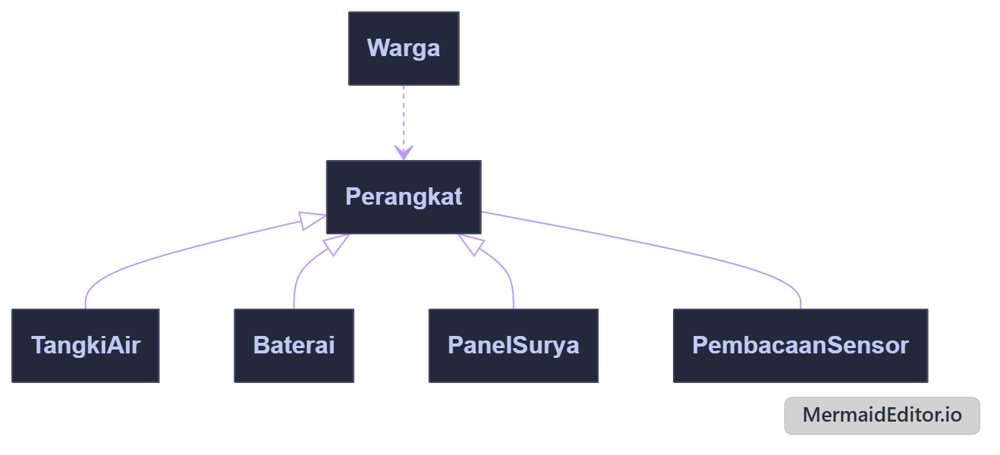

<i>Gambar 2. Diagram Kelas Use Case UC01</i>

 

| ID Kelas | Nama Kelas | Atribut | Metode/Operasi |
| :--- | :--- | :--- | :--- |
| C02 | Warga | idWarga, nama | pantauPemantauan() |
| C07 | Perangkat | idPerangkat, nama | statusTerbaru() (abstrak), pembacaanTerakhir() |
| C08 | TangkiAir | idTangki, volumeLiter, ambangRendah, ambangKritis | statusTerbaru(), statusAir() |
| C09 | Baterai | idBaterai, kapasitasPersen | statusTerbaru(), kapasitas() |
| C10 | PanelSurya | idPanel, dayaWatt | statusTerbaru(), dayaSaatIni() |
| C11 | PembacaanSensor | idPembacaan, nilai, satuan, waktu | catat() |

---

### 5.2.2 Use Case UC02

**Nama Use Case:** *Melihat Tagihan Iuran Final*

#### Identifikasi Kelas

| ID Kelas | Nama Kelas | Deskripsi Kelas |
| :--- | :--- | :--- |
| C02 | Warga | Pemilik tagihan yang melihat rincian iurannya. |
| C17 | Tagihan | Menyimpan data tagihan dan mengetahui status final serta rinciannya sendiri. |
| C14 | Periode | Menyimpan rentang periode tagihan (bulan/tahun). |

#### Diagram Kelas

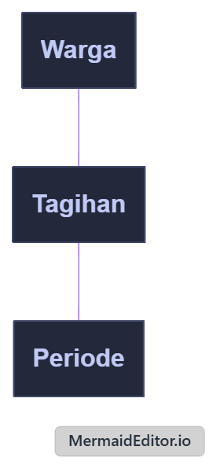

<i>Gambar 3. Diagram Kelas Use Case UC02</i>

 

| ID Kelas | Nama Kelas | Atribut | Metode/Operasi |
| :--- | :--- | :--- | :--- |
| C02 | Warga | idWarga, nama | lihatTagihan() |
| C17 | Tagihan | idTagihan, jumlahIuran, statusFinal, dataPemakaianDasar | sudahFinal(), rincian() |
| C14 | Periode | idPeriode, bulan, tahun | - |

### 5.2.3 Use Case UC03

**Nama Use Case:** *Mengirim Laporan Gangguan*

#### Identifikasi Kelas

| ID Kelas | Nama Kelas | Deskripsi Kelas |
| :--- | :--- | :--- |
| C02 | Warga | Menyimpan data akun warga yang mengirimkan laporan untuk memvalidasi status keanggotaan terdaftar. |
| C20 | LaporanGangguan | Menyimpan formulir laporan gangguan yang dibuat warga (jenis gangguan, deskripsi, foto pendukung) yang otomatis ditetapkan berstatus "Menunggu". |
| C21 | StatusLaporan | Enumerasi yang menyimpan nilai batas status laporan yang valid. |

#### Diagram Kelas

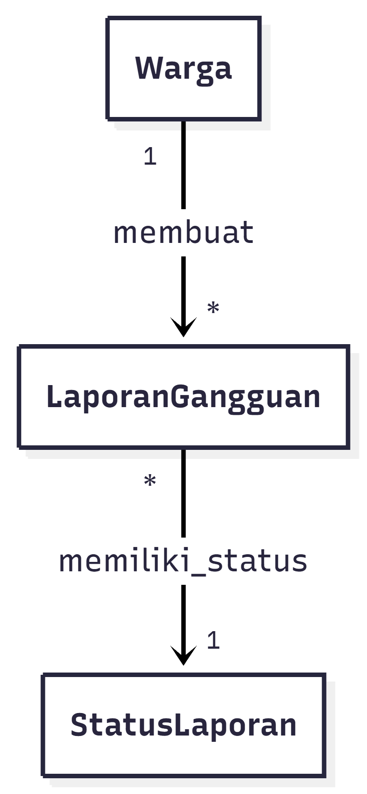

<i>Gambar 4. Diagram Kelas Use Case UC03</i>

 

| ID Kelas | Nama Kelas | Atribut | Metode/Operasi |
| :--- | :--- | :--- | :--- |
| C02 | Warga | idWarga, nama, statusTerdaftar | validasiKeanggotaan(), kirimLaporan() |
| C20 | LaporanGangguan | idLaporan, idWarga, jenisGangguan, deskripsi, fotoPendukung, waktuDibuat, status | setStatusMenunggu(), simpan() |
| C21 | StatusLaporan | MENUNGGU, SEDANG_DIPERBAIKI, SELESAI | - |

### 5.2.4 Use Case UC04

**Nama Use Case:** *Menelusuri Status Laporan Gangguan*

#### Identifikasi Kelas

| ID Kelas | Nama Kelas | Deskripsi Kelas |
| :--- | :--- | :--- |
| C02 | Warga | Aktor yang menelusuri daftar riwayat laporan gangguan berdasarkan identitasnya. |
| C20 | LaporanGangguan | Menyimpan data laporan yang pernah dikirim oleh warga beserta status terkininya untuk ditampilkan pada sistem. |
| C22 | RiwayatStatusLaporan | Menyimpan riwayat perkembangan status laporan gangguan dari waktu ke waktu. |

#### Diagram Kelas

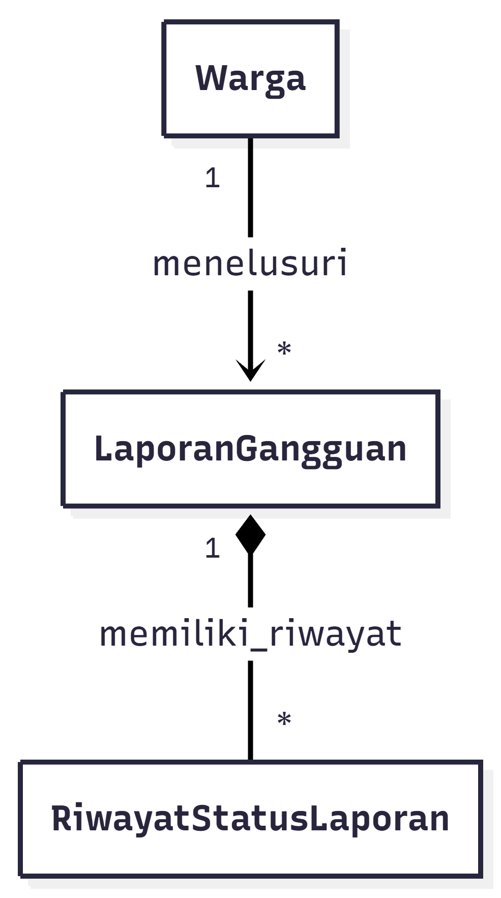

<i>Gambar 5. Diagram Kelas Use Case UC04</i>

 

| ID Kelas | Nama Kelas | Atribut | Metode/Operasi |
| :--- | :--- | :--- | :--- |
| C02 | Warga | idWarga, nama | lihatDaftarLaporan(), pilihLaporan() |
| C20 | LaporanGangguan | idLaporan, idWarga, jenisGangguan, deskripsi, statusLengkap | getLaporanByIdWarga(), getDetailLaporan() |
| C22 | RiwayatStatusLaporan | idRiwayat, idLaporan, status, timestamp | getRiwayatPerkembangan() |

### 5.2.5 Use Case 5

**Nama Use Case:** *Menerima Peringatan Dini Daya Kritis*

#### Identifikasi Kelas

| ID Kelas | Nama Kelas | Deskripsi Kelas |
| :--- | :--- | :--- |
| C03 | Teknisi | Akun teknisi yang bertanggung jawab dan menerima notifikasi. |
| C07 | Perangkat | Perangkat komunal yang dipantau, mis. pompa/tangki/panel. |
| C09 | Baterai | Komponen daya yang kapasitasnya dipantau. |
| C23 | PenugasanPerangkat | Relasi penugasan teknisi terhadap perangkat tertentu. |
| C25 | Notifikasi | Pesan peringatan yang dikirim sistem. |
| C26 | PeringatanDayaKritis | Notifikasi khusus untuk daya baterai di bawah ambang aman. |

#### Diagram Kelas

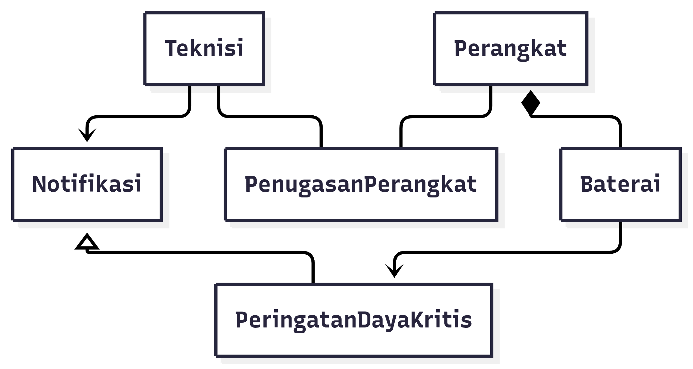

<i>Gambar 6. Diagram Kelas Use Case UC05</i>

 

| ID Kelas | Nama Kelas | Atribut | Metode/Operasi |
| :--- | :--- | :--- | :--- |
| C03 | Teknisi | idTeknisi, nama, kontak | terimaNotifikasi() |
| C07 | Perangkat | idPerangkat, nama, lokasi | - |
| C09 | Baterai | idBaterai, kapasitasPersen, ambangBatasAman | cekKapasitas() |
| C23 | PenugasanPerangkat | idPenugasan, idTeknisi, idPerangkat | verifikasiTanggungJawab() |
| C25 | Notifikasi | idNotifikasi, pesan, waktu, statusBaca | kirim(), tandaiDibaca() |
| C26 | PeringatanDayaKritis | level, kapasitasSaatIni | - |

### 5.2.6 Use Case 6

**Nama Use Case:** *Memantau Riwayat Kinerja Panel Surya*

#### Identifikasi Kelas

| ID Kelas | Nama Kelas | Deskripsi Kelas |
| :--- | :--- | :--- |
| C03 | Teknisi | Pengguna yang memantau riwayat kinerja panel surya. |
| C07 | Perangkat | Kelas umum untuk perangkat yang dipantau. |
| C10 | PanelSurya | Perangkat panel surya yang kinerjanya dianalisis. |
| C12 | DataHistorisKinerja | Data historis kinerja panel surya berdasarkan waktu. |
| C13 | RentangWaktu | Nilai rentang waktu yang dipilih teknisi. |

#### Diagram Kelas

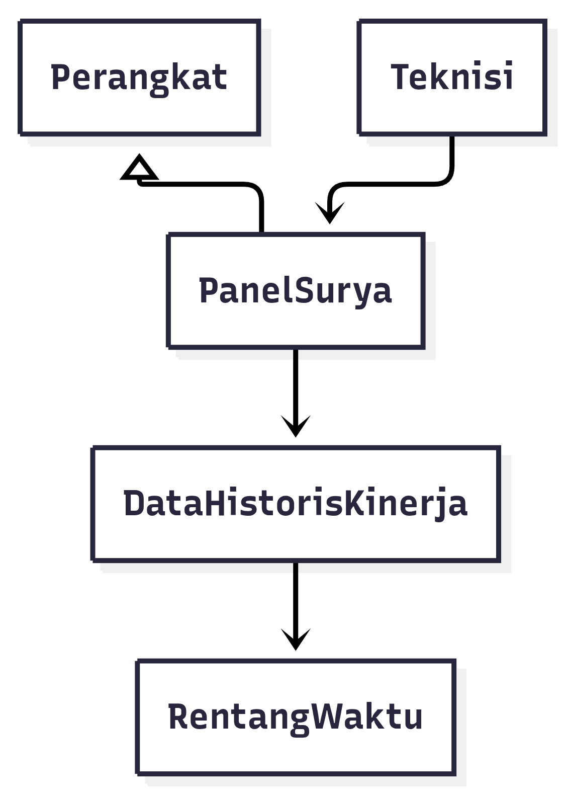

<i>Gambar 7. Diagram Kelas Use Case UC06</i>

 

| ID Kelas | Nama Kelas | Atribut | Metode/Operasi |
| :--- | :--- | :--- | :--- |
| C03 | Teknisi | idTeknisi, nama | pilihRentangWaktu(), lihatRiwayatKinerja() |
| C07 | Perangkat | idPerangkat, nama, tipe | - |
| C10 | PanelSurya | idPanel, kapasitas, lokasi | getDataKinerja() |
| C12 | DataHistorisKinerja | idData, waktu, dayaDihasilkan, energi | ambilBerdasarkanRentang() |
| C13 | RentangWaktu | waktuMulai, waktuSelesai | validasi() |

### 5.2.7 Use Case 7

**Nama Use Case:** *Memperbarui Status Penanganan Gangguan  *

#### Identifikasi Kelas

| ID Kelas | Nama Kelas | Deskripsi Kelas |
| :--- | :--- | :--- |
| C03 | Teknisi | Teknisi yang berwenang mengubah status laporan. |
| C20 | LaporanGangguan | Laporan gangguan yang ditangani. |
| C24 | PenugasanLaporan | Relasi penugasan teknisi terhadap laporan tertentu. |
| C22 | RiwayatStatusLaporan | Riwayat perubahan status beserta timestamp. |
| C21 | StatusLaporan | Enumerasi status laporan yang valid. |

#### Diagram Kelas

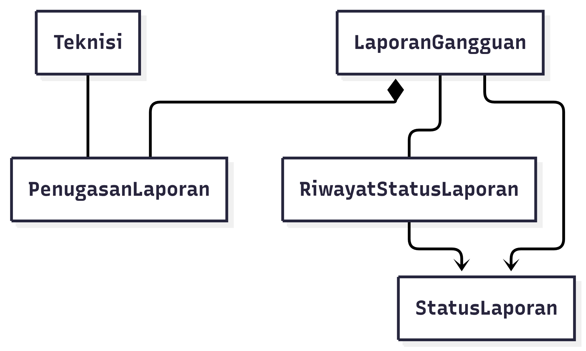

<i>Gambar 8. Diagram Kelas Use Case UC07</i>

 

| ID Kelas | Nama Kelas | Atribut | Metode/Operasi |
| :--- | :--- | :--- | :--- |
| C03 | Teknisi | idTeknisi, nama | ubahStatusLaporan() |
| C20 | LaporanGangguan | idLaporan, jenisGangguan, deskripsi, status, waktuDibuat | ubahStatus() |
| C24 | PenugasanLaporan | idPenugasan, idTeknisi, idLaporan, waktuPenugasan | verifikasi() |
| C22 | RiwayatStatusLaporan | idRiwayat, status, timestamp | catat() |
| C21 | StatusLaporan | MENUNGGU, SEDANG_DIPERBAIKI, SELESAI | - |

### 5.2.8 Use Case UC08

**Nama Use Case:** *Mencatat Kegiatan Pemeliharaan*

#### Identifikasi Kelas

| ID Kelas | Nama Kelas | Deskripsi Kelas |
| :--- | :--- | :--- |
| C03 | Teknisi | Akun petugas yang melakukan pengisian formulir pencatatan pemeliharaan. |
| C27 | CatatanPemeliharaan | Entri log yang menyimpan rincian perawatan fisik alat (waktu pelaksanaan, tindakan, catatan hasil). |
| C07 | Perangkat | Menyimpan detail alat komunal yang sedang dicatat riwayat perbaikannya oleh teknisi. |

#### Diagram Kelas

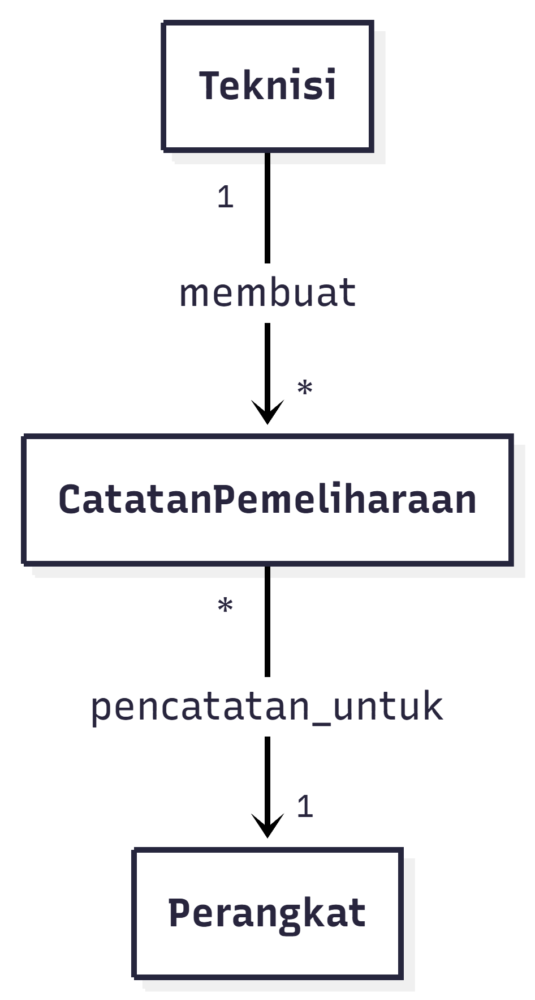

<i>Gambar 9. Diagram Kelas Use Case UC08</i>

 

| ID Kelas | Nama Kelas | Atribut | Metode/Operasi |
| :--- | :--- | :--- | :--- |
| C03 | Teknisi | idTeknisi, nama | buatCatatanPemeliharaan() |
| C27 | CatatanPemeliharaan | idCatatan, idTeknisi, idPerangkat, waktuPelaksanaan, tindakan, catatanHasil | validasiFormulir(), simpan() |
| C07 | Perangkat | idPerangkat, namaPerangkat, lokasi | getRiwayatPemeliharaan() |

### 5.2.9 Use Case UC09

**Nama Use Case:** *Menganalisis Pemakaian Komunal*

#### Identifikasi Kelas

| ID Kelas | Nama Kelas | Deskripsi Kelas |
| :--- | :--- | :--- |
| C04 | Pengurus | Pengguna yang berwenang mengakses dashboard administratif dan melihat analitik pemakaian komunal. |
| C14 | Periode | Merepresentasikan periode yang dipilih untuk mengelompokkan dan membandingkan data pemakaian. |
| C15 | DataPemakaian | Menyimpan data pemakaian air atau energi yang dapat dikelompokkan dan dianalisis berdasarkan periode. |

#### Diagram Kelas

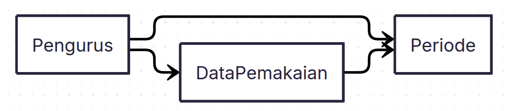

<i>Gambar 10. Diagram Kelas Use Case UC09</i>

 

| ID Kelas | Nama Kelas | Atribut | Metode/Operasi |
| :--- | :--- | :--- | :--- |
| C04 | Pengurus | idPengurus, nama | verifikasiKewenangan() |
| C14 | Periode | idPeriode, bulan, tahun | - |
| C15 | DataPemakaian | idPemakaian, idWarga, volumeAirM3, energiKWh, waktuCatat | isLengkap() |

### 5.2.10 Use Case 10

**Nama Use Case:** *Menghitung dan Menetapkan Iuran Warga* — Aktor: **Pengurus** — KF: KF25, KF26, KF27, KF28, KF33 — Relasi: `<<include>> UC09`, `<<extend>> UC02`

**Ringkasan skenario (dari 3.4.10):** Pengurus memilih periode → sistem mengambil DataPemakaian & menghitung otomatis dengan AturanTarif yang sama untuk semua warga → pratinjau ditampilkan → Pengurus menekan Tetapkan Final → verifikasi kewenangan → status Periode/Tagihan menjadi FINAL. Alternatif: pengurus tidak berwenang (ditolak) dan data pemakaian belum lengkap (peringatan).

#### Identifikasi Kelas — UC10

| ID Kelas | Nama Kelas | Deskripsi Kelas |
| :--- | :--- | :--- |
| C04 | Pengurus | Aktor pengurus yang memilih periode, meninjau hasil, dan menetapkan final; memverifikasi kewenangannya sendiri. |
| C14 | Periode | Periode tagihan (bulan, tahun) dengan statusFinal; menjadi konteks perhitungan dan finalisasi. |
| C15 | DataPemakaian | Pemakaian air (m³) & energi (kWh) per warga per periode; sumber utama perhitungan. |
| C16 | AturanTarif | Tarif/aturan perhitungan tunggal per periode (tarifAirPerM3, tarifEnergiPerKWh, biayaTetap) — menjamin KF28. |
| C17 | Tagihan | Hasil perhitungan iuran per warga (jumlahIuran, dataPemakaianDasar, status); mengetahui sudahFinal() & rincian() sendiri. |
| C19 | KalkulatorIuran | Domain service yang menghitung otomatis, memvalidasi kelengkapan & kewenangan, dan menetapkan final. |
| C18 | StatusTagihan | Enumerasi status tagihan: DRAFT, FINAL. |
| C02 | Warga | Warga pemilik Tagihan (asosiasi Tagihan→Warga, DataPemakaian→Warga). |

> Pemetaan global: C10-01→C04, C10-02→C14, C10-03→C15, C10-04→C16, C10-05→C17, C10-06→C19, C10-07→C18, C10-08→C02.

#### Diagram Kelas — UC10

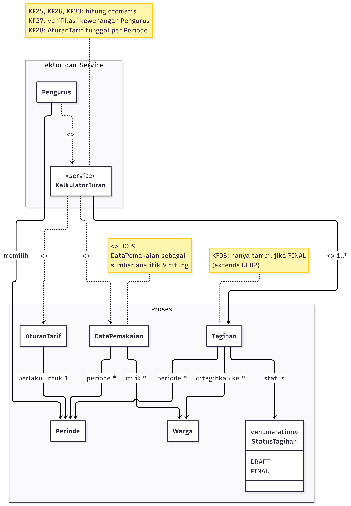

<i>Gambar 11. Diagram Kelas Use Case UC10 — Menghitung & Menetapkan Iuran </i>

 

| ID Kelas | Nama Kelas | Atribut | Metode/Operasi |
| :--- | :--- | :--- | :--- |
| C04 | Pengurus | idPengurus, nama, email | pilihPeriode(bulan, tahun): Periode, hitungIuran(periode: Periode): List<Tagihan>, tinjauHasil(daftar), tetapkanFinal(periode: Periode), verifikasiKewenangan(): boolean |
| C14 | Periode | idPeriode, bulan, tahun, statusFinal: boolean | isFinal(): boolean, tandaiFinal(): void |
| C15 | DataPemakaian | idPemakaian, idWarga, volumeAirM3, energiKWh, waktuCatat | isLengkap(): boolean |
| C16 | AturanTarif | idAturan, tarifAirPerM3, tarifEnergiPerKWh, biayaTetap, periodeId | terapkan(volume, energi): double, isValidUntukPeriode(p: Periode): boolean |
| C17 | Tagihan | idTagihan, idWarga, idPeriode, jumlahIuran, dataPemakaianDasar, status: StatusTagihan | hitungTotal(tarif, pemakaian): double, sudahFinal(): boolean, rincian(): String, tetapkanFinal(): void |
| C19 | KalkulatorIuran | — (service stateless) | hitung(periode): List<Tagihan>, pratinjau(periode): List<Tagihan>, validasiKelengkapan(periode): boolean, validasiKewenangan(pengurus): boolean, tetapkanFinal(periode, pengurus): void |
| C18 | StatusTagihan | DRAFT, FINAL | — |
| C02 | Warga | idWarga, nama | lihatTagihan(): Tagihan |

### 5.2.11 Use Case UC11

**Nama Use Case:** *Membuat Rekapitulasi Pemakaian dan Iuran*

#### Identifikasi Kelas

| ID Kelas | Nama Kelas | Deskripsi Kelas |
| :--- | :--- | :--- |
| C04 | Pengurus | Pengguna berwenang yang memilih periode dan membuat rekapitulasi administratif. |
| C14 | Periode | Merepresentasikan periode pemakaian dan iuran yang akan direkapitulasi. |
| C15 | DataPemakaian | Menyimpan data pemakaian air atau energi beserta status finalnya. |
| C17 | Tagihan | Menyimpan data iuran warga beserta status final untuk periode terkait. |
| C28 | Rekapitulasi | Merepresentasikan rekapitulasi pemakaian dan iuran yang dapat dihasilkan, diekspor, atau dicetak. |

#### Diagram Kelas

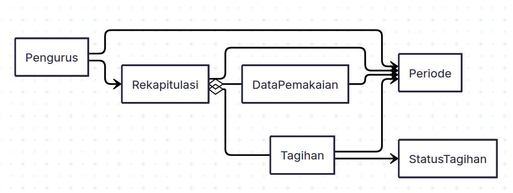

<i>Gambar 12. Diagram Kelas Use Case UC11</i>

 

| ID Kelas | Nama Kelas | Atribut | Metode/Operasi |
| :--- | :--- | :--- | :--- |
| C04 | Pengurus | idPengurus, nama | verifikasiKewenangan(), buatRekapitulasi() |
| C14 | Periode | idPeriode, bulan, tahun, statusFinal | isFinal() |
| C15 | DataPemakaian | idPemakaian, idWarga, volumeAirM3, energiKWh, waktuCatat | isLengkap() |
| C17 | Tagihan | idTagihan, idWarga, idPeriode, jumlahIuran, dataPemakaianDasar, status | sudahFinal(), rincian() |
| C18 | StatusTagihan | DRAFT, FINAL | - |
| C28 | Rekapitulasi | idRekap, idPeriode, totalPemakaianAir, totalPemakaianEnergi, totalIuran | generate(periode), ekspor(), cetak() |

### 5.2.12 Use Case UC12

**Nama Use Case:** *Melakukan Registrasi Akun*

#### Identifikasi Kelas

| ID Kelas | Nama Kelas | Deskripsi Kelas |
| :--- | :--- | :--- |
| C05 | CalonPengguna | Pendaftar yang mengisi data diri dan pilihan peran sebelum akun dibuat. |
| C01 | Akun | Superkelas abstrak yang menyimpan identitas dan status persetujuan akun. |
| C02 | Warga | Bentuk khusus akun untuk peran warga. |
| C03 | Teknisi | Bentuk khusus akun untuk peran teknisi. |
| C04 | Pengurus | Bentuk khusus akun untuk peran pengurus. |
| C06 | StatusAkun | Enumerasi status persetujuan akun yang valid. |

#### Diagram Kelas

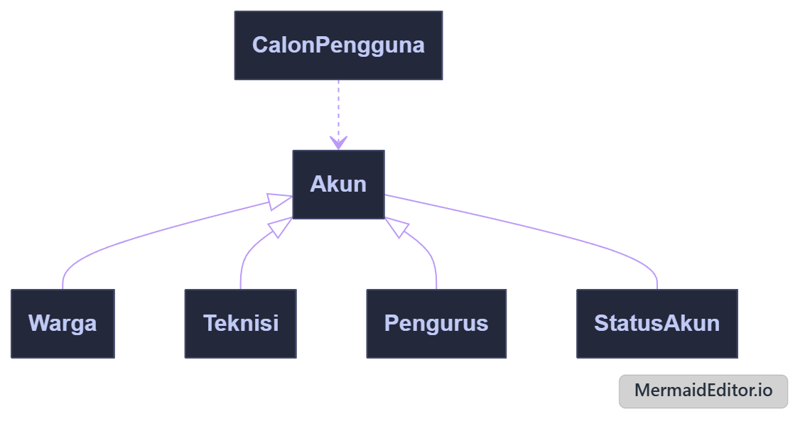

<i>Gambar 13. Diagram Kelas Use Case UC12</i>

 

| ID Kelas | Nama Kelas | Atribut | Metode/Operasi |
| :--- | :--- | :--- | :--- |
| C05 | CalonPengguna | nama, email, password, peranPilihan | daftarkan() |
| C01 | Akun | email, password, nama, statusAkun | statusAkun() |
| C02 | Warga | idWarga, nama | - |
| C03 | Teknisi | idTeknisi, nama | - |
| C04 | Pengurus | idPengurus, nama | - |
| C06 | StatusAkun | status | - |

---

### 5.2.13 Use Case UC13

**Nama Use Case:** *Melakukan Login Akun*

#### Identifikasi Kelas

| ID Kelas | Nama Kelas | Deskripsi Kelas |
| :--- | :--- | :--- |
| C01 | Akun | Superkelas abstrak yang memverifikasi kredensial dan statusnya sendiri. |
| C02 | Warga | Bentuk khusus akun warga; menjawab dashboard tujuan sendiri. |
| C03 | Teknisi | Bentuk khusus akun teknisi; menjawab dashboard tujuan sendiri. |
| C04 | Pengurus | Bentuk khusus akun pengurus; menjawab dashboard tujuan sendiri. |
| C06 | StatusAkun | Enumerasi status persetujuan akun yang valid. |

#### Diagram Kelas

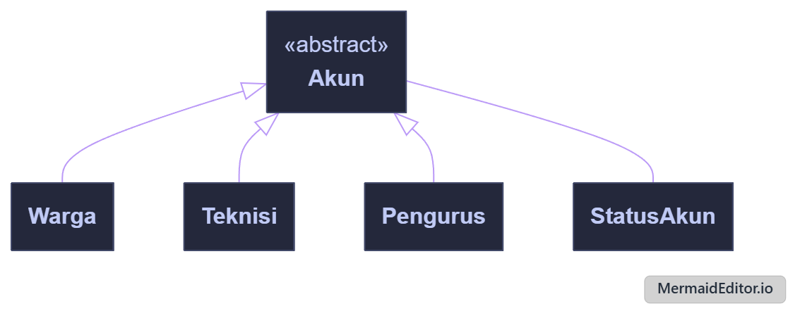

<i>Gambar 14. Diagram Kelas Use Case UC13</i>

 

| ID Kelas | Nama Kelas | Atribut | Metode/Operasi |
| :--- | :--- | :--- | :--- |
| C01 | Akun | email, password, statusAkun | cocokKredensial(email, password), sudahDisetujui(), dashboardTujuan() |
| C02 | Warga | idWarga, nama | dashboardTujuan() |
| C03 | Teknisi | idTeknisi, nama | dashboardTujuan() |
| C04 | Pengurus | idPengurus, nama | dashboardTujuan() |
| C06 | StatusAkun | status | - |

### 5.2.14 Use Case UC14

**Nama Use Case:** *Mengelola Persetujuan Akun*

#### Identifikasi Kelas

| ID Kelas | Nama Kelas | Deskripsi Kelas |
| :--- | :--- | :--- |
| C01 | Akun | Menyimpan identitas pengguna dan status persetujuan akun yang dapat diperbarui setelah proses peninjauan. |
| C04 | Pengurus | Bentuk khusus akun yang berwenang meninjau serta menyetujui atau menolak akun yang menunggu persetujuan. |
| C06 | StatusAkun | Merepresentasikan status persetujuan akun, seperti Menunggu Persetujuan, Disetujui, atau Ditolak. |

#### Diagram Kelas

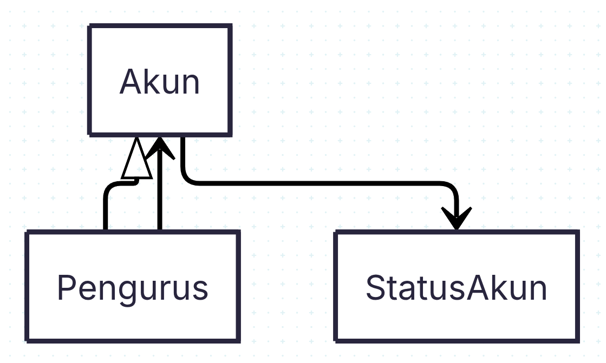

<i>Gambar 15. Diagram Kelas Use Case UC14</i>

 

| ID Kelas | Nama Kelas | Atribut | Metode/Operasi |
| :--- | :--- | :--- | :--- |
| C01 | Akun | email, password, nama, statusAkun | ubahStatus() |
| C04 | Pengurus | idPengurus, nama | lihatAkunMenunggu(), setujuiAkun(), tolakAkun() |
| C06 | StatusAkun | MENUNGGU, DISETUJUI, DITOLAK | - |

---

## 5.3 Diagram Kelas Keseluruhan 

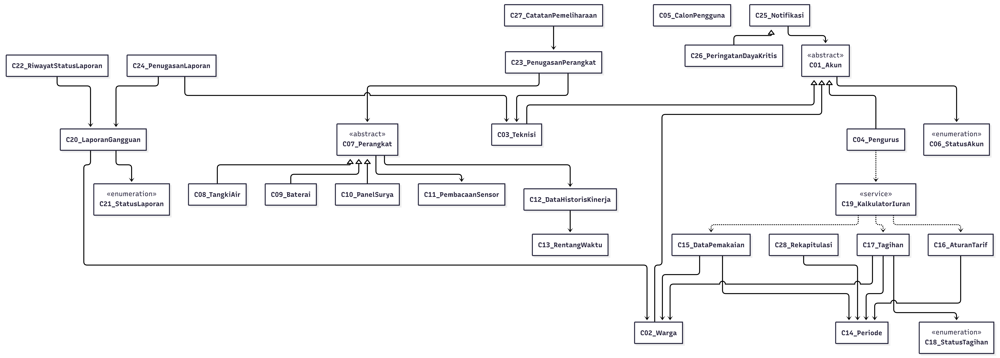

<i>Gambar 16. Diagram Kelas Keseluruhan Fajar Tech (28 kelas, 14 UC terintegrasi)</i>

 

| ID Kelas | Nama Kelas | Atribut | Metode/Operasi |
| :--- | :--- | :--- | :--- |
| C01 | Akun | email, password, nama, statusAkun | cocokKredensial(email, password), sudahDisetujui(), dashboardTujuan() {abstract} |
| C02 | Warga | idWarga, nama | pantauPemantauan(), lihatTagihan(), lihatRiwayatLaporan() |
| C03 | Teknisi | idTeknisi, nama, kontak | terimaNotifikasi(), ubahStatusLaporan(), pilihRentangWaktu() |
| C04 | Pengurus | idPengurus, nama | verifikasiKewenangan(), hitungIuran(periode), tetapkanFinal(periode), buatRekapitulasi() |
| C05 | CalonPengguna | nama, email, password, peranPilihan | daftarkan(): Akun |
| C06 | StatusAkun | MENUNGGU, DISETUJUI, DITOLAK | — |
| C07 | Perangkat | idPerangkat, nama, lokasi | statusTerbaru() {abstract}, pembacaanTerakhir() |
| C08 | TangkiAir | idTangki, volumeLiter, ambangRendah, ambangKritis | statusAir(), statusTerbaru() |
| C09 | Baterai | idBaterai, kapasitasPersen, ambangBatasAman | cekKapasitas(), kapasitas() |
| C10 | PanelSurya | idPanel, dayaWatt, kapasitas, lokasi | dayaSaatIni(), getDataKinerja() |
| C11 | PembacaanSensor | idPembacaan, nilai, satuan, waktu | catat() |
| C12 | DataHistorisKinerja | idData, waktu, dayaDihasilkan, energi | ambilBerdasarkanRentang(r: RentangWaktu) |
| C13 | RentangWaktu | waktuMulai, waktuSelesai | validasi() |
| C14 | Periode | idPeriode, bulan, tahun, statusFinal | isFinal(), tandaiFinal() |
| C15 | DataPemakaian | idPemakaian, idWarga, volumeAirM3, energiKWh, waktuCatat | isLengkap() |
| C16 | AturanTarif | idAturan, tarifAirPerM3, tarifEnergiPerKWh, biayaTetap, periodeId | terapkan(volume, energi), isValidUntukPeriode() |
| C17 | Tagihan | idTagihan, idWarga, idPeriode, jumlahIuran, dataPemakaianDasar, status | hitungTotal(), sudahFinal(), rincian(), tetapkanFinal() |
| C18 | StatusTagihan | DRAFT, FINAL | — |
| C19 | KalkulatorIuran | — (service) | hitung(periode), pratinjau(periode), validasiKelengkapan(), validasiKewenangan(), tetapkanFinal() |
| C20 | LaporanGangguan | idLaporan, jenisGangguan, deskripsi, status, waktuDibuat | ubahStatus(s), simpan() |
| C21 | StatusLaporan | MENUNGGU, SEDANG_DIPERBAIKI, SELESAI | — |
| C22 | RiwayatStatusLaporan | idRiwayat, status, timestamp | catat() |
| C23 | PenugasanPerangkat | idPenugasan, idTeknisi, idPerangkat | verifikasiTanggungJawab() |
| C24 | PenugasanLaporan | idPenugasan, idTeknisi, idLaporan, waktuPenugasan | verifikasi() |
| C25 | Notifikasi | idNotifikasi, pesan, waktu, statusBaca | kirim(), tandaiDibaca() |
| C26 | PeringatanDayaKritis | level, kapasitasSaatIni | — (inherit kirim()) |
| C27 | CatatanPemeliharaan | idCatatan, waktuPelaksanaan, tindakan, catatanHasil | simpan(), validasi() |
| C28 | Rekapitulasi | idRekap, idPeriode, totalPemakaianAir, totalPemakaianEnergi, totalIuran | generate(periode), ekspor(), cetak() |

# BAB 6: Traceability

| ID Kelas | ID Use Case | ID KF |
| :--- | :--- | :--- |
| *C01* | *UC12, UC13, UC14* | *KF09, KF14, KF18, KF23, KF27* |
| *C02* | *UC01, UC02, UC03, UC04* | *KF01, KF02, KF03, KF04, KF05, KF06, KF07, KF08, KF09, KF10, KF11, KF34* |
| *C03* | *UC05, UC06, UC07, UC08* | *KF12, KF13, KF14, KF15, KF16, KF17, KF18, KF19, KF20, KF21, KF35* |
| *C04* | *UC09, UC10, UC11, UC14* | *KF22, KF23, KF24, KF25, KF26, KF27, KF28, KF29, KF30, KF31, KF32, KF33* |
| *C05* | *UC12* | *KF09, KF14* |
| *C06* | *UC12, UC13, UC14* | *KF09, KF14, KF18, KF23, KF27* |
| *C07* | *UC01, UC05, UC06, UC08* | *KF01, KF02, KF03, KF04, KF13, KF14, KF15, KF16, KF20, KF21* |
| *C08* | *UC01* | *KF01, KF02, KF03, KF04* |
| *C09* | *UC01, UC05* | *KF01, KF02, KF03, KF04, KF13, KF14* |
| *C10* | *UC01, UC06* | *KF01, KF02, KF03, KF04, KF15, KF16* |
| *C11* | *UC01* | *KF01, KF02, KF03, KF04* |
| *C12* | *UC06* | *KF15, KF16* |
| *C13* | *UC06* | *KF15, KF16* |
| *C14* | *UC02, UC09, UC10, UC11* | *KF05, KF06, KF22, KF23, KF24, KF25, KF26, KF27, KF28, KF29, KF30, KF31, KF32, KF33* |
| *C15* | *UC09, UC10, UC11* | *KF22, KF23, KF24, KF25, KF26, KF27, KF28, KF29, KF30, KF31, KF32, KF33* |
| *C16* | *UC10* | *KF25, KF26, KF27, KF28, KF33* |
| *C17* | *UC02, UC10* | *KF05, KF06, KF25, KF26, KF27, KF28, KF33* |
| *C18* | *UC02, UC10, UC11* | *KF05, KF06, KF25, KF26, KF27, KF28, KF29, KF30, KF31, KF32, KF33* |
| *C19* | *UC10* | *KF25, KF26, KF27, KF28, KF33* |
| *C20* | *UC03, UC04, UC07* | *KF07, KF08, KF09, KF10, KF11, KF12, KF17, KF18, KF19, KF34, KF35* |
| *C21* | *UC03, UC04, UC07* | *KF07, KF08, KF09, KF10, KF11, KF12, KF17, KF18, KF19, KF34, KF35* |
| *C22* | *UC04, UC07* | *KF11, KF12, KF17, KF18, KF19, KF34, KF35* |
| *C23* | *UC05* | *KF13, KF14* |
| *C24* | *UC07* | *KF12, KF17, KF18, KF19, KF35* |
| *C25* | *UC05* | *KF13, KF14* |
| *C26* | *UC05* | *KF13, KF14* |
| *C27* | *UC08* | *KF20, KF21* |
| *C28* | *UC11* | *KF29, KF30, KF31, KF32* |

---

# Referensi
- Diagram UML: [https://drive.google.com/file/d/1dWHSIYX9YLLHwaWSedQTZqx9cc3SbARq/view?usp=sharing](https://www.drawio./), [https://staruml.io/](https://staruml.io/)
- Use Case Diagram [Use Case Diagram](https://drive.google.com/file/d/1dWHSIYX9YLLHwaWSedQTZqx9cc3SbARq/view?usp=sharing)