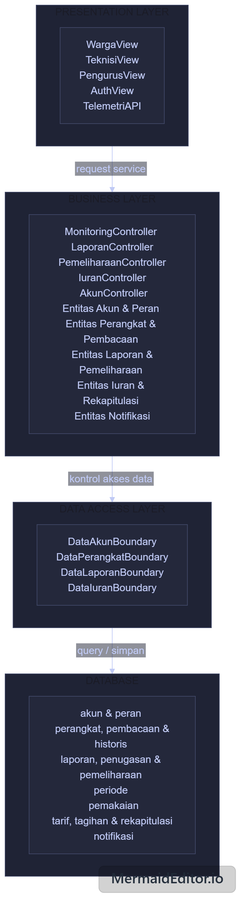
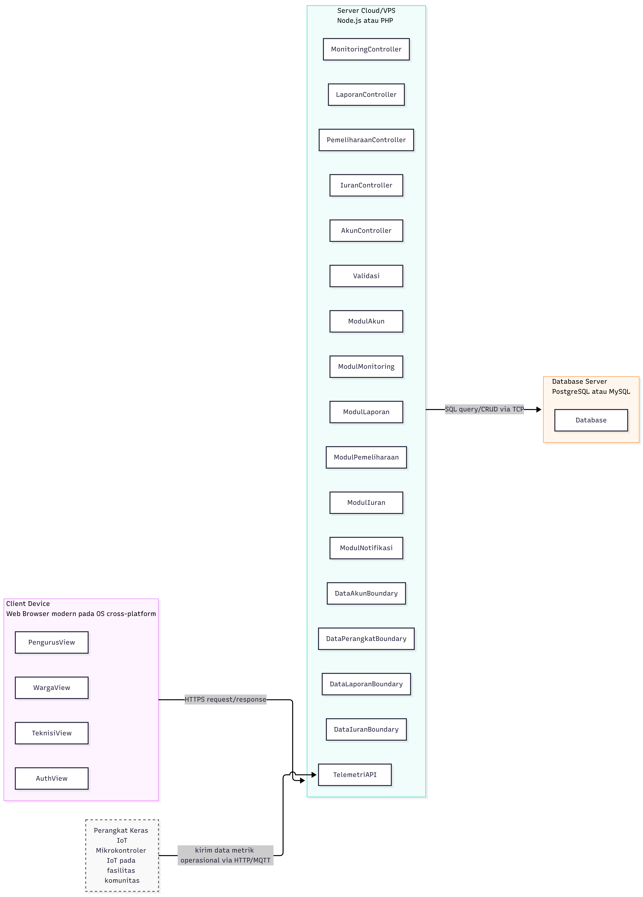

<h1>
IF2150 REKAYASA PERANGKAT LUNAK
 
TUGAS 6
 
ARSITEKTUR PERANGKAT LUNAK (APL)
</h1>
 

## *FAJAR TECH*

### Untuk: *Tigress / Agatha*

Dipersiapkan oleh:

| Informasi | Keterangan |
| --- | --- |
| Kelas | K-3 |
| Kelompok | 10 |

| NIM | Nama |
| --- | --- |
| *13525054* | *Raffi Fauzi Hermawan* |
| *13525030* | *Rionaldo Casey Pandhitha* |
| *13525129* | *Andro Irsa Syafiq* |
| *13525078* | *Muhammad Faiz Ramadhan* |
| *13525006* | *Muhammad Rafiandhi Suryadinata* |

---

 
 

# BAB 1: Style/Pattern Arsitektur Acuan

Fajar Tech menggunakan **Layered Architecture** dengan empat lapisan, yaitu **Presentation Layer**, **Business Layer**, **Data Access Layer**, dan **Database**. Pembagian ini mengikuti pola Layered Architecture yang digunakan pada Asistensi Akbar M6. *Presentation Layer* menangani interaksi pengguna dan masukan dari perangkat lapangan, *Business Layer* menangani controller, aturan bisnis, dan entitas/domain aplikasi, *Data Access Layer* menjadi batas akses data antara logika bisnis dan penyimpanan, sedangkan *Database* menyimpan data persisten. Ketergantungan antarlapisan mengikuti aturan *top-to-bottom*: lapisan atas dapat menggunakan layanan lapisan di bawahnya, tetapi lapisan bawah tidak menggunakan layanan dari lapisan di atasnya.

Pemilihan pola ini sesuai dengan karakteristik Fajar Tech yang memiliki beberapa jenis pengguna dengan antarmuka berbeda, aturan bisnis yang saling berkaitan, data pemantauan dan transaksi yang perlu disimpan secara terpusat, serta masukan berkala dari perangkat pengukuran lapangan. Pemisahan tanggung jawab antarlapisan membantu membatasi perubahan antarkomponen dan mendukung kebutuhan keamanan berdasarkan peran (KNF01–KNF02). Keandalan, keselamatan, ketersediaan, dan waktu respons tetap ditelusurkan ke KNF03–KNF06 serta KNF11–KNF12. Biaya tambahan berupa alur permintaan yang melewati beberapa lapisan diterima karena kebutuhan kinerja sistem masih memiliki batas waktu respons yang terukur.

Gambar 1 menerapkan Layered Architecture pada Fajar Tech. Blok entitas pada *Business Layer* merepresentasikan modul domain pada Tabel 2.1: **Entitas Akun & Peran** merepresentasikan `ModulAkun`, **Entitas Perangkat & Pembacaan** merepresentasikan `ModulMonitoring`, **Entitas Laporan & Pemeliharaan** merepresentasikan `ModulLaporan` dan `ModulPemeliharaan`, **Entitas Iuran & Rekapitulasi** merepresentasikan `ModulIuran`, dan **Entitas Notifikasi** merepresentasikan `ModulNotifikasi`. `Validasi` digunakan sebagai komponen pendukung oleh controller pada *Business Layer*. Nama controller, View/API, dan data boundary pada gambar digunakan secara konsisten pada Tabel 2.1.

<i>Gambar 1. Layered Architecture Fajar Tech</i>

Selain style/pattern, lingkungan operasi Fajar Tech adalah sebagai berikut.

Tabel 1.1. Lingkungan Operasi Perangkat Lunak

| Komponen | Spesifikasi |
| :--- | :--- |
| *Server* | *[Node.js atau PHP, dijalankan pada layanan cloud hosting / VPS]* |
| *Client* | *[Web Browser modern (Google Chrome, Mozilla Firefox, Safari, Microsoft Edge).]* |
| *DBMS* | *[PostgreSQL atau MySQL]* |
| *OS* | *[Cross-platform (Windows, Linux, macOS, Android, iOS) melalui browser]* |
| *Perangkat Keras* | *[Mikrokontroler IoT pada fasilitas komunitas (untuk mengirim data metrik operasional)]* |

Kaitan teknologi dengan style/pattern: web browser menjadi lingkungan utama *Presentation Layer*; logika aplikasi pada server Node.js atau PHP menjalankan *Business Layer* dan *Data Access Layer*; PostgreSQL atau MySQL menjadi *Database* sesuai keputusan implementasi; dan mikrokontroler IoT berinteraksi dengan sistem melalui `TelemetriAPI`. Dengan demikian, pemetaan teknologi tetap mengikuti lingkungan operasi yang telah ditetapkan pada SKPL tanpa menetapkan framework atau DBMS yang belum diputuskan.

---

# BAB 2: Identifikasi Komponen / Modul / Subsistem

Komponen Fajar Tech dikelompokkan mengikuti empat lapisan pada BAB 1. Komponen pada *Business Layer* bukan pengganti kelas pada SKPL, melainkan wadah tanggung jawab yang mengelompokkan kelas-kelas terkait. Keseluruhan kelas C01–C28 tetap tercakup oleh modul domain, dan controller serta View/API mendukung UC01–UC14.

Tabel 2.1. Identifikasi Komponen/Modul/Subsistem

| Nama Komponen/Modul/Subsistem | Jenis | Penjelasan |
| :--- | :--- | :--- |
| *WargaView* | *PRESENTATION LAYER* | *Menampilkan dashboard air dan energi, tagihan final, serta fitur laporan gangguan bagi Warga dan meneruskan aksi pengguna ke controller terkait (UC01–UC04).* |
| *TeknisiView* | *PRESENTATION LAYER* | *Menampilkan peringatan daya kritis, riwayat kinerja panel surya, pembaruan status gangguan, dan pencatatan pemeliharaan bagi Teknisi (UC05–UC08).* |
| *PengurusView* | *PRESENTATION LAYER* | *Menampilkan analitik pemakaian, pengelolaan iuran, rekapitulasi, dan persetujuan akun bagi Pengurus (UC09–UC11, UC14).* |
| *AuthView* | *PRESENTATION LAYER* | *Menyediakan antarmuka registrasi dan login serta meneruskan data autentikasi ke AkunController (UC12–UC13).* |
| *TelemetriAPI* | *PRESENTATION LAYER* | *Menerima data dari perangkat pengukuran lapangan dan meneruskannya ke MonitoringController untuk mendukung pemantauan serta peringatan (UC01, UC05, UC06).* |
| *MonitoringController* | *BUSINESS LAYER* | *Mengoordinasikan pemantauan air dan energi, pengolahan telemetri, riwayat kinerja panel surya, dan evaluasi kondisi daya kritis dengan ModulMonitoring dan ModulNotifikasi (UC01, UC05, UC06).* |
| *LaporanController* | *BUSINESS LAYER* | *Mengoordinasikan pembuatan laporan gangguan, penelusuran riwayat/status, dan pembaruan status penanganan dengan ModulLaporan (UC03, UC04, UC07).* |
| *PemeliharaanController* | *BUSINESS LAYER* | *Mengoordinasikan pencatatan kegiatan pemeliharaan atau perbaikan perangkat dengan ModulPemeliharaan (UC08).* |
| *IuranController* | *BUSINESS LAYER* | *Mengoordinasikan akses tagihan final, analitik pemakaian, perhitungan dan finalisasi iuran, serta pembuatan rekapitulasi dengan ModulIuran (UC02, UC09–UC11).* |
| *AkunController* | *BUSINESS LAYER* | *Mengoordinasikan registrasi, login, pemeriksaan status akun, serta persetujuan atau penolakan akun dengan ModulAkun (UC12–UC14).* |
| *Validasi* | *BUSINESS LAYER* | *Menyediakan pemeriksaan input yang dapat digunakan ulang, seperti kelengkapan field, format, tipe data, dan rentang dasar. Aturan bisnis tetap ditangani controller dan modul domain terkait.* |
| *ModulAkun* | *BUSINESS LAYER* | *Mengelompokkan C01 Akun, C02 Warga, C03 Teknisi, C04 Pengurus, C05 CalonPengguna, dan C06 StatusAkun untuk aturan akun, peran, autentikasi, dan persetujuan akun (UC12–UC14 serta penggunaan akun pada use case terkait).* |
| *ModulMonitoring* | *BUSINESS LAYER* | *Mengelompokkan C07 Perangkat, C08 TangkiAir, C09 Baterai, C10 PanelSurya, C11 PembacaanSensor, C12 DataHistorisKinerja, dan C13 RentangWaktu untuk pemantauan perangkat dan data historis (UC01, UC05, UC06).* |
| *ModulLaporan* | *BUSINESS LAYER* | *Mengelompokkan C20 LaporanGangguan, C21 StatusLaporan, C22 RiwayatStatusLaporan, dan C24 PenugasanLaporan untuk pelaporan serta penanganan gangguan (UC03, UC04, UC07).* |
| *ModulPemeliharaan* | *BUSINESS LAYER* | *Mewadahi C27 CatatanPemeliharaan untuk pencatatan tindakan, waktu, hasil, dan perangkat yang dipelihara (UC08).* |
| *ModulIuran* | *BUSINESS LAYER* | *Mengelompokkan C14 Periode, C15 DataPemakaian, C16 AturanTarif, C17 Tagihan, C18 StatusTagihan, C19 KalkulatorIuran, dan C28 Rekapitulasi untuk pemakaian, kalkulasi/finalisasi iuran, dan rekapitulasi (UC02, UC09–UC11).* |
| *ModulNotifikasi* | *BUSINESS LAYER* | *Mengelompokkan C23 PenugasanPerangkat, C25 Notifikasi, dan C26 PeringatanDayaKritis untuk menentukan penerima serta isi peringatan daya kritis (UC05).* |
| *DataAkunBoundary* | *DATA ACCESS LAYER* | *Menjadi batas akses data akun, peran, status persetujuan, dan kredensial antara Business Layer dan Database.* |
| *DataPerangkatBoundary* | *DATA ACCESS LAYER* | *Menjadi batas akses data perangkat, pembacaan sensor, data historis, penugasan perangkat, notifikasi terkait perangkat, dan catatan pemeliharaan.* |
| *DataLaporanBoundary* | *DATA ACCESS LAYER* | *Menjadi batas akses data laporan gangguan, riwayat status, dan penugasan laporan.* |
| *DataIuranBoundary* | *DATA ACCESS LAYER* | *Menjadi batas akses data periode, pemakaian, aturan tarif, tagihan, dan rekapitulasi.* |
| *Database* | *DATABASE* | *Menyimpan data persisten Fajar Tech secara terpusat menggunakan PostgreSQL atau MySQL sesuai lingkungan operasi pada SKPL.* |

Ketentuan pengisian Tabel 2.1:
1. Kolom **Jenis** mengikuti pengelompokan pada *style/pattern* di BAB 1.
2. Komponen **tidak sama dengan** kelas. Satu komponen dapat mewadahi beberapa kelas dari diagram kelas pada dokumen SKPL.
3. Seluruh kelas C01–C28 tercakup oleh modul domain dan seluruh UC01–UC14 dapat dijalankan melalui View/API, controller, modul domain, data boundary, dan Database yang sesuai.

<b><i>Catatan</i></b>: <i>Nama komponen pada Tabel 2.1 menjadi acuan untuk BAB 3. Jika diperlukan perubahan komponen, perubahan harus diselaraskan kembali pada BAB 1, Tabel 2.1, dan view pada BAB 3.</i>

---

# BAB 3: Model Arsitektur Perangkat Lunak

Architectural View adalah cara mendeskripsikan arsitektur sistem dari sudut pandang tertentu. Pada BAB 3 ini, model arsitektur Fajar Tech digambarkan menggunakan **Logical View** sebagai view utama dan **Physical View** sebagai view pelengkap. Pemilihan ini disesuaikan dengan style **Layered Architecture** pada BAB 1 serta komponen pada Tabel 2.1.

## 3.1 Logical View

Logical View dipilih karena mampu memperlihatkan pembagian tanggung jawab setiap lapisan dan hubungan fungsional antarkomponen. View ini juga paling mudah dicek konsistensinya dengan Tabel 2.1 dan style Layered Architecture pada BAB 1.

<i>Gambar 2. Logical View</i>

**Gambar 3.1. Logical View Fajar Tech**

Gambar 3.1 memperlihatkan empat lapisan utama, yaitu **Presentation Layer**, **Business Layer**, **Data Access Layer**, dan **Database**. Aktor serta sistem eksternal digambarkan dengan garis putus-putus di luar sistem, yaitu Warga, Teknisi, Pengurus, Calon Pengguna, dan Perangkat IoT.

### Presentation Layer

- `WargaView`
- `TeknisiView`
- `PengurusView`
- `AuthView`
- `TelemetriAPI`

### Business Layer

Controller:

- `MonitoringController`
- `LaporanController`
- `PemeliharaanController`
- `IuranController`
- `AkunController`

Komponen pendukung:

- `Validasi`

Modul domain:

- `ModulAkun`
- `ModulMonitoring`
- `ModulLaporan`
- `ModulPemeliharaan`
- `ModulIuran`
- `ModulNotifikasi`

### Data Access Layer

- `DataAkunBoundary`
- `DataPerangkatBoundary`
- `DataLaporanBoundary`
- `DataIuranBoundary`

### Database

- `Database`

### Hubungan Antarkomponen

Aktor eksternal ke Presentation Layer:

- Warga → `WargaView`
- Teknisi → `TeknisiView`
- Pengurus → `PengurusView`
- Calon Pengguna → `AuthView`
- Perangkat IoT → `TelemetriAPI` : “kirim data metrik operasional”

Presentation Layer ke Business Layer:

- `WargaView` → `MonitoringController` : “lihat dashboard air/energi (UC01)”
- `WargaView` → `IuranController` : “lihat tagihan final (UC02)”
- `WargaView` → `LaporanController` : “buat/lihat laporan gangguan (UC03–UC04)”
- `TeknisiView` → `MonitoringController` : “lihat peringatan daya kritis & riwayat panel surya (UC05–UC06)”
- `TeknisiView` → `LaporanController` : “perbarui status gangguan (UC07)”
- `TeknisiView` → `PemeliharaanController` : “catat pemeliharaan (UC08)”
- `PengurusView` → `IuranController` : “analitik pemakaian, kelola iuran, rekapitulasi (UC09–UC11)”
- `PengurusView` → `AkunController` : “persetujuan akun (UC14)”
- `AuthView` → `AkunController` : “registrasi/login (UC12–UC13)”
- `TelemetriAPI` → `MonitoringController` : “teruskan data telemetri (UC01, UC05, UC06)”

Controller ke `Validasi`:

- `MonitoringController`, `LaporanController`, `PemeliharaanController`, `IuranController`, `AkunController` → `Validasi` : “validasi input”

Controller ke modul domain:

- `MonitoringController` → `ModulMonitoring`, `ModulNotifikasi`
- `LaporanController` → `ModulLaporan`
- `PemeliharaanController` → `ModulPemeliharaan`
- `IuranController` → `ModulIuran`
- `AkunController` → `ModulAkun`

Modul domain ke Data Access Layer:

- `ModulAkun` → `DataAkunBoundary` : “akses data akun, peran, kredensial”
- `ModulMonitoring` → `DataPerangkatBoundary` : “akses perangkat, sensor, historis”
- `ModulLaporan` → `DataLaporanBoundary` : “akses laporan, status, penugasan”
- `ModulPemeliharaan` → `DataPerangkatBoundary` : “akses catatan pemeliharaan”
- `ModulIuran` → `DataIuranBoundary` : “akses periode, pemakaian, tarif, tagihan, rekap”
- `ModulNotifikasi` → `DataPerangkatBoundary` : “akses penugasan & notifikasi perangkat”

Data Access Layer ke Database:

- `DataAkunBoundary` → `Database` : “query/CRUD akun”
- `DataPerangkatBoundary` → `Database` : “query/CRUD perangkat”
- `DataLaporanBoundary` → `Database` : “query/CRUD laporan”
- `DataIuranBoundary` → `Database` : “query/CRUD iuran”

Aturan ketergantungan antarlapisan mengikuti pola top-to-bottom. Lapisan atas dapat menggunakan layanan lapisan di bawahnya, tetapi lapisan bawah tidak menggunakan layanan dari lapisan di atasnya.

Gambar 2 adalah contoh *Logical View* dalam bentuk *block diagram*. Seluruh komponen pada Tabel 2.1 digambarkan dan dikelompokkan sesuai pola yang digunakan, ditambah komponen pendukung dan basis data. Sistem di luar P/L digambarkan dengan garis putus-putus. Setiap garis diberi label agar hubungan antarkomponen dapat dipahami.

## 3.2 Physical View

Physical View dipilih untuk menunjukkan lingkungan operasi sesuai Tabel 1.1, yaitu web browser, server Node.js atau PHP, DBMS PostgreSQL atau MySQL, dan perangkat keras IoT.

<i>Gambar 3. Physical View</i>

**Gambar 3.2. Physical View Fajar Tech**

Gambar 3.2 memperlihatkan empat node utama.

### Client Device

Label: “Web Browser modern pada OS cross-platform: Windows/Linux/macOS/Android/iOS”

Isi:

- `WargaView`
- `TeknisiView`
- `PengurusView`
- `AuthView`

### Server Cloud/VPS

Label: “Node.js atau PHP”

Isi:

- `TelemetriAPI`
- `MonitoringController`
- `LaporanController`
- `PemeliharaanController`
- `IuranController`
- `AkunController`
- `Validasi`
- `ModulAkun`
- `ModulMonitoring`
- `ModulLaporan`
- `ModulPemeliharaan`
- `ModulIuran`
- `ModulNotifikasi`
- `DataAkunBoundary`
- `DataPerangkatBoundary`
- `DataLaporanBoundary`
- `DataIuranBoundary`

### Database Server

Label: “PostgreSQL atau MySQL”

Isi:

- `Database`

### Perangkat Keras IoT

Label: “Mikrokontroler IoT pada fasilitas komunitas”

Node ini merupakan lingkungan operasi dari Tabel 1.1, bukan komponen perangkat lunak pada Tabel 2.1.

### Hubungan Antarnode

- Client Device → Server Cloud/VPS : “HTTPS request/response”
- Perangkat Keras IoT → `TelemetriAPI` : “kirim data metrik operasional via HTTP/MQTT”
- Server Cloud/VPS → Database Server : “SQL query/CRUD via TCP”

---

# Referensi

- Sommerville, I. (2016). *Software Engineering* (10th ed.). Pearson. Chapter 6: *Architectural Design*: [https://software-engineering-book.com/slides/](https://software-engineering-book.com/slides/)
- Diagram arsitektur: [https://www.drawio.com/](https://www.drawio.com/), [https://staruml.io/](https://staruml.io/)
